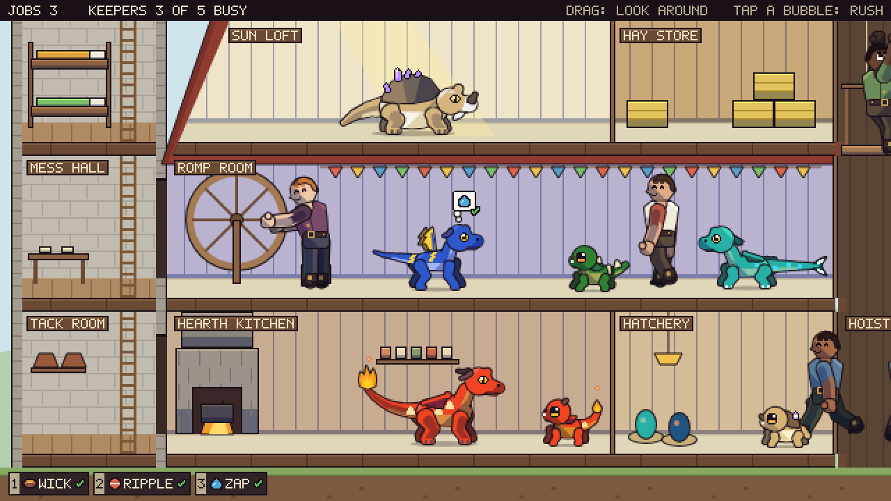

# Dragon Care: The Base (design v1)

**What this covers.** The layer the pet game grows into: a **barn** where the dragons live, **towers** where their
human teammates live, **managed care** (dragons have needs, keepers meet them), and **missions** the teams go out on
and that you can watch. It sits on top of the art in `docs/ART_BIBLE.md`, and every rule there still holds: where
this document leans on one, it names the section.

**Where it came from.** A design conversation with the user, with greybox mockups at the game's true scale (the
dragons in them are the real rigs, the people the engine's humanoid rig; everything else is placeholder blocks,
`docs/base/`). The references were Fallout Shelter (the cutaway, rooms that merge), Two Point Museum (expeditions,
rooms that earn their keep) and World of Warcraft's mission table (pick a team, counter the challenges, see the odds).

**Status.** Designed, and being built in slices. The first, needs and jobs, runs as `view=base` in the gallery (section 8).

---

## Decisions

| # | Decision | Why (and what lost) |
|---|---|---|
| B1 | **The base is a side-view cutaway:** a barn for the dragons with a tower at each end for the people, scrolled at 1x like Fallout Shelter's vault. | The rig is side view, facing right, authored at scale 1 (1.1). A cutaway shows every room at once in that view. |
| B2 | **Care is managerial.** Dragons have needs that drain over time; keepers (the humans) walk over and meet them. The player's one per-dragon action is **Rush**. | Tapping every dragon every few minutes is a chore, not a game (the user's words: "that doesn't sound very fun"). The hands-on care of the art bible (spike's chin, dusk's tuck-in) becomes what keepers *do*, animated. |
| B3 | **Needs show as thought bubbles** over the dragons and as a **prioritised job queue** along the bottom of the screen. | The bubble says *which* dragon wants *what* at a glance; the queue says *what's next*. |
| B4 | **Missions are set and forget,** a mission table in the style of World of Warcraft: pick a team, the dragons' elements and the riders' skills counter the mission's challenges, a success chance, a reward. | Simple at this stage, by the user's choice; no choices mid-mission. |
| B5 | **Missions are watchable:** an animated side-scrolling scene of the team completing it. **The scene is the timer.** | The user wants to see the team at work; the side-view walk the rig already has makes it cheap. |
| B6 | **Everything runs only while the game is open.** One clock drives care, missions and hatching; closing the game pauses the world. | No coming back to a barn of red bubbles; no offline catch-up to build. Missions therefore last minutes of play, not hours. |
| B7 | **Humans are assigned automatically:** keepers to jobs, riders to the dragons you send. | Fewer clicks; the player's choices are *which dragons* and *what to build*. |
| B8 | **Cozy:** no combat. Missions have hazards, not enemies; nobody is hurt; old age is never decline (D21). | The game's face set has no angry face (D18) and the elder is a reward. |

---

## 1. What the art already decides

- **Scale.** The screen is 640 x 360, upscaled with nearest neighbour. An adult dragon is 93 to 128 px long (an elder
  to 137) and 48 to 70 px tall (2.4); a human on the engine rig stands 72 to 76 px. The house style cannot shrink:
  a 1 px outline and nothing under about 2 px (5.2). So the base is drawn at 1x and **scrolled**; the whole of it is
  about 2 x 2 screens. A zoomed-out view has to be a different drawing (a blueprint of room blocks with a status dot
  per dragon), never the sprites made small.
- **Floors stay pale.** Gate (i) (5.4): every floor a dragon stands on sits >= 25 % in luminance from every body and
  belly colour, with saturation under 0.20; straw `#e0d6b8` is the reference. A grass floor would swallow spike. **A
  room's identity comes from its walls, props and light, never its floor.** Walls behind the dragons are kept
  mid-light and low in saturation (they separate from the ink, and from the dark bodies by value); a wall gate joins
  `tools/palette-check.ts` once the room palette settles.
- **Darkness hides the dark dragons.** Dusk's body sits at luminance 0.08 and slinkwing's at 0.05: a night sky or a
  mine swallows them whole. Dark places show the team **only inside a pool of light** (the mission tunnel, lit by
  dusk's lamp), and night outdoors stays mid-value (the blue hour of the mission mockup). The dragons are never tinted
  to fake night: every palette gate is measured on their own colours.
- **Each element already has exactly one need of its own** (3.8): fire's is food, spike's touch, rock's bond,
  lightning's play, water's baths, slinkwing's company, dusk's sleep. The barn's core rooms are that list.
- **Loose ends the base picks up.** Nothing consumes the anims' `shriek`, `call` and `hush` events yet (5.4); `bond`,
  `charge` and `wary` are fed only by the gallery; and several anims have no scene to play in: play, the baths of six
  elements, water floating belly-up ("the habitat has no water"), the grow-up, the fly and the hop-glide. The base
  gives each a home.

---

## 2. The building

- **The barn** (the dragons): six modules wide on three floors, the ground floor, the upper floor and the **hayloft**
  under the gambrel roof. A barn room is 1 to 3 modules wide; rooms merge like Fallout Shelter's.
- **The hay hoist** runs up the barn's middle, between modules 2 and 3: it carries keepers (and, later, dragons)
  between the barn's floors. The hayloft is reached by the hoist alone.
- **The towers** (the people): one at each end of the barn, five floors, a ladder up each. Their doors into the barn
  are human-sized, on the ground and upper floors: dragons don't fit, which is the reason for the split.
- **The aerie** on the left tower's roof: where teams leave and land.

| Measure (px, at scale 1) | Value | Why |
|---|---|---|
| Barn module | 160 wide | one adult and a baby with room to turn (2.4) |
| Floor pitch | 112: 88 of wall, a 14 px straw band, a 10 px slab | 96 px of headroom over the feet; the tallest adult is 70, and a spread wing reaches about 20 over the shoulders (5.4) |
| Hoist | 64 wide | a keeper and a lift car |
| Tower | 112 wide, 96 inside | a human is 72 to 76 tall and about 30 wide |
| World | 1360 x 760, ground at y 712 | about 2 x 2 screens; the player pans |

**Moving around.** Keepers walk a floor, climb the tower ladders and ride the hoist; the towers and the barn meet on
the ground and upper floors only. In v1 a dragon stays in its home room (the idle anim and its variants keep it
lively); moving a dragon to another room is the player's call, later by dragging it.

---

## 3. Rooms

**Barn rooms.** Each need room *restores* its need for the dragons that live there, a little at a time (4.6), and
*supplies* the keepers who meet that need elsewhere.

| Room | Need (the element it suits) | Supplies | What living well there gives back |
|---|---|---|---|
| Hearth Kitchen | food (fire) | the bowl | warms the rooms beside it (fire is "a pet heater", 3.2) |
| Grooming Parlour | love (spike: touch) | | an adult spike's shed quills, a crafting material (3.3) |
| Sun Loft (top floor only) | love (rock: bond) | | rock's crystals grow with its bond (3.4); the elder's sunning |
| Romp Room | play (lightning) | the ball | the play wheel turns the mill (feed); play drains lightning's static (3.5) |
| Bathhouse | bath (water) | the bucket | fire won't go in (3.2); water floats belly-up (an anim to build) |
| Song Roost | love (slinkwing: company) | | its song lifts nearby rooms; its lonely call carries through walls |
| Lamp Dorm | sleep (dusk) | | the tuck-in (3.8); dusk's `hush` calms the rooms around it |
| Hatchery | | | eggs become babies; faster beside the hearth |
| Nursery | | | babies and the young; an elder living here mentors them |
| Feed Store, Hay Store, Attic | | stock | storage |

**Tower rooms.** Bunks (how many people you can have), Mess Hall, Tack Room (mission gear), Map Room (the mission
table), Lookout (finds new missions), Library (element lore), Workshop (crafts from quills and mission finds),
Infirmary (a tired team recovers faster), and the Aerie.

**Neighbours** (later; all from traits the rig already has): slinkwing's shriek and lonely call carry one room over,
so the Song Roost wants distance from the Lamp Dorm, or a dusk next door (`hush`); the hearth warms its neighbours (a
Hatchery beside it hatches faster, a Bathhouse beside it is a hot spring); the Sun Loft needs the roof; spike's wary
latch (5.4) already measures crowding, so spike wants a roomy room.

---

## 4. Needs and jobs

**4.1 Needs.** Every dragon has five: **food, sleep, play, bath, love**, each 0 to 1, draining over play time.
- Its element's own need (section 1) drains **twice as fast**: fire food, lightning play, water bath, dusk sleep, and
  love for spike, rock and slinkwing.
- **Fire has no bath need**: it hates baths.
- Stage scales every drain: baby 1.25, young 1.1, adult 1, elder 0.8.

**4.2 Bubbles and moods.** Below **0.5** a need opens a job and the dragon shows a white bubble; below **0.25** the
bubble turns yellow; below **0.1** red, with a "!". A dragon shows one bubble, its most pressing job's, with a green
check once a keeper has taken it. The worst need sets the dragon's **mood** (0.8 when every need is at 0.6 or more,
down to -1 when one is empty), and the rig draws it: the cue is the mood gauge (D7). An unmet play need charges
lightning's static (its crackle, then the zap: 3.5); a hungry dragon begs.

**4.3 The queue.** Every open job is in one queue, in this order:
1. rushed jobs;
2. then by tier (red, yellow, white);
3. then the dragon's own need first;
4. then the lower need;
5. then the longer wait;
6. then the older job (so the order never flickers, and the simulation stays deterministic).

**4.4 Keepers.** The humans on care duty; they are assigned automatically.
- **Taking a job.** A free keeper takes the highest job in the queue. Among jobs that are close in priority, a keeper
  prefers their **specialty** (the cook feeds, the groomer grooms, the handler plays and bathes) and the nearer dragon.
- **Doing it.** The keeper fetches the **supply** from its room (a bowl from the kitchen, a ball from the Romp Room, a
  bucket from the Bathhouse), walks to the dragon and does the job while the dragon plays the anim for it:
  - food: `eat`, with the bowl the keeper set down;
  - love: `pet`;
  - play and bath: `happy`;
  - sleep: `sleep`, or dusk's `tuckin`. The keeper leaves once the dragon is down, and it sleeps on.
- **After.** The need refills while the job runs. The keeper takes the next job, or goes back to their station.

**4.5 Rush.** Tap a bubble (or its chip in the queue) and that job jumps to the top. The nearest keeper runs to it, at
1.6 times their pace:
- a free keeper, if there is one;
- otherwise the keeper on the lowest job, which goes back into the queue.

It costs nothing but the job it bumps.

**4.6 Rooms help.** A room restores its own need for the dragons living in it at 1.5 times the base drain. A dragon
in a room that matches its needs asks for less; its own need, draining twice as fast, still falls, only slowly. Good
placement shrinks the queue.

**4.7 Capacity.** A queue that keeps growing means too few keepers or the wrong rooms: hire, or build. Riders away on
a mission are not keeping, which is the price of sending a team (5.6).

**4.8 On screen.**
- **Bubbles** over the dragons.
- **The job strip** along the bottom: the top five jobs in order, numbered, each chip in its tier's colour with a
  check or an hourglass. Tapping a chip pans to that dragon and rushes the job.
- **Panning:** drag the barn.

**4.9 First numbers** (tuning, not law):

| | |
|---|---|
| Base drain | full to 0.5 in 6 minutes of play; a dragon's own need in 3 |
| Keeper pace | 1 px a frame walking, 0.8 climbing, 1.6 times either when rushed |
| Fetching a supply | 40 frames |
| A job at the dragon | food 200 frames, love 160, play 200, bath 200; sleep: 90 of tuck-in, then 15 s asleep while it refills |

---

## 5. Missions

- **5.1 The board.** The Lookout keeps 3 or 4 missions on the Map Room's table. Each has a region, a length (2 to 10
  minutes of play), 2 to 4 challenges and its rewards.
- **5.2 The team.** 1 to 3 **pairs**, each a rider and a dragon. You pick the dragons; each takes a rider
  automatically (B7):
  - its partner, if free;
  - else a free rider whose skill counters a challenge nobody covers yet;
  - else any free rider.

  Babies stay home; the young go only on the easy missions; elders go as guides (steadier, never weaker: D21).
- **5.3 Challenges and counters.**
  - **Dragons** counter terrain by element: the dark by dusk, heavy loads and rockfalls by rock, the cold by fire,
    storms by lightning, floods and deep water by water, thorns by spike, caves and lost things by slinkwing.
  - **Riders** counter people problems by skill: a grumpy miller by Charm, a hurt animal by Medic, fog by Navigator,
    and more as missions need them.
- **5.4 The odds.** 20 %, plus 15 % for each countered challenge, plus 5 % for each pair in a good mood and 5 % for
  each pair that are partners (tuning). Shown live while you pick; the empty slot hints at what's missing.
- **5.5 The outcome** is rolled when the team is sent (seeded, like everything in the simulation):
  - success: the full reward;
  - failure: half the reward and a tired team.

  Nobody is hurt.
- **5.6 Rewards.** Coin, feed and materials; **eggs**, which come from the regions, so exploring is how new elements
  arrive; curios that decorate rooms and give them a bonus; blueprints; recruits. The team comes home hungry and
  tired (its needs drain on the road: 6), so a mission always ends in a burst of bubbles in the barn.

---

## 6. Watching a mission

- **The scene is the timer.** From the table, the team walks out into a side-scrolling scene that lasts exactly as
  long as the mission.
- **The trip is a road with the challenges as stops.**
  - **Covered:** at a covered stop, whoever counters it has their moment. Dusk's lamp flares and lights the tunnel,
    the rock hauls the cart, the rider talks the miller round.
  - **Uncovered:** an uncovered stop is where the tension sits, and the team struggles (they wait out the flood). On a
    successful mission they get through, late; on a failed one, this is where they turn back.
- **What you see.** The team's food and sleep drain on screen. A banner names each challenge and who met it. The end
  is a result card.
- **Leaving.** "Back to barn" leaves the scene without stopping it, and a "team out" chip in the barn's HUD returns to
  it.
- **Built from data, not animated per mission.** A region is:
  - a backdrop in parallax layers;
  - a few set pieces (a tunnel, a ford, a mill);
  - one reusable *beat* per challenge type.

  The dragons walk their own walk, each played at the speed that keeps the team together without a skating paw (a
  walk's `move` is its world speed: 4.1). New work: a human walk cycle (the engine rig has none authored here) and the
  beat library.
- **The dark** follows section 1: in the tunnel only the lamp's pool of light is open, stepped in flat rings (no
  gradients).

---

## 7. Time

- **One clock.** One simulation clock, fixed 60 Hz steps, running only while the game is open (B6). Care, missions,
  hatching and growing up all read it.
- **Saves.** The world saves as it goes and when it closes; closing pauses it.
- **Seeded.** Every random choice (a mission's roll, a starting need, a keeper's tie-break) goes through the engine's
  seeded RNG (`src/lib/engine/rng.ts`). That keeps a run reproducible and keeps the gallery's frozen-time screenshot
  contract (`t=`) true for the base too.

---

## 8. Build order

1. **Needs and jobs.** Built. Run `npm run dev` and open `index.html?view=base`: drag to look around, and tap a bubble,
   a job chip or a dragon to Rush it.

   

   | File | What it is |
   |---|---|
   | `src/game/pet.ts` | the pet code, moved out of `src/gallery.ts` unchanged (the gallery renders pixel for pixel as before) |
   | `src/game/needs.ts` | the five needs, the drains, the tiers, mood and lightning's charge |
   | `src/game/layout.ts` | the grid, the rooms, the floor spans, the ladders and the hoist, and routes between any two spots |
   | `src/game/start.ts` | the starting base: the mockups' rooms, twelve dragons and five keepers |
   | `src/game/sim.ts` | the care simulation: the queue, the keepers' trips and jobs, and Rush; no drawing, seeded, deterministic |
   | `src/game/building.ts`, `people.ts`, `icons.ts` | the greybox building, the keepers on the engine rig, the bubbles and chips |
   | `src/game/base.ts` | the live view: the simulation driving the dragons' anims, the camera, the HUD and the input |
   | `tools/sim-check.ts` | `npm run sim`, in `npm run check`: every route, 30 minutes of play with its invariants, determinism, Rush |

   Measured by `npm run sim` on the starting base: over 30 minutes of play, 274 jobs opened and 272 were done. A
   keeper started on a job 14 s after it opened on average (47 s at most), and no need ever emptied. Not in this
   slice:
   - dragons stay where they stand (the idle and its variants keep them lively);
   - the base is the fixed starting one, and nothing is saved;
   - there is no building yet, and no missions.
2. **Rooms you build:** place, merge and upgrade rooms; move dragons between them; save and load.
3. **Missions:** the table, then the scene.
4. **The rest of the world:** people's own lives (bunks, the mess hall), eggs and hatching, day and night, the
   neighbour effects, the blueprint zoom-out.

## 9. Open questions

- Should a dragon ever take itself to a room (a tired dragon to the Lamp Dorm), or only ever be moved by the player?
- Day and night: dusk is the early sleeper and slinkwing the night owl (3.7, 3.8). A night shift of keepers?
- Is any care kept as a player action, the grow-up (240 f, "look at me") above all?
- The wall gate's exact rule, once the room palette exists.
