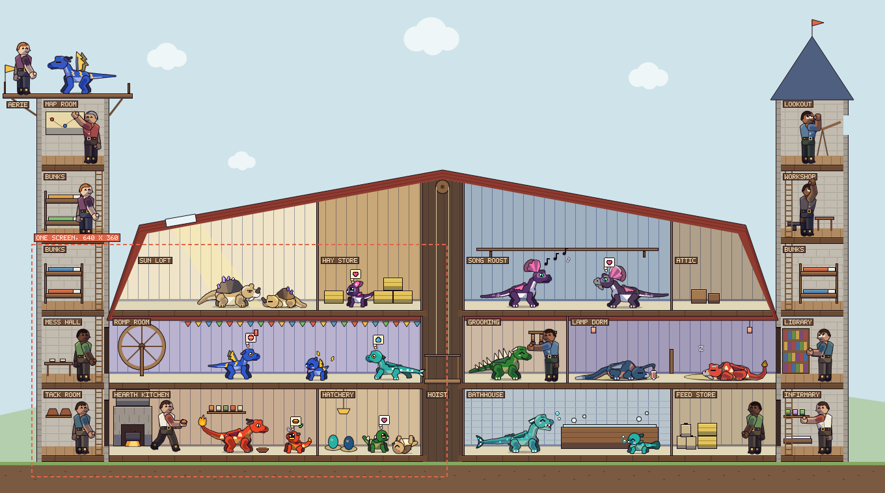
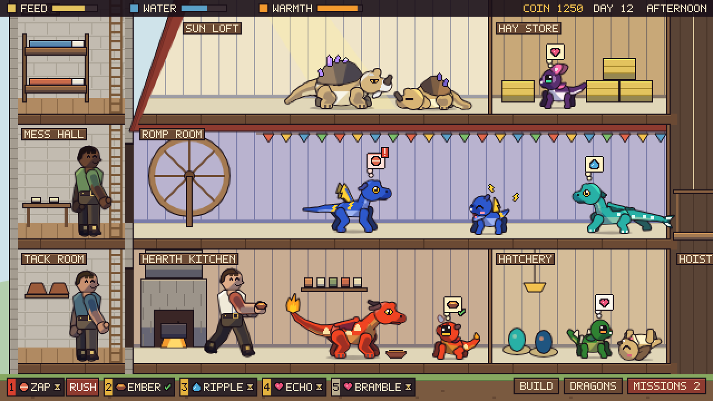
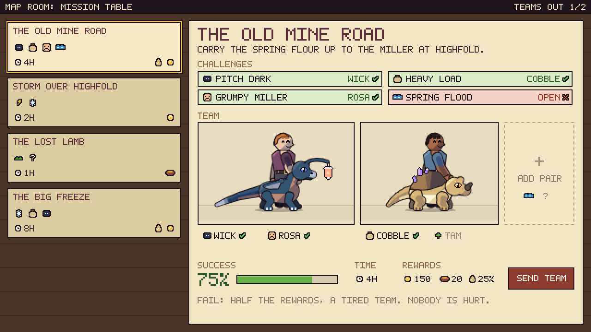
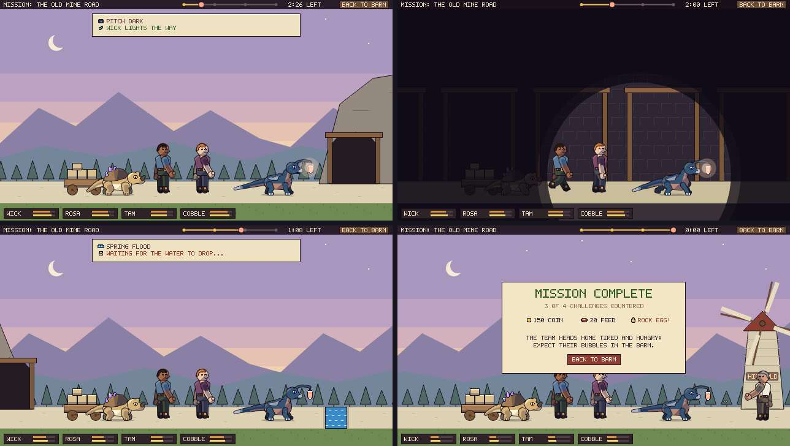

# Dragon Care: The Base (design v1)

**What this covers.** The layer the pet game grows into: a **barn** where the dragons live, **towers** where their
human teammates live, **managed care** (dragons have needs, keepers meet them), and **missions** the teams go out on
and that you can watch. It sits on top of the art in `docs/ART_BIBLE.md`, and every rule there still holds: where
this document leans on one, it names the section.

**Where it came from.** A design conversation with the user, with greybox mockups at the game's true scale (the
dragons in them are the real rigs, the people the engine's humanoid rig; everything else is placeholder blocks,
`docs/base/`). The references were Fallout Shelter (the cutaway, rooms that merge), Two Point Museum (expeditions,
rooms that earn their keep) and World of Warcraft's mission table (pick a team, counter the challenges, see the odds).

**Status.** Designed, and being built in slices. The first, needs and jobs, runs as `view=base` in the gallery, in the
building of sections 2 and 3: one room per need, the Dragon Lift and the Aerie (section 8).

*The first greybox mockup (this image and section 2's), drawn before the rooms were settled (#11): its Sun Loft, Hay
Store, Song Roost, Attic, Hoist, Feed Store, Mess Hall, Lookout, Workshop, Library and Infirmary are gone, and module 2
is now the Dragon Lift. Sections 2 and 3 describe the building as built; section 8's picture (`base/base_live.png`)
shows it.*

---

## Decisions

| # | Decision | Why (and what lost) |
|---|---|---|
| B1 | **The base is a side-view cutaway:** a barn for the dragons with a tower at each end for the people, scrolled at 1x like Fallout Shelter's vault. | The rig is side view, facing right, authored at scale 1 (1.1). A cutaway shows every room at once in that view. |
| B2 | **Care is managerial.** Dragons have needs that drain over time; keepers (the humans) walk over and meet them. The player's one per-dragon action is **Rush**. | Tapping every dragon every few minutes is a chore, not a game (the user's words: "that doesn't sound very fun"). The hands-on care of the art bible (spike's chin, dusk's tuck-in) becomes what keepers *do*, animated. |
| B3 | **Needs show as thought bubbles** over the dragons and as a **prioritised job queue** along the bottom of the screen. | The bubble says *which* dragon wants *what* at a glance; the queue says *what's next*. |
| B4 | **Missions are set and forget,** a mission table in the style of World of Warcraft: pick a team, the dragons' elements and the riders' skills counter the mission's challenges, a success chance, a reward. | Simple at this stage, by the user's choice; no choices mid-mission. |
| B5 | **Missions are watchable:** an animated side-scrolling scene of the team completing it. **The scene is the timer.** | The user wants to see the team at work; the side-view walk the rig already has makes it cheap. |
| B6 | **Everything runs only while the game is open.** One clock drives care, missions and hatching; closing the game pauses the world. | No coming back to a barn of red bubbles; no offline catch-up to build. Missions therefore last minutes of play, not hours. |
| B7 | **Humans are assigned automatically:** keepers to jobs, riders to the dragons you send. | Fewer clicks; the player's choices are *which dragons* and *what to build*. |
| B8 | **Cozy:** no combat. Missions have hazards, not enemies; nobody is hurt; old age is never decline (D21). | The game's face set has no angry face (D18) and the elder is a reward. |

*Young adult* in the user's request (#9: "start with a young adult dragon of each kind") means a dragon at the very
start of the adult stage; the stage before adult is called *young* (the art bible's stage names: baby, young, adult,
elder). A new game therefore starts with seven dragons, one per element, each 0 days into adulthood.

---

## 1. What the art already decides

- **Scale.** The screen is 640 x 360, upscaled with nearest neighbour. An adult dragon is 93 to 128 px long (an elder
  to 137) and 48 to 70 px tall (2.4); a human on the engine rig stands 72 to 76 px. The house style cannot shrink:
  a 1 px outline and nothing under about 2 px (5.2). So the base is drawn at 1x and **scrolled**; the whole of it is
  about 2 x 2 screens. A zoomed-out view has to be a different drawing (a blueprint of room blocks with a status dot
  per dragon), never the sprites made small.
- **Floors stay pale.** Gate (i) (5.4): every floor a dragon stands on sits >= 25 % in luminance from every body and
  belly colour, with saturation under 0.20; straw `#e0d6b8` is the reference. A grass floor would swallow spike. **A
  room's identity comes from its walls, props and light, never its floor.** Walls behind the dragons are kept
  mid-light and low in saturation (they separate from the ink, and from the dark bodies by value); gate (w) in
  `tools/palette-check.ts` holds every wall, and everything else a dragon is seen against, to that (7): lighter than
  every dark body, never darker.
- **Darkness hides the dark dragons.** Dusk's body sits at luminance 0.08 and slinkwing's at 0.05: a night sky or a
  mine swallows them whole. Dark places show the team **only inside a pool of light** (the mission tunnel, lit by
  dusk's lamp), and night outdoors stays mid-value (the blue hour of the mission mockup). The dragons are never tinted
  to fake night: every palette gate is measured on their own colours.
- **Each element already has exactly one need of its own** (3.8): fire's is food, spike's touch, rock's bond,
  lightning's play, water's baths, slinkwing's company, dusk's sleep. The barn's core rooms are that list.
- **Loose ends the base picks up.** Nothing consumes the anims' `shriek`, `call` and `hush` events yet (5.4); `bond`,
  `charge` and `wary` are fed only by the gallery; and several anims have no scene to play in: play, the baths of six
  elements, water floating belly-up ("the habitat has no water"), the grow-up, the fly and the hop-glide. The base
  gives each a home.

---

## 2. The building

*The mockup's screen, for the bubbles, the queue and the scale; its rooms are the old set (the Sun Loft, the Hay
Store, the Mess Hall, the Hoist, the Hatchery on module 2). The building as built is below, and in section 8's
picture.*

- **The barn** (the dragons): six modules wide on three floors, the ground floor, the upper floor and the **hayloft**
  under the gambrel roof. A barn room is 1 to 3 modules wide; rooms merge like Fallout Shelter's.
- **The Dragon Lift** is barn module 2 (x 488 to 648) on every floor: a shaft from the ground floor up through the
  roof to the Aerie. One car carries one dragon on a 152 px straw deck (an elder, at most 137 px, fits), between two
  40 px side rails, on two cables from a headframe that stands over the Aerie a room's height above the deck. It stops
  at the ground floor, the upper floor, the hayloft and the Aerie (floors 0, 1, 2 and 5; floors 3 and 4 are passed
  through), and a straw landing runs across the shaft on each barn floor. Keepers never ride it. Dragons ride it to
  their needs' rooms (below, "Moving around").
- **The ladder bay** is where the hay hoist was, between modules 2 and 3 (64 px): the keepers' centre ladder through
  the barn's three floors, a hatch in each slab, with straw floors running straight across it. The hoist went because
  dragons are to walk across the middle of the barn: its dark shaft (`#5a4436`, L 0.07) failed the floor gate (1),
  and a car passing through floors that dragons stand on would clash with them.
- **The towers** (the people): one at each end of the barn, five floors, a ladder up each. Their doors into the barn
  are human-sized, on the ground and upper floors: dragons don't fit, which is the reason for the split.
- **Windows.** The ladder bay has a window each side of its ladder on every floor, and each bare hayloft module has
  one: panes cut out of the back wall, so the sky shows through them (7: by day the day's, at night the night's; the
  ground floor's look out on the far hills). The towers have a window slit a floor in their outer walls, lit at dusk
  and night. A named room has none: its wall and its props are its identity (#11). Every wall, sky colour and big prop
  a dragon is seen against is a `src/game/surfaces.ts` backdrop, held by gate (w) (7).
- **The Aerie** is walkable **floor 5** (feet at y 136): one straw deck from x 8 to 648, over the left tower's top,
  then a gantry over the barn roof (x 168 to 488: a railing along its back, two trestles down to the roof and a knee
  brace to the tower), then the lift's head. The left tower's ladder climbs on to it. Teams will leave and land here (5).
- **Every floor is straw.** Every surface a dragon or a keeper stands on (a room's band, the landings, the ladder bay,
  the towers' boards, the lift car's deck, the Aerie deck) is a `FLOORS` colour in `src/game/surfaces.ts`, and
  `tools/palette-check.ts` gates every entry before anything stands on it: gate (i) against every dragon colour at every
  stage, gate (Ki) against the keepers' shoes and trousers, and HSV saturation under 0.20. There is one entry so far,
  straw `#e0d6b8` (L 0.674, S 0.18).

| Measure (px, at scale 1) | Value | Why |
|---|---|---|
| Barn module | 160 wide | one adult, or two babies, with room to turn (2.4) |
| Floor pitch | 112: 88 of wall, a 14 px straw band, a 10 px slab | 96 px of headroom over the feet; the tallest adult is 70, and a spread wing reaches about 20 over the shoulders (5.4) |
| Dragon Lift | module 2 (160 wide), a 152 px car deck | the longest elder is 137 px |
| Ladder bay | 64 wide | a keeper's ladder, and straw across it |
| Tower | 112 wide, 96 inside | a human is 72 to 76 tall and about 30 wide |
| Aerie | floor 5: x 8 to 648, feet at y 136 | one deck over the left tower, the roof and the lift's head |
| World | 1360 x 760, ground at y 712 | about 2 x 2 screens; the player pans |

**Moving around.** Keepers walk a floor and climb the three ladders: up each tower (the left one on to the Aerie) and
the centre ladder bay's through the barn; the towers and the barn meet on the ground and upper floors only. Dragons
have ways of their own, a net per stage: the barn's floors kept half a body's length from the walls (30, 56, 72 and 76
px, baby to elder: the measured extents), the hayloft between modules 1 and 5 only (clear of the low roof slopes), the
Aerie deck, and the lift between them; never a tower.

**A dragon with an open need walks to that need's room** (#7), riding the Dragon Lift between floors, and a keeper
meets it there (section 3's slots, 4.4). It walks by its walk anim's own root motion, frame by frame (`src/game/gait.ts`:
the body moves exactly as far each step as the anim's planted paws slide, so nothing skates; spike's creep and
slinkwing's pointer pause stand still for whole frames), and a reversal is a paper turn in place (6 steps, the facing
flipped halfway: the yard's). Among its jobs in the same tier it takes one met on its own floor before one a ride away.

**Waiting for the car.** A dragon going up or down waits at its side's landing, facing the bay, its snout just short
of the bay's edge. The ones waiting there, and the ones held at the bay's edge (the bay rule, below), stand in a
**line**: each at the place nearest the bay where its body covers no dragon's eye (ART_BIBLE 1.4) -- not the eye of a
dragon in a slot beside the landing (or of one coming to that slot), of one standing there, or of one ahead of it in
the line, whose rump its head is over (nose to tail: the mean of their half-bodies and 16 px apart, 88 px for two
adults). Each one waiting is drawn over the ones ahead of it and over the dragons in the slots; where no such place is
left (the room beside the landing full), it may stand drawn *behind* the dragons about it instead, where none of their
bodies covers its eye. A dragon on its way to the line may have to walk back to its place (an evictee leaving the slot
beside the landing that its evicter is coming to); one already waiting only ever steps up, and keeps its place (and
its turn for the car) if it changes where it is going but still rides from there. A slot beside a landing is not taken
while a dragon waits over it, and a dragon lingering in one (3) while others wait at that landing, or are on their way
to it, moves over to a free slot of its own room clear of the landing. Walking up to the bay (within 250 px of its
edge), a dragon keeps a step behind one walking up ahead of it the same way, so two never arrive on one spot; and a
crosser held at the bay's edge stops short of the places of anyone waiting ahead of it there, its snout clear of their
eyes.

What is left, and why. A dragon walking past one waiting (an alighter walking off toward the landing it came to, or a
crosser through a line) covers it for the moment it takes to pass. And a landing has room for only so many dragons
with every eye clear: the west landing of the ground and upper floors stands back to back with the Hearth Kitchen's
and the Romp Room's second slot (x 408, facing west: 27 px from the landing's front, so no drawing order keeps both
eyes clear), and while that slot is held by a dragon that cannot move over (being met, or the room full) it has room
for one waiting adult (behind both slots' dragons, x 319). When more queue there than it has room for, one stands
over another's eye, and the car takes that one first (below). The model the check counts with is the worst case (the
longest body and the widest eye of every element, and any body over the eye's x, tail tip included): about 5 s in 30
minutes on average (seeds 1 to 24; it was 26 s before these rules), 14 s at most (it was 80 s) (4.7, 8.1). Drawn, most
of what is left is the waiting one's tail passing under the head of the dragon in the slot, the eye clear. Only fewer
waiting (a car that keeps up) or a landing moved clear of the slots (the building's layout, section 3) would end it.

**The car.** It takes the waiting dragons one at a time, in this order: a rushed dragon's call first; then one caught
standing over another's eye, or under another's body (a landing crowded past its room), so that ends; then the one
going for the most pressing need; then any call waiting a minute or more; then, while its last rider walks off, a
caller who can walk in behind it; then a caller on the floor the car is at; then the front of a landing's line; then
the oldest call. It comes for its rider, who walks in to the car's middle once no other dragon is in the bay, turns
to face the side it will walk off, rides, and walks off; the car is its rider's until it has walked clear of the bay
(`src/game/travel.ts`). A caller on the far side may follow the last rider in while it walks off, nose to tail, its
body 8 px behind that one's; a rider turns in the car only once the one walking off is clear of its turn.

**The bay rule.** The lift bay (x 488 to 648) is also the way across each barn floor, so one rule keeps a moving car
clear of everyone and the shaft never showing one dragon over another:
- nobody (a keeper, or a dragon other than the car's rider) steps into the bay while the car moves past their floor,
  but waits at its edge (a keeper at x 478 or 658, a dragon in that side's line); nor, once a rider is walking in,
  on a floor its ride will pass, so the car finds the way clear when it goes;
- the car sets off only when nobody stands in the bay on any floor from where it is to where it goes; a departure
  blocked for 4 s closes the bay to newcomers until the car goes; anyone already in the bay walks on out, never
  stopping there;
- while the car stands at a floor for its rider there (about to board, walking in, aboard, walking off), no other
  dragon steps into the bay there -- but a dragon held at the bay's edge 40 s in all goes before the next rider boards;
- a dragon steps into the bay only if everyone in it walks its way (it follows them, nose to tail, its body 8 px
  behind the one ahead -- and behind one ahead stepping in with it, so two let go from the bay's edge at once go in one
  after the other), never into one coming the other way or standing there; a crosser that has stepped through a line
  toward the bay has the right of way, paused behind one ahead of it too: the car does not set off past its floor, no
  rider boards there (a rider still waiting to board waits for it, rather than holding it at the edge), and nobody
  steps in from the other side until it has crossed; it waits at the bay's edge only while the car moves past its
  floor, a rider is at work in the bay there, or one comes the other way;
- a dragon held at the bay's edge 40 s in all crosses next on its floor: nobody steps in the other way before it (the
  one waiting longer goes first), and it may step into a bay that is only closing (the car still standing, held by
  someone else), the car waiting for it too;
- a dragon near the bay does not start a turn that would swing its body into a bay the car is using, or over one in
  it; it waits at the edge.

---

## 3. Rooms

**Every named room has a purpose** (#11: "Rooms should only be named and have special furniture if the room has a
real purpose"): a dragon need, met there by a keeper, or a human or other action. **Each need is met in exactly one
kind of room, with a keeper** (#7: "Each room should be where a need is fulfilled - which need to be done by a
trainer"): a dragon with an open need walks to that room, and a keeper meets it there; nothing else raises a need. A place with no purpose is not a room: it is left bare (an empty wall, no props, no name). The code
holds each purpose (`src/game/layout.ts` `ROOM_INFO`, `STRUCTURES`), and `tools/sim-check.ts` proves every named room
is used: every mechanic that uses one counts it (`sim.stats.used`), and over the whole check each must show a use, or
be listed as planned for a later slice (and a planned one that shows a use fails, so the list is kept honest).

| Where | Room | Purpose | Built (the slice that uses it) |
|---|---|---|---|
| Ground floor, modules 0-1 | Hearth Kitchen | meets **food**: a keeper feeds the dragon here, with the bowl taken at the hearth | S2: food met there, bowls picked up |
| Module 2, floor to roof | Dragon Lift | carries dragons between the barn's floors and up to the Aerie | S3: dragons ride it (a ride completed) |
| Ground floor, modules 3-4 | Bathhouse | meets **bath**: a keeper washes the dragon here, with the bucket filled at the tub | S2: baths met there, buckets filled |
| Ground floor, module 5 | Hatchery | eggs lie in its three nests and hatch into babies | S5: an egg laid or hatched |
| Upper floor, modules 0-1 | Romp Room | meets **play**: a keeper plays with the dragon here, with a ball from the box by the wheel | S2: play met there, balls taken |
| Upper floor, modules 3-5 | Grooming Parlour | meets **love**, the busiest need (the own need of spike, rock and slinkwing): a keeper grooms and pets the dragon here | S2: love met there |
| Hayloft, modules 3-4 | Lamp Dorm | meets **sleep**: a keeper tucks the dragon in here | S2: sleep met there |
| Left tower, ground floor | Tack Room | riders take their saddles here before a mission and hang them back after | S8 |
| Left tower, floor 2 | Bunks | riders rest here after a mission | S8 |
| Left tower, floor 4 | Map Room | the mission table: the world map and the mission chooser | S8 |
| The roof (floor 5) | Aerie | teams gather here, leave and land | S8 |
| Right tower, ground floor | Garden Gate | the dragons' way out to the garden | S6 |
| Outside, east | Garden | the retired elders' home | S6 |

**Bare:** the hayloft's modules 0, 1 and 5; the left tower's floors 1 and 3; the right tower's five floors (its ground
floor becomes the Garden Gate in S6). **Dropped:** the Nursery, the Feed Store, the Hay Store and the Attic (nothing
used them); the Sun Loft and the Song Roost (love is met in one room, the Grooming Parlour); the Mess Hall, the
Library, the Workshop, the Infirmary and the Lookout (no mechanic); and two of the three Bunks.

**Slots.** A dragon room's dragons stand in fixed slots. Each module has one at its middle, facing the room's keepers
(a one-module room faces its post; in a two-module room the two dragons face each other, so their keepers work between
them; a three-module room faces +1, +1, -1), and two baby sub-slots 40 px in from its sides. A module holds either one
grown dragon or up to two babies; the Hatchery has baby sub-slots only. A keeper meets a dragon at its slot's **stand
spot**: in front of its snout (58 px for an adult), kept inside the room. A dragon going for a need **reserves** the
room's lowest free slot of its size and walks there; after its job it **lingers** in that slot (there is no home room)
until it leaves for another need. If the room is full, it moves on a lingerer (one with nowhere to be, no act and no
keeper coming: the lowest id), who walks to the nearest free slot elsewhere (one on its own floor first: a ride is
counted 600 px more, for the car's time); a Rush may also move on a holder whose keeper has not started work (the
lowest in the queue). A slot beside a lift landing is not free while a dragon waiting there stands over it, and a
lingerer in one moves over to a free slot of its own room while dragons wait at that landing (2). A dragon standing in a room that meets another of its jobs in
the same tier as its most pressing one takes that job first, and saves the walk. The new game starts with one dragon
per need room's first slot, the three love dragons filling the Grooming Parlour. Between jobs a keeper waits in their own
room at a spot clear of every slot's body, whatever the stage in it (the middle of the Hearth Kitchen, the Romp Room
and the Lamp Dorm; the Grooming Parlour's between its second and third slots), so a keeper at rest is never hidden
behind a dragon; the supplies are still taken at the hearth, the ball box and the tub. The room names hang on the
walls, drawn behind the dragons and keepers, so a name never covers a face.

**Neighbours** (later; all from traits the rig already has): slinkwing's shriek and lonely call carry one room over,
and dusk's `hush` calms the rooms around it; the hearth warms its neighbours; spike's wary latch (5.4) already
measures crowding, so spike wants a roomy room.

---

## 4. Needs and jobs

**4.1 Needs.** Every dragon has five: **food, sleep, play, bath, love**, each 0 to 1, draining over play time.
- Its element's own need (section 1) drains **twice as fast**: fire food, lightning play, water bath, dusk sleep, and
  love for spike, rock and slinkwing.
- **Fire has no bath need**: it hates baths.
- Stage scales every drain: baby 1.25, young 1.1, adult 1, elder 0.8.

**4.2 Bubbles and moods.** Below **0.5** a need opens a job and the dragon shows a white bubble; below **0.25** the
bubble turns yellow; below **0.1** red, with a "!". A dragon shows one bubble, its most pressing job's, with a green
check once a keeper has taken it. The worst need sets the dragon's **mood** (0.8 when every need is at 0.6 or more,
down to -1 when one is empty), and the rig draws it: the cue is the mood gauge (D7). An unmet play need charges
lightning's static (its crackle, then the zap: 3.5); a hungry dragon begs.

**4.3 The queue.** Every open job is in one queue, in this order:
1. rushed jobs;
2. then by tier (red, yellow, white);
3. then the dragon's own need first;
4. then the lower need;
5. then the longer wait;
6. then the older job (so the order never flickers, and the simulation stays deterministic).

**4.4 Keepers.** The humans on care duty; they are assigned automatically.
- **Taking a job.** A free keeper takes the highest job in the queue. Among jobs that are close in priority, a keeper
  prefers their **specialty** (the cook feeds, the groomer grooms, the handler plays and bathes) and the nearer dragon.
- **When.** A keeper goes to a job once its dragon is going for it, to a slot in the need's own room, and is there,
  or past its lift ride and nearly there (300 px of route left, so they meet about when it arrives) -- or, for a
  rushed job, anywhere past its lift ride (the keeper runs, so still meets it). No keeper stands at the stand spot
  while the dragon queues for the car: however near the room, a dragon still to ride may wait minutes for it when the
  barn is crowded (4.7), and the keeper takes another job meanwhile.
- **Doing it.** The keeper fetches the **supply** from the room's post (a bowl at the hearth, a ball from the box by
  the Romp Room's wheel, a bucket filled at the Bathhouse's tub), walks to the slot's stand spot and, if the dragon
  is not there yet, **waits** for it (watching it come). The job starts the moment the dragon stands in its slot,
  facing its way; the keeper does it while the dragon plays the anim for it:
  - food: `eat`, with the bowl the keeper set down;
  - love: `pet`;
  - play and bath: `happy`;
  - sleep: `sleep`, or dusk's `tuckin`. The keeper leaves once the dragon is down, and it sleeps on.
- **After.** The need refills while the job runs. The keeper takes the next job, or goes back to their station.

**4.5 Rush.** Tap a bubble (or its chip in the queue) and that job jumps to the top. Its dragon sets off for it at
once (taking a slot in the room from its lowest holder if the room is full, section 3) and its call for the lift goes
first. As soon as the dragon is near (4.4's "When"), the nearest keeper runs to it, at 1.6 times their pace:
- a free keeper, if there is one;
- otherwise the keeper on the lowest job, which goes back into the queue.

It costs nothing but the job it bumps. Rushed again and again (one every 30 s), the one car's queue is what a Rush
reorders, so a dragon not rushed can wait long enough for a need to touch empty (8.1).

**4.6 Rooms don't heal; keepers do.** A need rises only through a keeper's act, in that need's room (#7): the dragon
walks there, and the keeper meets it. A room no longer restores the need it meets (the regeneration of the first slices
is gone), and a job no longer closes by itself: every job opened is either done by a keeper or still open. A keeper
waiting at a stand spot gives the job back after 2 minutes if the dragon never comes (it never happens in the checked
run).

**4.7 Capacity.** A queue that keeps growing means too few keepers or the wrong rooms: hire, or build. Riders away on
a mission are not keeping, which is the price of sending a team (5.6).

**The Dragon Lift is the barn's limit today, not the keepers.** One car carries one dragon at a time, and a ride holds
it about 15 s: the rider's walk in to the car's middle (about 130 px) and off until clear of the bay (about 150 px),
both at the dragon's own walking pace (4.9: never hurried), plus the ride itself (under a second a floor). For about a
fifth of its time the car also waits for a dragon crossing the bay (the ground and upper floors' rooms lie on both
sides of it) to clear the floors it must pass. Never idle, it gives about 105 to 115 rides in 30 minutes. Measured on
the starting base (`npm run sim` section 10, and the seeds named), 30 minutes each:

| Dragons | Average wait | Longest | A need at 0 | The car |
|---|---|---|---|---|
| the start's 7 adults | 61 to 106 s (mean 76, seeds 1 to 48) | up to 335 s | never (48 seeds); in two hours, on one seed of 16, for 4 s | 95 % busy, about 105 rides |
| 8 adults | 79 to 144 s (seeds 1 to 8) | up to 346 s | on two seeds of eight, briefly | 99 %, about 109 rides |
| 9 adults | 131 to 216 s | up to 516 s | on five seeds of eight | 100 %, about 98 rides |
| 10 adults | 231 to 328 s | up to 865 s | on every seed, much of the time | 100 %, about 88 rides |
| 7 adults and 3 babies | 234 to 296 s | up to 749 s | on every seed, much of the time | 100 %, about 90 rides |
| the `ages` preset's 12 | 363 to 424 s | up to 1793 s | nearly always, for someone | 100 %, about 81 rides |

So the barn serves **seven grown dragons well and eight at a stretch**. More dragons give the car *fewer* rides, not
more (more crossings and more dragons moved out of slots hold it), and a baby walks at 0.15 to 0.30 px a frame, so
its ride holds the car about twice as long as an adult's.

**Why no tuning moves it.** The walk in and off is about 280 px a ride at 0.28 to 0.54 px a frame for adults: 9 to 17
s, about 12 s at the start cast's mean pace. So even never idle and never held by a crosser, one car gives at most
about 150 rides in 30 minutes. Seven adults open about 20 jobs each in 30 minutes and ride for about 0.8 of them:
about 110 rides, the car 95 % busy, and a job's wait is mostly its dragon's wait for the car (seeds 1 to 4: a job
waits 20 to 34 s for its dragon to finish another first, then 45 to 55 s while the dragon travels, 25 to 34 s of it
at the lift, then under a second at the slot). Ten adults would ask about 160 rides, past what the car could give even at that bound, so no
order of calls, placing rule or faster car within the plan's cap closes it; the start's waits sit above the plan's
first 60 s for the same reason (4.9). What was tried and measured, each within the noise at seven and eight dragons:
the car at 2.5 px a frame (about 5 s off the average wait at seven; 2 is the cap on that lever), closing the bay at
once instead of after 4 s, closing the floors the car will pass as soon as it takes a call (worse: crossers on the
upper floor starve), taking each landing's front caller first, keepers setting off only once a dragon is past its
ride, a dragon moved on avoiding a slot across the bay or
going for its own next job, a stronger own-floor preference, and call orders that favour following the last rider in
or the car's own floor. One more was measured and not built, because it changes when a job opens (4.3): a need met on
the floor a dragon stands on opening its job early (at 0.65 or 0.8, not 0.5), so one ride serves two needs. It cuts
the start's rides by about a quarter (the car 86 to 87 % busy, waits about 65 s), but ten dragons still run needs
empty on every seed. Growing the barn past eight (S5's hatchlings, S8's trips to the Aerie) needs a decision first: a
second car or a second lift, a cap on the barn's dragons, the early-opening rule above with more besides, or slower
drains.

**4.8 On screen.**
- **The top bar** (y 0 to 15, `src/game/hud.ts`), left to right:
  - the time of day, as the sky shows it (7): a sun by day, a low orange sun at dawn and dusk, the moon at night, and
    the clock, `DAY 3 14:00` (the minutes in tens; from day 100 `D100 14:00`, so the clock never runs into JOBS);
  - `JOBS n`, the open jobs (at x 90, or a space after a longer clock);
  - a badge per keeper (46 x 13, at x 138, 186, 234 and 282): a chip in the keeper's own top colour, the name, and a
    dot while at a job (display only; taking a keeper makes them tappable, S7);
  - three buttons: **NEW** (x 528: tap it twice within 2 s for a new barn), **II** (x 558: pause) and **>1X** (x 578:
    the speed, cycling 1x, 2x, 4x and 8x). A button is lit (`#6b4a34`) while it is in force: NEW asked, paused,
    faster than 1x. A tap on the bar goes to its buttons, never to the world under it.
- **Bubbles** over the dragons.
- **The job strip** along the bottom: the top five jobs in order, numbered, each chip in its tier's colour with a
  check or an hourglass. Tapping a chip pans to that dragon and rushes the job.
- **The hint** (drag to look around, tap a bubble to Rush) on an ink strip at the bottom right, beside the job strip;
  it gives way when the strip reaches it.
- **Toasts**, centred under the top bar for 3 s: "SURE? TAP AGAIN", "A NEW BARN", "NEW BARN: THE OLD SAVE DIDN'T FIT".
- **Panning:** drag the barn. **Keys:** 1 to 4 pick 1x, 2x, 4x and 8x; p pauses and plays.

**4.9 First numbers** (tuning, not law):

| | |
|---|---|
| Base drain | full to 0.5 in 7.5 minutes of play; a dragon's own need in 3.75 (`HALF_LIFE_S` 450; it was 6 and 3 until S3, see below) |
| Keeper pace | 1 px a frame walking, 0.8 climbing, 1.6 times either when rushed |
| Dragon pace | its walk anim's own: each frame's `move` at the anim's speed 1, 0.28 to 0.54 px a frame for adults (spike 0.28 and slinkwing 0.32 with their pauses, rock 0.30, dusk 0.40, fire and water 0.45, lightning 0.54); no hurrying, even under Rush |
| Fetching a supply | 40 frames |
| A job at the dragon | food 200 frames, love 160, play 200, bath 200; sleep: 90 of tuck-in, then 15 s asleep while it refills |
| A keeper sets off (`LEAD_PX`) | when the dragon is there, or past its lift ride with 300 px of route left; for a rushed job, as soon as it is past its lift ride |
| A keeper waits at the stand spot (`WAIT_MAX`) | at most 7200 frames (2 min), then gives the job back |
| The lift (`LIFT_SPEED`) | 2 px a frame, a floor in 0.93 s (the plan's third lever, 1 to 1.5, taken to its cap of 2) |
| The bay closes (`BAY_CLOSE`) | after a departure is blocked 240 frames (4 s) |
| A call is overdue (`OVERDUE`) | after 3600 frames (1 min): it is served before the follow-in, the car's own floor and the front of a line |
| Waiting at a landing (`LANDING_CLEAR`, `DRAGON_EYE`) | the snout 2 px short of the bay; nose to tail behind the one ahead (the mean of their half-bodies and 16 px: 88 px for adults); no body over an eye (an eye 21 to 38 px ahead of an adult's root) |
| Walking in behind the last rider (`FOLLOW_GAP`) | 8 px, body to body |
| Walking up to the bay (`APPROACH`) | within 250 px of the bay's edge, a dragon keeps `FOLLOW_GAP` behind one walking up ahead of it the same way |
| A dragon moved on picks a slot (`RIDE_PX`) | a ride counted 600 px more than its route: one on its own floor first |
| A dragon held at the bay's edge (`CROSS_MAX`) | 2400 frames (40 s) in all, and it goes before the next rider on its floor boards |

The changes from the first numbers were measured (`npm run sim`, 30 minutes on the starting base, section 8.1).
With the dragons walking and one car between the floors, the car is the barn's bottleneck (4.7). Served strictly
oldest call first, it made empty trips: jobs waited 131 s on average, and needs ran empty on five of six seeds.
Serving a caller on the car's own floor first (with a one-minute overdue rule, so nobody waits on for ever), then the
plan's third and fourth levers, a faster car and slower drains (its first two, `LEAD_PX` 450 and `QUEUE` 0.55, did not
help), brought that to 55 to 74 s as first built. That car let the next rider walk in through the last one walking
off, and anyone cross the bay through a rider; the shaft now shows one dragon at a time (the bay rule, 2), which costs
the car that overlap. Some of it came back: the next rider on the far side follows the last one in, nose to tail; a
landing's front is the snout's length from the bay, not half a body's; a rider's ride closes the floors it will pass
while it walks in; a dragon picks a job on its own floor first in the same tier, and one moved on takes a slot on its
own floor first. The car goes at 2 px a frame. With `HALF_LIFE_S` 420, the fourth lever as planned, a need still
touched empty on some seeds (one of 18 in 30 minutes; within two hours on seed 2); at 450 none did, so it is 450 -- a
step past the plan's lever, for the one-dragon shaft the plan did not count on: waits of 62 to 98 s on average over
seeds 1 to 18, the longest 185 to 307 s, and no need ever empty. The rules that keep eyes clear at a crowded landing
(2: walking up behind one ahead, a held crosser stopping short, a lingerer moving over, the car taking one caught over
an eye first, a waiting dragon keeping its place), the long-held crosser going next, and keepers setting off only once
the dragon is past its ride left the average where it was and shortened the worst waits (over seeds 1 to 48: a mean
of 76.4 s against 77.2 before them, the longest 335 s against 406, a landing 119 s against 157, the bay's edge 60 s
against 102, and no need empty on any seed against one), and cut the eye covered from 26 s to about 5 s in 30
minutes. Any such change moves one seed's own numbers by a fifth either way (seed 1's average went from 66.6 s to
87.6 s, seed 4's from 85.7 s to 65.6 s), so `npm run sim` gates the waits on seeds 1 to 3 together: their mean
average wait at most 100 s (83.5 measured), the longest 360 s (301.2), a landing wait 124 s (103.4), a rider held in
the car 25 s (20.5). The plan's first 60 s, 180 s and 60 s are not reached on any of 48 seeds at this car (4.7); the
gates that are the plan's own stay: no need empty, done >= 120, a keeper's wait at the
stand spot <= 20 s, the bay's edge <= 60 s.

---

## 5. Missions

- **5.1 The board.** The Map Room's table keeps 3 or 4 missions. Each has a region, a length (2 to 10
  minutes of play), 2 to 4 challenges and its rewards.
- **5.2 The team.** 1 to 3 **pairs**, each a rider and a dragon. You pick the dragons; each takes a rider
  automatically (B7):
  - its partner, if free;
  - else a free rider whose skill counters a challenge nobody covers yet;
  - else any free rider.

  Babies stay home; the young go only on the easy missions; elders go as guides (steadier, never weaker: D21).
- **5.3 Challenges and counters.**
  - **Dragons** counter terrain by element: the dark by dusk, heavy loads and rockfalls by rock, the cold by fire,
    storms by lightning, floods and deep water by water, thorns by spike, caves and lost things by slinkwing.
  - **Riders** counter people problems by skill: a grumpy miller by Charm, a hurt animal by Medic, fog by Navigator,
    and more as missions need them.
- **5.4 The odds.** 20 %, plus 15 % for each countered challenge, plus 5 % for each pair in a good mood and 5 % for
  each pair that are partners (tuning). Shown live while you pick; the empty slot hints at what's missing.
- **5.5 The outcome** is rolled when the team is sent (seeded, like everything in the simulation):
  - success: the full reward;
  - failure: half the reward and a tired team.

  Nobody is hurt.
- **5.6 Rewards.** Coin, feed and materials; **eggs**, which come from the regions, so exploring is how new elements
  arrive; curios that decorate rooms and give them a bonus; blueprints; recruits. The team comes home hungry and
  tired (its needs drain on the road: 6), so a mission always ends in a burst of bubbles in the barn.

---

## 6. Watching a mission

- **The scene is the timer.** From the table, the team walks out into a side-scrolling scene that lasts exactly as
  long as the mission.
- **The trip is a road with the challenges as stops.**
  - **Covered:** at a covered stop, whoever counters it has their moment. Dusk's lamp flares and lights the tunnel,
    the rock hauls the cart, the rider talks the miller round.
  - **Uncovered:** an uncovered stop is where the tension sits, and the team struggles (they wait out the flood). On a
    successful mission they get through, late; on a failed one, this is where they turn back.
- **What you see.** The team's food and sleep drain on screen. A banner names each challenge and who met it. The end
  is a result card.
- **Leaving.** "Back to barn" leaves the scene without stopping it, and a "team out" chip in the barn's HUD returns to
  it.
- **Built from data, not animated per mission.** A region is:
  - a backdrop in parallax layers;
  - a few set pieces (a tunnel, a ford, a mill);
  - one reusable *beat* per challenge type.

  The dragons walk their own walk, each played at the speed that keeps the team together without a skating paw (a
  walk's `move` is its world speed: 4.1). New work: a human walk cycle (the engine rig has none authored here) and the
  beat library.
- **The dark** follows section 1: in the tunnel only the lamp's pool of light is open, stepped in flat rings (no
  gradients).

---

## 7. Time

- **One clock.** One simulation clock, fixed 60 Hz steps, running only while the game is open (B6). Care, missions,
  hatching and growing up all read it. It counts game time, in steps since day 1's midnight (`src/game/clock.ts`; the
  simulation keeps `clock0 + tick`).
- **The day.** A game day is **10 800 steps: 3 minutes at 1x** (23 s at 8x). A new game starts at 07:00 on day 1
  (`hour=` starts one at another hour). The phases: **dawn** 05:00 to 07:00, **day** 07:00 to 18:00, **dusk** 18:00 to
  20:00, **night** 20:00 to 05:00. The sky turns into a phase over its first hour, in three stepped thirds (each a flat
  mix of the two phases' colours: no gradient, no alpha).
- **Night lives in the sky and the lights; the dragons, floors and walls never change.**
  - The sky is drawn behind the building, in screen space: three flat bands, far hills and clouds at half the camera's
    pace, and at night the moon and 24 stars at a fifth of it (the stars come out a third at a time as the night comes
    on, and go the same way at dawn). The barn's windows (2) show it.
  - The lights follow the sky, not the clock's phase (the sky turns into a phase over its first hour, so at 20:00 it
    is still the dusk's and at 05:00 still the night's; `src/game/sky.ts` `lightsOf`): as the dusk's sky turns (from
    18:20) and until the dawn's has (06:00), the towers' window slits are lit and each Lamp Dorm lamp throws stepped
    rings on its wall, the inner one and then both (they go out the same way), never on the floor's band; while the
    stars are out the hearth throws one on the kitchen wall and the hayloft's skylight shows the sky and a star. The
    top bar's sun or moon is the one the sky mostly shows.
  - Nothing tints a dragon, a floor or a wall. The night is a mid-value blue hour (its bands L 0.19 to 0.28), never
    black, so a dark dragon on the Aerie still shows against it. Gate (w) in `tools/palette-check.ts` holds every sky
    colour at every phase and every stepped mix between two, every wall and the lamps' light >= 25 % *lighter* than
    every dark body (lightning, dusk and slinkwing, at every stage: so L >= 0.159, and a black night fails), the big
    props right behind a slot (the hearth and its dark firebox, the tub, the dorm's pallets) >= 25 % from them either
    way, and all 6 Oklab L from the ink: 1001 gates, all passing (ART_BIBLE 5.8).
  - The barn's care never reads the day's phase: a barn started at noon and one started at ten at night, stepped alike,
    are the same barn (`npm run sim` section 12), and `view=base&layers=world` (the world alone: the building, the car,
    the cast, the bubbles and the plates) is the same picture at noon and at ten at night (`npm run smoke`). Only a
    garden resident's naps (S6) and the dawn's mission board (S8) will read it.
- **Speed.** The top bar's speed button and the keys 1 to 4 run 1, 2, 4 or 8 whole world steps a frame; pause (II, or
  p) runs none, and only the camera and the HUD move. A faster speed is more of the same fixed steps, never longer
  ones, so the world is the same at every speed, only sooner. Speed is the view's: never saved, and 1x after a load.
  (At 4x and 8x an effect's 3 to 6 frame keys can change every frame drawn: ART_BIBLE 5.1, accepted as the
  fast-forward look.)
- **Saves.** The browser keeps the barn (`localStorage`, key `dragon-care/base`; `src/game/storage.ts` is the only code
  that touches it). It is loaded when the game's page opens, and saved every 10 s of play (600 frames) and when the
  page is hidden or left; closing pauses the world (B6). A save is the whole world as JSON, loaded back exactly
  (`src/game/save.ts`). **NEW** (tap twice) starts a new barn on a fresh seed, and it replaces the old one. A save this
  build can't read (another version, not a save at all, or one whose insides it can't build, step once and draw: an
  element, a stage or a keeper it doesn't know) starts a new barn, with a toast ("NEW BARN: THE OLD SAVE DIDN'T
  FIT"), and the old save is kept aside at `dragon-care/base.bak`; nothing of it is swapped in until the whole trial
  has passed, so a broken save never freezes the page or is written back. **The tests and `t=` are exempt:** a frozen
  page (`t=`), a preset page, a page given `hour=`, `save=0` and every headless check never read or write it, so `t=`
  always shows the new game (or the preset) stepped t times at 1x, whatever the browser holds.
- **Seeded.** Every random choice (a mission's roll, a starting need, a keeper's tie-break) goes through the engine's
  seeded RNG (`src/lib/engine/rng.ts`); after the world is built every draw is stateless (`rngAt`), so a save keeps
  only the seed. That keeps a run reproducible and keeps the gallery's frozen-time screenshot contract (`t=`) true for
  the base too. The one seed drawn from the browser's randomness is NEW's.

---

## 8. Build order

1. **Needs and jobs.** Built. Run `npm run dev` and open `index.html` (this is the game's default page; `?view=base`
   still names it, for the gallery's other debug views): drag to look around, and tap a bubble, a job chip or a
   dragon to Rush it. Each dragon walks to its need's room, riding the Dragon Lift between floors, and a keeper meets
   it there (#7). The four keepers are the named cast of `docs/KEEPERS.md`, each in the anim closest to its job
   while this slice's own simulation walks it and picks what it's doing (KEEPERS.md's status has the join). The page
   takes `seed=`, `cam=x,y` (where the camera starts, world px), `preset=ages` (a code-built start with every stage:
   the base's first twelve-dragon cast) and `save=0` (a live page that never loads or saves; a preset page never
   does either); `t=` freezes it as in every gallery view. The gallery's own keys (the arrows, Space, E, the digits)
   do nothing here, and its arrows step over the base, so a debug view reached with them can still be left.
   **Time is built too** (7): the day and night (a day is 3 minutes at 1x: watch one whole, or in 23 s at 8x), the
   speed (the top bar's button, the keys 1 to 4, and p to pause), and the barn kept in the browser (a reload resumes
   it; NEW, tapped twice, starts another). The page also takes `hour=0..23` (the hour day 1 starts at; like a preset
   page, a page given an hour never loads or saves, so it always starts at that hour) and `layers=world` (the world
   drawn alone, for the no-tint check).

   ![The built slice, 49 s in, in the start frame: RIPPLE walks off the Dragon Lift's car at the upper floor to the Romp Room, and Pip, sent for it now it is past its ride, goes for a ball at the box by the wheel; ZAP waits at the ground floor's east landing for the car up to the Lamp Dorm, back to back with COBBLE walking into the Bathhouse's first slot (Tomas brings the bucket, out of frame); WICK waits at the hayloft's east landing for the car down to the Romp Room; ECHO walks past BRAMBLE in the Grooming Parlour on its way down to the Bathhouse; Bea waits in the Hearth Kitchen; the job strip](base/base_live.png)

   | File | What it is |
   |---|---|
   | `src/game/pet.ts` | the pet code, moved out of `src/gallery.ts` unchanged (the gallery renders pixel for pixel as before), and the paper turn the base's dragons turn with |
   | `src/game/needs.ts` | the five needs, the drains, the tiers, mood and lightning's charge |
   | `src/game/layout.ts` | the grid; the rooms, each with its purpose (#11), and their dragon slots and stand spots; the Dragon Lift and the Aerie; the keepers' net (the ladders) and a dragon net per stage (the lift); routes between any two spots on a net; the name plates' places |
   | `src/game/surfaces.ts` | every floor anyone stands on (`FLOORS`: straw), and everything a dragon is seen against (the walls, the sky's colours at every phase, the big props behind a slot, the lamps' light), each gated by `tools/palette-check.ts` (i, Ki, w) |
   | `src/game/clock.ts` | the day's length and phases, the speeds, reading the clock (the day, the time, the phase and the sky's stepped turn) |
   | `src/game/sky.ts` | the sky behind the building, in screen space: the bands, the far hills and clouds, the moon and the stars |
   | `src/game/hud.ts` | the top bar (the clock, the jobs, the keepers' badges, NEW, pause, the speed), the toasts and the hint |
   | `src/game/storage.ts` | the only code that touches the browser's storage: load the barn (or set aside one that doesn't fit), save it, forget it |
   | `src/game/start.ts` | the starting base: the rooms of section 3, seven newly adult dragons (one per element, 0 days into adulthood), each in a slot of its own need's room, and the four named keepers |
   | `src/game/presets.ts` | code-built starts for views that need what a new game hasn't got (`ages`: every stage) |
   | `src/game/sim.ts` | the care simulation: the queue, the keepers' trips and jobs (fetch, go, wait at the stand spot, work), and Rush; no drawing, seeded, deterministic; dragons with stable ids, a clock, and its options (seed, day length, start time) |
   | `src/game/travel.ts` | the dragons on the move: each chooses its need's room and takes a slot there (moving a lingerer on, or bumping a holder for a Rush), walks and turns, waits in a landing's line where it covers no eye, and rides the Dragon Lift; the lift's car and its calls; the bay rule, and one dragon at a time in the shaft; how deep each dragon is drawn |
   | `src/game/gait.ts` | each element's walk at each stage as a table of per-frame root motion, the pace the simulation walks a dragon at |
   | `src/game/save.ts` | the save format: the whole world as JSON, every reference an id, loaded back exactly (`CareSim.fromSave`); the digest two runs compare |
   | `src/game/rand.ts` | stateless draws (`rngAt(seed, tag, ...keys)`): no RNG state is ever kept or saved |
   | `src/game/building.ts`, `people.ts`, `icons.ts` | the greybox building (its rooms, the lift's shaft, car and headframe, the ladder bay, the windows, the Aerie's deck and gantry) and its lights by night, the keepers on the named cast's rig (`docs/KEEPERS.md`), their walks played at their pace, the bubbles and chips |
   | `src/game/base.ts` | the live view: the simulation driving the dragons (where they stand, their walks, turns and rides) and their anims, the lift's car, the sky and the lights, the speed, the camera, the HUD and the input; a live page loads and saves the barn |
   | `tools/sim-check.ts` | `npm run sim`, in `npm run check`: every route on the keepers' and the dragons' nets, 30 minutes of play on three seeds with its invariants (the bay rule, one dragon at a time in the lift's shaft, no eye under a standing body but for a moment), determinism, Rush (a keeper sent once the dragon is near, one taken off a lower job, a slot bump, and a Rush every 30 s), the start cast, saves (a loaded world steps on exactly as its original, mid-ride too), `rngAt`, the rooms (a purpose each, one room per need, every named room used over the check unless planned), the gait (the walks against their anim tables and players, a walk with an intro, a scripted walk as far as the anim carries it), and one car's capacity (eight adults, ten, and the `ages` preset's twelve: the ceiling, measured and frozen); the clock (every phase's start, the sky's stepped thirds, a whole day read step by step), and night not the barn's (a barn started at 07:00 and one at 19:00 the same barn for 20 000 steps; no simulation module reads the phase) |

   Measured by `npm run sim` on the starting base (its seven dragons and four keepers): over 30 minutes of play (seed
   1), 136 jobs opened and 128 were done, every one by a keeper (none closed on its own). A keeper started on a job
   87.6 s after it opened on average (301.2 s at most), most of it the dragon's own walk and its wait for the lift; no
   need ever emptied. Keepers who reached the stand spot first waited 7.5 s on average for the dragon, and none gave
   up. The dragons walked 93 057 px and rode the lift 112 times (a wait at a landing of 103.4 s at most, a rider held
   in the car at most 20.5 s while the bay cleared); dragons were held at the bay's edge at most 42.1 s and keepers 3.1
   s; 43 lingerers were moved on. The shaft never showed two dragons one over the other; an eye was under the body of a
   dragon standing over it 2.9 s in all (8 moments, the longest 2.5 s: section 2's "What is left"). Every dragon had
   its needs met in four rooms or more (EMBER, which has no bath need, in four; the rest in five), and the rooms were
   used 48 (Hearth Kitchen), 48 (Bathhouse), 54 (Romp Room), 28 (Grooming Parlour), 25 (Lamp Dorm) and 112 (the lift)
   times. Seeds 1 to 3 together (the check's service gates): average waits of 87.6, 74.6 and 88.3 s (mean 83.5), 301.2
   s at most, no need empty, the bay's edge 55.5 s at most, an eye covered 4.2 s in all (2.5 s at most). Over seeds 1
   to 48: waits of 61 to 106 s on average (mean 76.4), 335 s at most, no need empty; over seeds 1 to 24 an eye covered
   about 5 s in 30 minutes on average, 14 s at most. Over two hours on seeds 1 to 16: no invariant broken and no
   keeper giving up; a need touched empty on one seed, for 4 s, and the longest waits at a landing and at the bay's
   edge grow past the 30-minute gates on some seeds (159 s and 63 s). A Rush every 30 s for 30 minutes (seed 1): no
   need empty, every rushed job done within 124.6 s, keepers standing for rushed dragons 9.3 % of their time; for an
   hour on seeds 1 to 6 a need touched empty on one (1533 steps). Eight adults (seed 1): waits of 113 s on average, no
   need empty; nine or more empty needs (4.7). (With the dragons in their slots and the rooms restoring their needs,
   S2's building gave 149 opened, 146 done, 14.5 s and 41.0 s; its checks wanted 30 s and 120 s, and this slice's want
   a mean of 100 s and 360 s over three seeds: 4.9 says why.) Not in this slice:
   - the seven span more than one screen, so the start camera shows some of them and a drag shows the rest; they
     no longer stay put;
   - nothing uses the Hatchery, the riders' rooms or the Aerie yet (section 3's table says which slice does), so no
     dragon rides the lift to the Aerie yet;
   - one car serves seven grown dragons well and eight at a stretch; more (hatchlings, Aerie trips) need a decision
     first (4.7);
   - a dragon walking past one waiting at a landing (an alighter walking off toward it, a crosser through a line)
     covers it for the moment it takes to pass, and a landing crowded past its room leaves one over another's eye
     until the car takes it (section 2);
   - the base is the fixed starting one (or a preset); it is kept in the browser (7), but there is one barn, with no
     save slots;
   - no building of rooms (the rooms are section 3's fixed set), and no missions.
2. **Rooms you build:** place, merge and upgrade rooms; move dragons between them; ~~save and load~~ (built: 7).
3. **Missions:** the table, then the scene.
4. **The rest of the world:** people's own lives (the bunks), eggs and hatching, ~~day and night~~ (built: 7), the
   neighbour effects, the blueprint zoom-out.

## 9. Open questions

- ~~Should a dragon ever take itself to a room (a tired dragon to the Lamp Dorm), or only ever be moved by the
  player?~~ Resolved (S3, #7): every dragon takes itself to its needs' rooms, and a keeper meets it there (2, 3, 4.4).
- Day and night: dusk is the early sleeper and slinkwing the night owl (3.7, 3.8). ~~A night shift of keepers?~~
  Deferred (S4, plan P15): the barn keeps no keeper day and night rhythm in v1 (the care never reads the phase: 7),
  and a resting keeper stays assignable. The elements' own night habits wait with it.
- Is any care kept as a player action, the grow-up (240 f, "look at me") above all?
- ~~The wall gate's exact rule, once the room palette exists.~~ Answered (S4): gate (w) (7) holds every wall, sky
  colour and lamp's light >= 25 % lighter than every dark body, every big prop behind a slot >= 25 % from them either
  way, and all 6 Oklab L from the ink.
  A prop's cel shadow band and its 1 px lines are marks, not backdrops, and are not gated.
- Night in the start frame is quiet: the barn's windows, the Lamp Dorm's lamp and the hearth's glow change (about 2 %
  of the frame at 23:20 against noon); the sky, the stars and the moon show once the camera is on the roof or the
  Aerie. A lantern in each named room, lit at dusk with its own stepped rings (gated by (w) like the dorm's), would say
  more -- but a lamp is furniture (#11: a room's props are its purpose) and the Lamp Dorm's own mark, so it waits for
  a design call rather than being added with the time slice (S4 review).
