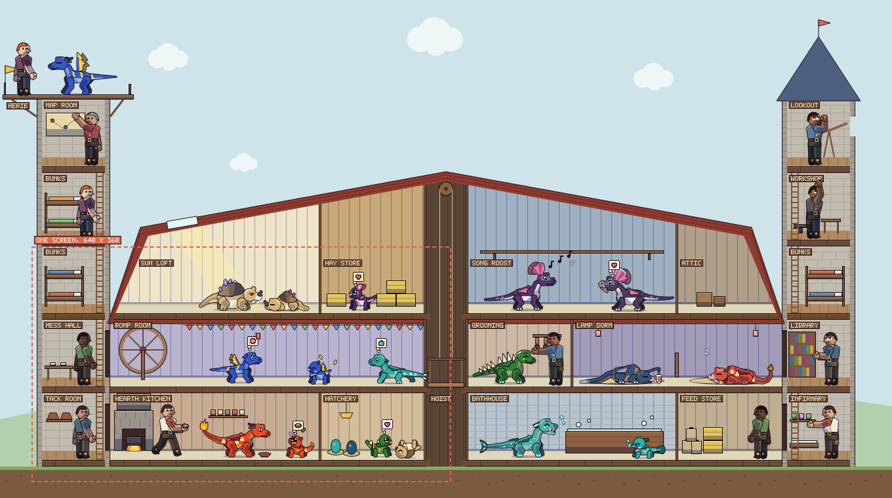
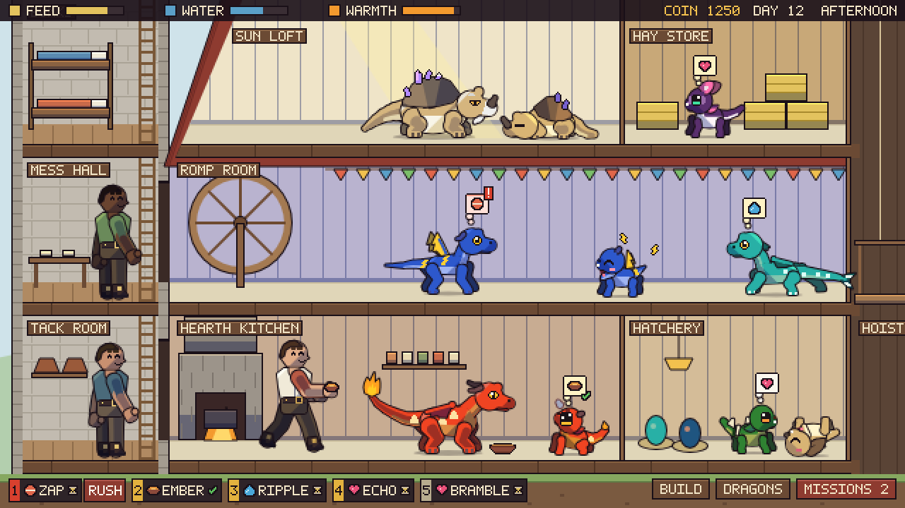
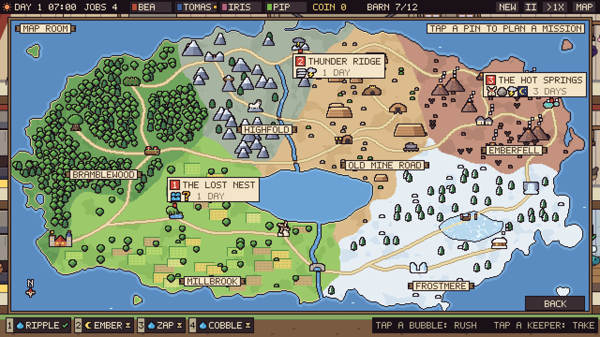
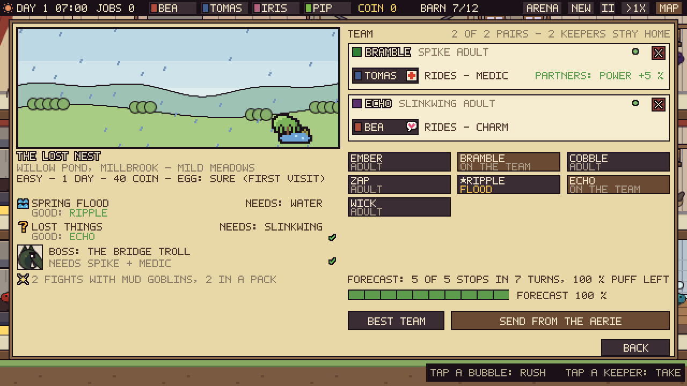
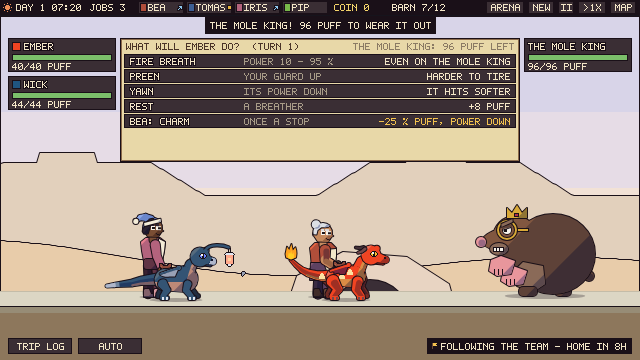

# Dragon Care: The Base (design v1)

**What this covers.** The layer the pet game grows into: a **barn** where the dragons live, **towers** where their
human teammates live, **managed care** (dragons have needs, keepers meet them), and **missions** the teams go out on
and that you can watch. It sits on top of the art in `docs/ART_BIBLE.md`, and every rule there still holds: where
this document leans on one, it names the section.

**Where it came from.** A design conversation with the user, with greybox mockups at the game's true scale (the
dragons in them are the real rigs, the people the engine's humanoid rig; everything else is placeholder blocks,
`docs/base/`). The references were Fallout Shelter (the cutaway, rooms that merge), Two Point Museum (expeditions,
rooms that earn their keep) and World of Warcraft's mission table (pick a team, counter the challenges, see the odds).

**Status.** Built, as the game's default page (`view=base`), in the building of sections 2 and 3: the need rooms,
repeated on the barn's floors, the Dragon Lift, the Aerie and the elder garden; dragons walking to their needs and
keepers meeting them (4), the clock, day and night, the speed and the barn kept in the browser (7), growing up, eggs and
hatching and the barn's cap (7, 4.7), taking a keeper by hand (4.10), and missions -- the Map Room's table, the team, the
trip from the Aerie, the watchable scene (5, 6). Section 8 says what each part is and how it is checked; section 9 what
is still open.

**Issues #5 to #11: what implements each.**
- **#5 Missions:** the Map Room's table (5.1: the world map -- a little island of places to visit, each mission met at
  one, the regions under cloud revealed by success -- the chooser with its climate picture), the team and its riders
  (5.2), challenges met by elements and rider skills, shown up front and met on the road (5.3), the odds and the
  seeded outcome (5.4, 5.5), coin and eggs brought home to the Hatchery (5.6), big baddies calmed, outwitted or driven
  off (5.3, 6; a baddie's road is on the board every fourth day from day 3: 5.1), sent from the Aerie (the muster, the
  sky bridge, the landing), and the watchable scene (6) -- `missions.ts`, `regions.ts`, `worldmap.ts`, `maptable.ts`,
  `missionview.ts` and the mission art kit;
  `npm run sim` sections 17 to 24 and 26.
- **#6 Take a keeper:** a tap, a badge or Tab takes one; WASD or the arrows walk and climb; E or Space picks up,
  serves and puts back; Esc, LET GO or a tap on empty space lets go; a touch pad (4.10) -- `control.ts`; section 25.
- **#7 Dragons move by needs:** every dragon walks to a room meeting its open need, on its own floor first, riding the
  Dragon Lift between floors, and a keeper meets it there (2, 3, 4) -- `travel.ts`, `sim.ts`; sections 2, 4, 9, 10.
- **#8 Growing up, day and night, speed:** a stage is 30 game days (growing up and hatching: 7), the sky, lights and
  walls turn with the clock (never a dragon), the speed button and pause, and the barn saved in the browser (7) --
  `clock.ts`, `life.ts`, `sky.ts`, `storage.ts`; sections 11 to 14.
- **#9 Young adults:** a new game starts with seven dragons, one per element, each on the first day of the adult stage
  (the Decisions) -- `start.ts`; section 5.
- **#10 The elder garden:** elders retire 30 days into the stage through the Garden Gate to a garden that grows a plot
  for each, where they nap, sit and stroll with few needs -- all but the barn's last flier, which stays until another
  dragon can fly a mission (3, The Garden) -- `garden.ts`, `gardenArt.ts`, `life.ts`; sections 15 and 16.
- **#11 Rooms with a purpose:** every named, furnished room has one, each copy of a need's room included, and every one
  is proven used; the rest of the building is bare (3) -- `layout.ts` `ROOM_INFO`; section 8.

*The first greybox mockup (this image and section 2's), drawn before the rooms were settled (#11): its Sun Loft, Hay
Store, Song Roost, Attic, Hoist, Feed Store, Mess Hall, Lookout, Workshop, Library and Infirmary are gone, and module 2
is now the Dragon Lift. Sections 2 and 3 describe the building as built; section 8's picture (`base/base_live.png`)
shows it.*

---

## Decisions

| # | Decision | Why (and what lost) |
|---|---|---|
| B1 | **The base is a side-view cutaway:** a barn for the dragons with a tower at each end for the people, scrolled at 1x like Fallout Shelter's vault. | The rig is side view, facing right, authored at scale 1 (1.1). A cutaway shows every room at once in that view. |
| B2 | **Care is managerial by default; you may take any one keeper by hand** (4.10). Dragons have needs that drain over time; keepers (the humans) walk over and meet them. The player's one per-dragon action is **Rush**; a keeper taken by hand is walked by the player and does the chores the player picks (#6). | Tapping every dragon every few minutes is a chore, not a game (the user's words: "that doesn't sound very fun"). The hands-on care of the art bible (spike's chin, dusk's tuck-in) becomes what keepers *do*, animated. |
| B3 | **Needs show as thought bubbles** over the dragons and as a **prioritised job queue** along the bottom of the screen. | The bubble says *which* dragon wants *what* at a glance; the queue says *what's next*. |
| B4 | **Missions are set and forget,** a mission table in the style of World of Warcraft: pick a team, the dragons' elements and the riders' skills counter the mission's challenges, a success chance, a reward. The challenges are shown up front, with who at home meets each (the chooser: 5), and met on the road (the scene: 6). | Simple at this stage, by the user's choice; no choices mid-mission. |
| B5 | **Missions are watchable:** an animated side-scrolling scene of the team completing it. **The scene is the timer.** (Built and confirmed, 6: the scene is a pure function of the trip and the world's clock and lasts exactly as long as the trip; its result card shows when the trip's time is up.) (Amended: "On a mission you never turn back; the pass fail happens at the end" -- every team walks its whole road, and only the result card, at the road's end, tells a success from a failure: 5.5, 6.) | The user wants to see the team at work; the side-view walk the rig already has makes it cheap. |
| B6 | **Everything runs only while the game is open.** One clock drives care, missions and hatching; closing the game pauses the world. | No coming back to a barn of red bubbles; no offline catch-up to build. Missions therefore last minutes of play, not hours. |
| B7 | **Humans are assigned automatically:** keepers to jobs, riders to the dragons you send (each pair's rider is filled in for you, and you may swap it: 5.2) -- unless you take one (4.10): the keeper you hold is left out of every automatic pick, riders included, until you let go. | Fewer clicks; the player's choices are *which dragons* and *what to build*. |
| B8 | **Cozy:** no combat, and nobody is hurt. Missions have hazards, and some end in a big baddie that is outwitted, calmed or driven off, never fought or killed. Old age is never decline (D21); retiring to the garden is the elder's reward, a place and never a farewell (3, The Garden). | The game's face set has no angry face (D18) and the elder is a reward. (Amended for #5: "Some of the missions might end with a big baddie" -- a baddie, but a cozy one.) |

*Young adult* in the user's request (#9: "start with a young adult dragon of each kind") means a dragon at the very
start of the adult stage; the stage before adult is called *young* (the art bible's stage names: baby, young, adult,
elder). A new game therefore starts with seven dragons, one per element, each 0 days into adulthood.

---

## 1. What the art already decides

- **Scale.** The screen is 640 x 360, upscaled with nearest neighbour. An adult dragon is 93 to 128 px long (an elder
  to 137) and 48 to 70 px tall (2.4); a human on the engine rig stands 72 to 76 px. The house style cannot shrink:
  a 1 px outline and nothing under about 2 px (5.2). So the base is drawn at 1x and **scrolled**; the whole of it is
  about 2 x 2 screens. A zoomed-out view has to be a different drawing (a blueprint of room blocks with a status dot
  per dragon), never the sprites made small.
- **Floors stay pale.** Gate (i) (5.4): every floor a dragon stands on sits >= 25 % in luminance from every body and
  belly colour, with saturation under 0.20; straw `#e0d6b8` is the reference. A grass floor would swallow spike. **A
  room's identity comes from its walls, props and light, never its floor.** Walls behind the dragons are kept
  mid-light and low in saturation (they separate from the ink, and from the dark bodies by value); gate (w) in
  `tools/palette-check.ts` holds every wall, and everything else a dragon is seen against, to that (7): lighter than
  every dark body, never darker.
- **Darkness hides the dark dragons.** Dusk's body sits at luminance 0.08 and slinkwing's at 0.05: a night sky or a
  mine swallows them whole. Dark places show the team **only inside a pool of light** (the mission tunnel, lit by
  dusk's lamp), and night outdoors stays mid-value (the blue hour of the mission mockup). The dragons are never tinted
  to fake night: every palette gate is measured on their own colours. The walls may shift with the hour (7: the
  moonlit night colours, each gated like a day wall), the dragons and the floors never.
- **Each element already has exactly one need of its own** (3.8): fire's is food, spike's touch, rock's bond,
  lightning's play, water's baths, slinkwing's company, dusk's sleep. The barn's core rooms are that list.
- **Loose ends the base picks up.** Nothing consumes the anims' `shriek`, `call` and `hush` events yet (5.4); `bond`,
  `charge` and `wary` are fed only by the gallery; and several anims have no scene to play in: play, the baths of six
  elements, water floating belly-up ("the habitat has no water"), the grow-up, the fly and the hop-glide. The base
  gives each a home.

---

## 2. The building

*The mockup's screen, for the bubbles, the queue and the scale; its rooms are the old set (the Sun Loft, the Hay
Store, the Mess Hall, the Hoist, the Hatchery on module 2). The building as built is below, and in section 8's
picture.*

- **The barn** (the dragons): six modules wide on three floors, the ground floor, the upper floor and the **hayloft**
  under the gambrel roof. A barn room is 1 to 3 modules wide; rooms merge like Fallout Shelter's. The barn as built has
  one-module rooms only: a need's rooms repeat on the floors, so the herd's needs are met on its own floors (3, 4.7).
- **The Dragon Lift** is barn module 2 (x 488 to 648) on every floor: a shaft from the ground floor up through the
  roof to the Aerie. One car carries one dragon on a 152 px straw deck (an elder, at most 137 px, fits), between two
  40 px side rails, on two cables from a headframe that stands over the Aerie a room's height above the deck. It stops
  at the ground floor, the upper floor, the hayloft and the Aerie (floors 0, 1, 2 and 5; floors 3 and 4 are passed
  through), and a straw landing runs across the shaft on each barn floor. Keepers never ride it. Dragons ride it to
  their needs' rooms (below, "Moving around").
- **The ladder bay** is where the hay hoist was, between modules 2 and 3 (64 px): the keepers' centre ladder through
  the barn's three floors, a hatch in each slab, with straw floors running straight across it. The hoist went because
  dragons are to walk across the middle of the barn: its dark shaft (`#5a4436`, L 0.07) failed the floor gate (1),
  and a car passing through floors that dragons stand on would clash with them.
- **The towers** (the people): one at each end of the barn, five floors, a ladder up each. Their doors into the barn
  are human-sized, on the ground and upper floors: dragons don't fit, which is the reason for the split -- except the
  **Garden Gate's arch**: the right tower's ground floor is the Garden Gate (3), an 84 px arch in both its walls (the
  towers' other doors are 70) with a straw floor straight through, the dragons' way out to the garden.
- **Windows.** The ladder bay has a window each side of its ladder on every floor, and each bare hayloft module has
  one: panes cut out of the back wall, so the sky shows through them (7: by day the day's, at night the night's; the
  ground floor's look out on the far hills). The towers have a window slit a floor in their outer walls, lit at dusk
  and night. A named room has none: its wall and its props are its identity (#11). Every wall, sky colour and big prop
  a dragon is seen against is a `src/game/surfaces.ts` backdrop, held by gate (w) (7).
- **The Aerie** is walkable **floor 5** (feet at y 136): one straw deck from x 8 to 648, over the left tower's top,
  then a gantry over the barn roof (x 168 to 488: a railing along its back, two trestles down to the roof and a knee
  brace to the tower), then the lift's head. The left tower's ladder climbs on to it. Teams will leave and land here (5).
- **Every floor is pale.** Every surface a dragon or a keeper stands on (a room's band, the landings, the ladder bay,
  the towers' boards, the lift car's deck, the Aerie deck, the Garden Gate's floor, the garden's path) is a `FLOORS`
  colour in `src/game/surfaces.ts`, and `tools/palette-check.ts` gates every entry before anything stands on it: gate
  (i) against every dragon colour at every stage, gate (Ki) against the keepers' shoes and trousers, and HSV saturation
  under 0.20. There are two: straw `#e0d6b8` (L 0.674, S 0.18), and the elder garden's path, a pale gravel `#dcd6c0`
  (L 0.671, S 0.13: no green underfoot).

| Measure (px, at scale 1) | Value | Why |
|---|---|---|
| Barn module | 160 wide | one adult, or two babies, with room to turn (2.4) |
| Floor pitch | 112: 88 of wall, a 14 px straw band, a 10 px slab | 96 px of headroom over the feet; the tallest adult is 70, and a spread wing reaches about 20 over the shoulders (5.4) |
| Dragon Lift | module 2 (160 wide), a 152 px car deck | the longest elder is 137 px |
| Ladder bay | 64 wide | a keeper's ladder, and straw across it |
| Tower | 112 wide, 96 inside | a human is 72 to 76 tall and about 30 wide |
| Aerie | floor 5: x 8 to 648, feet at y 136 | one deck over the left tower, the roof and the lift's head |
| World | the building 1360 x 760, ground at y 712; the walkable ground runs on east through the garden, 1688 wide with its first two plots and 176 more a plot (2568 with seven) | about 2 x 2 screens, then the garden; the player pans |

**Moving around.** Keepers walk a floor and climb the three ladders: up each tower (the left one on to the Aerie) and
the centre ladder bay's through the barn; the towers and the barn meet on the ground and upper floors only. Dragons
have ways of their own, a net per stage: the barn's floors kept half a body's length from the walls (30, 56, 72 and 76
px, baby to elder: the measured extents), the hayloft between modules 1 and 5 only (clear of the low roof slopes), the
Aerie deck, and the lift between them; never a tower, but the ground floor goes on through the Garden Gate's arches to
the garden's end (3): an elder retiring walks out that way, and the residents stroll there. Keepers walk out to the
garden's end on the ground floor too. The nets are rebuilt as the garden grows (only ever east, so a route under way
stays a route).

**A dragon with an open need walks to that need's room** (#7), riding the Dragon Lift between floors, and a keeper
meets it there (section 3's slots, 4.4). It walks by its walk anim's own root motion, frame by frame (`src/game/gait.ts`:
the body moves exactly as far each step as the anim's planted paws slide, so nothing skates; spike's creep and
slinkwing's pointer pause stand still for whole frames), and a reversal is a paper turn in place (6 steps, the facing
flipped halfway: the yard's). Among its jobs in the same tier it takes one met on its own floor before one a ride away.
A need's rooms repeat on the floors (3), so it goes to one on its own floor whenever its floor has one -- the ground and
upper floors have all five, the hayloft food, love and sleep -- and rides the lift only for the hayloft's missing play
and bath, a Rush (which may take it to any floor's room), a full floor that has none of its size, a need fallen to its
yellow bubble with no room of its floor to be had (it then takes a slot free a floor away: `STAY_TIER`, 4.9 -- a baby
with a job is never moved on, so babies each resting in the room another needs would otherwise wait for ever), or the
garden.

**The lively step** (the barn capacity work, 4.7). Stepping on to the lift's car and off it until clear of the bay, and wherever its body
is in the lift bay or steps into it (a dragon crossing the bay on its own floor: need rooms lie on both sides of it), a
dragon walks at twice its pace: its walk played at 2x and its body moved by exactly the same factor, each step twice the
frame's own `move` (`src/game/travel.ts` `LIVELY`, `pace`; the view plays the walk at the dragon's `gaitS`), so the
planted paws stay planted. The walk visibly quickens as its snout crosses the bay's edge and eases as its tail clears
it: stepping lively onto the lift. It is the one exception to a dragon's never hurrying (4.9); keepers never walk
lively, and Rush does not change a dragon's pace. It pays for the bay's crossings: without it, twelve dragons ran a need
empty on 2 of 8 seeds (4.7).

**Waiting for the car.** A dragon going up or down waits at its side's landing, facing the bay, its snout just short
of the bay's edge. The ones waiting there, and the ones held at the bay's edge (the bay rule, below), stand in a
**line**: each at the place nearest the bay where its body covers no dragon's eye (ART_BIBLE 1.4) -- not the eye of a
dragon in a slot beside the landing (or of one coming to that slot), of one standing there, or of one ahead of it in
the line, whose rump its head is over (nose to tail: the mean of their half-bodies and 16 px apart, 88 px for two
adults). Each one waiting is drawn over the ones ahead of it and over the dragons in the slots; where no such place is
left (the room beside the landing full), it may stand drawn *behind* the dragons about it instead, where none of their
bodies covers its eye. A dragon on its way to the line may have to walk back to its place (an evictee leaving the slot
beside the landing that its evicter is coming to), but never back through another on its way there: two walking up at
one spot are placed in the order they stand (each placed in turn from the bay, the nearest may get the best place clear
of every eye behind the other's, and the two would pass each other, swap and turn back every few steps); one already
waiting only ever steps up, and keeps its place (and its turn for the car) if it changes where it is going but still
rides from there. A slot beside a landing is not taken
while a dragon waits over it, and a dragon lingering in one (3) while others wait at that landing, or are on their way
to it, moves over to a free slot of its own room clear of the landing. Walking up to the bay (within 250 px of its
edge, to cross it or to call the car there), a dragon keeps a step behind one walking up ahead of it the same way, so
two never arrive on one spot -- one whose walk ends at a slot short of the bay is not held so, nor holds another; and a
crosser held at the bay's edge stops short of the places of anyone waiting ahead of it there, its snout clear of their
eyes.

What is left, and why. A dragon walking past one waiting (an alighter walking off toward the landing it came to, or a
crosser through a line) covers it for the moment it takes to pass. And a landing, or a bay's edge, has room for only
so many dragons with every eye clear: when more wait there than it has room for, one stands over another's eye, and
the car takes that one first (below). With the need rooms repeated (3) few dragons wait for the car at all -- the
start's seven ride it 1 to 4 times in 30 minutes -- so what is left is mostly two dragons held at the bay's edge on one
floor, one standing over the other while they wait to cross. The model the check counts with is the worst case (the
longest body and the widest eye of every element, and any body over the eye's x, tail tip included): 3.7 s over three
30-minute runs of the start (seeds 1 to 3, 1.5 s at most; it was 4.2 s and 2.5 s with one room per need), and
with twelve dragons, the barn's cap (4.7), 31.6 s in 30 minutes on average over seeds 1 to 8, 15.3 s at most (it was
273.6 s and 117.5 s in the one-room-per-need barn) (4.7, 8.1). Drawn, most of it is a tail or a flank over the other's
head, and it ends when the bay opens.

**The car.** It takes the waiting dragons one at a time, in this order: a rushed dragon's call first; then one caught
standing over another's eye, or under another's body (a landing crowded past its room), so that ends; then an elder
on its way to the garden (3, The Garden) that has waited a minute or more; then the one going for the most pressing
need (a retiree's, its lower garden need's); then any call waiting a minute or more; then, while its last rider walks off, a
caller who can walk in behind it; then a caller on the floor the car is at; then the front of a landing's line; then
the oldest call. It comes for its rider, who walks in to the car's middle once no other dragon is in the bay, turns
to face the side it will walk off, rides, and walks off -- stepping lively on and off (above); the car is its rider's
until it has walked clear of the bay (`src/game/travel.ts`). A caller on the far side may follow the last rider in
while it walks off, nose to tail, its body 8 px behind that one's; a rider turns in the car only once the one walking
off is clear of its turn. With the need rooms repeated the car is nearly idle: the start's seven ride it 1 to 4 times in
30 minutes (it was about 110, the car 95 % busy), twelve dragons about 42 times (the car 29 % busy); its riders are
the hayloft's play and bath, Rushes, a full floor's overflow, elders leaving for the garden, and the missions' teams.

**The bay rule.** The lift bay (x 488 to 648) is also the way across each barn floor, so one rule keeps a moving car
clear of everyone and the shaft never showing one dragon over another (the code cites its parts as R1 to R5):
- (R1) nobody (a keeper, or a dragon other than the car's rider) steps into the bay while the car moves past their floor,
  but waits at its edge (a keeper at x 478 or 658, a dragon in that side's line); nor, once a rider is walking in,
  on a floor its ride will pass, so the car finds the way clear when it goes;
- (R2) the car sets off only when nobody stands in the bay on any floor from where it is to where it goes; (R3) a
  departure blocked for 4 s closes the bay to newcomers until the car goes; (R4) anyone already in the bay walks on
  out, never stopping there (a keeper held by hand and let stand in it walks on the way they face);
- (R5, the shaft holds one dragon) while the car stands at a floor for its rider there (about to board, walking in,
  aboard, walking off), no other dragon steps into the bay there -- but a dragon held at the bay's edge 40 s in all
  goes before the next rider boards;
- (R5, the lane) a dragon steps into the bay only if everyone in it walks its way (it follows them, nose to tail, its body 8 px
  behind the one ahead -- and behind one ahead stepping in with it, so two let go from the bay's edge at once go in one
  after the other), never into one coming the other way or standing there; a crosser that has stepped through a line
  toward the bay has the right of way, paused behind one ahead of it too: the car does not set off past its floor, no
  rider boards there (a rider still waiting to board waits for it, rather than holding it at the edge), and nobody
  steps in from the other side until it has crossed; it waits at the bay's edge only while the car moves past its
  floor, a rider is at work in the bay there, or one comes the other way;
- a dragon held at the bay's edge 40 s in all crosses next on its floor: nobody steps in the other way before it (the
  one waiting longer goes first), and it may step into a bay that is only closing (the car still standing, held by
  someone else), the car waiting for it too;
- a dragon near the bay does not start a turn that would swing its body into a bay the car is using, or over one in
  it; it waits at the edge;
- (the barn capacity work, 4.7: every one needed for no two bodies ever in the shaft at once with twelve dragons crossing) a dragon about
  to step into the bay waits behind one of its own way held at the bay's edge ahead of it, held too, and follows it in;
  within 250 px of the bay, walking toward it, a dragon does not start a walk under one of its own way walking over it
  (that one passes first); **the shaft guard**: no dragon but the car's rider steps to where its body, in the bay,
  would lie over another's there (one standing in the bay, or the rider standing in the car at its floor), unless the
  two already lie over each other -- it stands that step instead; and a dragon walking up to the bay walks on through
  one of its own way standing under it out of the bay, that one's walk ended (the shaft guard then keeps that one out
  of the bay until the other's body is clear of it; without this a baby standing under an adult held behind a slow
  crosser deadlocked with it).

---

## 3. Rooms

**Every named room has a purpose** (#11: "Rooms should only be named and have special furniture if the room has a
real purpose"): a dragon need, met there by a keeper, or a human or other action. **Each room meets one need, and a
need's rooms repeat** (#7: "Each room should be where a need is fulfilled - which need to be done by a trainer"): a
dragon with an open need walks to a room that meets it -- one on its own floor, if its floor has one -- and a keeper
meets it there; nothing else raises a need. (The Decisions' "each need is met in its own room" is read as one room
*kind* per need: the barn capacity work repeated the rooms so the barn serves the herd eggs and missions grow it to,
4.7.) A place with no purpose is not a room: it is left bare (an empty wall, no props, no name). The code holds each
purpose (`src/game/layout.ts` `ROOM_INFO`, `STRUCTURES`), and `tools/sim-check.ts` proves every named room is used:
every mechanic that uses one counts it (`sim.stats.used`, by kind, and `stats.usedRoom`, room by room), and over the
whole check each kind and **each room itself** must show a use: every named, furnished room -- each copy of a need's
room, the Tack Room, the Bunks and the Map Room too -- is proven used.

**The barn's rooms** (`src/game/start.ts`, one module each; a room's id is its place in this order: the ground floor's
0-4, the Hatchery 5, the upper floor's 6-10, the hayloft's 11-13):

| Floor | Module 0 | Module 1 | Module 2 | Modules 3 to 5 (past the ladder bay) |
|---|---|---|---|---|
| Hayloft (2) | Hatchery (5), under the roof's west slope | Hearth Kitchen (11) | Dragon Lift | Grooming Parlour (12), Lamp Dorm (13), bare (under the east slope) |
| Upper floor (1) | Hearth Kitchen (6) | Romp Room (7) | Dragon Lift | Grooming Parlour (8), Bathhouse (9), Lamp Dorm (10) |
| Ground floor (0) | Hearth Kitchen (0) | Grooming Parlour (1) | Dragon Lift | Bathhouse (2), Romp Room (3), Lamp Dorm (4) |

Three kitchens, three parlours, three dorms, two bathhouses and two romp rooms: 13 grown dragons' module slots (one room
per need had 11), and the Hatchery's two baby sub-slots. The ground and upper floors have all five needs' rooms, the hayloft
food, love and sleep (under its low slopes there is room only for babies, and the west one is the Hatchery's).

| Room | Purpose | Where | Proof of use (counted over `npm run sim`: section 8) |
|---|---|---|---|
| Hearth Kitchen | meets **food**: a keeper feeds the dragon here, with the bowl taken at the hearth | module 0 of the ground and upper floors, module 1 of the hayloft | food met there, bowls picked up |
| Grooming Parlour | meets **love**, the busiest need (the own need of spike, rock and slinkwing): a keeper grooms and pets the dragon here | one a floor | love met there |
| Bathhouse | meets **bath**: a keeper washes the dragon here, with the bucket filled at the tub | the ground and upper floors | baths met there, buckets filled |
| Romp Room | meets **play**: a keeper plays with the dragon here, with a ball from the box by the wheel | the ground and upper floors | play met there, balls taken |
| Lamp Dorm | meets **sleep**: a keeper tucks the dragon in here | one a floor | sleep met there |
| Hatchery | eggs lie in its three nests and hatch into babies | the hayloft's west corner, under the roof's slope | eggs laid and hatched there (7), a mission's egg carried up to it by its rider (5) |
| Dragon Lift | carries dragons between the barn's floors and up to the Aerie | module 2, floor to roof | dragons ride it (a ride completed) |
| Tack Room | riders take their saddles here before a mission and hang them back after | left tower, ground floor | each rider takes a saddle down at the muster and hangs it back after landing (each counted) |
| Bunks | riders rest here after a mission | left tower, floor 2 | each rider rests here after landing (a rest counted; a job may call them from it) |
| Map Room | the mission table: the world map and the mission chooser | left tower, floor 4 | missions are chosen and sent from its table (a send counted) |
| Aerie | teams gather here, leave and land | the roof (floor 5) | the team musters on the deck, walks off west over the sky bridge, and lands on it (each counted) |
| Garden Gate | the dragons' way out to the garden: an arch in both walls, the one tower door a dragon fits | right tower, ground floor | elders walk out through it, keepers out to the residents and back (a pass counted each way) |
| Garden | the retired elders' home: they move here 30 days into the elder stage, and it grows a plot for each | outside, east | residents arrive, and their needs are met there |

**Bare:** the hayloft's module 5 (under the east slope); the left tower's floors 1 and 3; the right tower's floors 1 to
4. **Dropped:** the Nursery, the Feed Store, the Hay Store and the Attic (nothing used them); the Sun Loft and the Song
Roost (love is met in the Grooming Parlours); the Mess Hall, the Library, the Workshop, the Infirmary and the Lookout (no
mechanic); and two of the three Bunks.

**Each copy earns its name.** Over the check every room is used (`npm run sim` section 8 prints them room by room: 8.1).
The hayloft's rooms are the overflow the herd grows into: in 30 minutes (seeds 1 to 3) the start's seven have 0 to 3
needs met in each of the hayloft's Grooming Parlour and Lamp Dorm and use its kitchen 2 to 4 times (a meal met there, or
a bowl taken), twelve dragons 9 to 14 in each and 25 to 30 at the kitchen; each room of the ground and upper floors is
used 8 to 60 times.

**Slots.** A dragon room's dragons stand in fixed slots. A room is one module (160 px): one slot at its middle for a
grown dragon, facing the room's post (the hearth, the tub, the ball box; in a Grooming Parlour or a Lamp Dorm, its
keepers' side), and two baby sub-slots 40 px in from its sides (facing +1 and -1). A module holds either one grown
dragon or up to two babies. The Hatchery has two baby sub-slots only, 60 and 120 px in from the barn's west wall, both
facing into the barn, tails to the slope (no grown dragon fits there). A keeper meets a dragon at its slot's **stand
spot**: in front of its snout (58 px for an adult), kept inside the room. A dragon going for a need **reserves** a
free slot of its size in a room that meets it -- among that need's rooms on its own floor if the floor has one (every
floor's for a Rush, and a slot free a floor away once the need has fallen to its yellow bubble with none of its floor's
to be had: `STAY_TIER`), the cheapest by its walk there (a ride counted 600 px more, a room with no slot free for it
200 px more: `travel.ts` `roomsFor`) -- and walks there; after its job it **lingers** in that slot (there is no home
room) until it leaves for another need. If the room is full, it moves on a lingerer (one with nowhere to be, no act and
no keeper coming, never a baby with a job open: the lowest id), who goes to a free slot on its own floor in a room
meeting its own lowest need (most likely its next job, then met where it stands), else to the nearest such slot on any
floor, else to the nearest free slot -- never the Hatchery's; a Rush may also move on a holder whose keeper has not
started work (the lowest in the queue). A slot beside a lift landing is not free while a dragon waiting there stands
over it, and a lingerer in one moves over to a free slot of its own room while dragons wait at that landing (2). A
dragon standing in a room that meets another of its jobs in the same tier as its most pressing one takes that job
first, and saves the walk. The new game starts with one dragon in each of seven rooms' module slots: EMBER in the
ground floor's Hearth Kitchen (facing its hearth), BRAMBLE in its Grooming Parlour, RIPPLE in its Bathhouse and WICK in
its Lamp Dorm; ZAP in the upper floor's Romp Room and COBBLE in its Grooming Parlour; ECHO in the hayloft's Grooming
Parlour. **The keepers have fixed stations** (4.7): Bea the ground floor's Hearth Kitchen, Tomas the upper floor's
Grooming Parlour, Pip its Romp Room, Iris the hayloft's Lamp Dorm. Between jobs each waits at a spot clear of the body
of any grown dragon in any slot on their floor (past the module slot's snout, or in a kitchen 16 px in from its west
wall); a baby resting in a sub-slot there may reach 13 px into a waiting keeper with its tail, never its head (a
one-module room has no spot clear of both its sub-slots, and keepers are drawn behind dragons). A keeper fetches a
supply from whichever hearth, ball box or tub makes the job's trip -- to it, then on to the dragon -- shortest. The room
names hang on the walls, drawn behind the dragons and keepers, so a name never covers a face.

**The Garden** (#10; `src/game/garden.ts`, `gardenArt.ts`). Outside, east of the right tower, through the Garden Gate:
the retired elders' home -- the elder's reward, **a place, not a stage** (B8, ART_BIBLE D21). Nothing in it reads as
decline: no graves, no wilting or autumn plants, no farewell or sunset, no sleepy lid on an awake resident; the trees
are in leaf with apples on them, and the elders are the same elders, drawn as before.
- **Where, and how big.** A row of plots, 176 px each, from the tower's outer wall (x 1304) east: one for each resident
  (or elder on its way there), never fewer than two, so the garden is there from day 1 with two empty plots waiting.
  The walkable world ends at the garden's end, 1304 + 176 a plot + 32 (1688 at the start, 2568 with seven residents);
  the ground floor's nets run out to it, and a picket fence stands 40 px in from it, moving out as the garden grows.
  Its floor is a pale gravel path (2); its green is the hedge and the lawn behind the path and the grass strip below
  it, never underfoot. Each plot has a straw nest mound, a lantern (lit at dusk and night: two stepped rings on the
  hedge, following its scalloped top, never on the path) and flowers on stalks in the lawn (a round 4 x 4 blossom on
  a 2 px stalk: no mark under 2 px); every other plot an apple tree; plot 0 a bench and the GARDEN sign.
- **Retiring.** 30 game days into its elder stage (counted from the step it grew into an elder, however late that
  stage-up was: 7), an elder retires as soon as it
  may be sent somewhere new -- not being met, not in the lift's hands or its bay -- wherever it is (it keeps its size,
  so unlike a stage-up it need not stand settled): its jobs are dropped (a keeper coming for one goes home), its slot
  is let go, and it walks, riding the lift down if it must, through the Garden Gate to the middle of the lowest free
  plot. There it is a resident, and a toast says so: "ASH MOVED TO THE GARDEN". **The last flier stays:** an elder
  retires only while another dragon that could go on a mission (any but a baby: the young go on the easy roads) is
  left outside the garden -- eggs come only from missions, so a barn with nobody left to fly one would stay empty for
  good. The last one stays on in the barn past its time ("WICK STAYS IN THE BARN: NOBODY ELSE CAN FLY A MISSION", once;
  its card reads `ELDER - THE LAST FLIER`) and retires as soon as another dragon can fly (`life.ts` `lastFlier`; the
  seven starters all fall due together, so six walk out and one stays). A retiree asks for nothing on its
  way, so no need of its can raise its call for the lift as a barn dragon's does: once its call has waited a minute
  it goes before the barn's (4.9 `OVERDUE`), so it waits at a landing no longer than a barn dragon may (at most 124 s;
  measured 73.7 s in the busy barn and 72.7 s in a crowded one of ten, where it waited 161.9 s before that rule) and
  its walk out takes 218 s at most (the longest in a run: 139 to 218 s; `npm run sim` section 15).
- **What residents do.** They **nap** (1800 to 3600 steps: 30 to 60 s of play at 1x, 4 to 8 game hours of the real
  day), **sit** (600 to 1200 steps: 10 to 20 s, about 1.3 to 2.7 game hours: the elder's idle and its variants), and
  from a sit **stroll** (six times in ten) to a resting place among their own plot and the two beside it, walked by
  their own walk like any dragon, or nap again. At night they only nap: a sit ends at nightfall, a nap that ends at
  night starts another, and no stroll starts that would not end before 20:00 -- the one thing in the simulation that
  reads the day's phase (7). Every resident's resting place, and every plot's middle waiting for a newcomer, are kept
  apart: clear of each other's eyes (ART_BIBLE 1.4), and roomy, no two bodies overlapping more than 20 px
  (`REST_OVERLAP`: a tail's tip behind another's, never one lying across another -- eye-clear alone let two lie back to
  back, up to 95 px of their bodies one over the other, in 43 % of a full garden's steps); a stroll goes only to such a
  place, else it naps; passing another on the way is a moment's overlap, as in the barn. Measured over 30 minutes
  (`npm run sim` section 16): asleep 73 to 74 % of their steps, every night step, each strolled 9 to 12 times, and two
  at rest overlapped 10.7 px at most; in a full seven-plot garden (the `retire` preset, seeds 1 and 2, 35 minutes of
  the real day) they still stroll 3 to 25 times each, 31 to 100 px at the median, and overlap 12.7 px at most.
- **Few needs** (4.1): food and love only, at a quarter of an elder's drain; sleep, play and bath are held full. A
  resident asks for a keeper about four times an hour of play, where a barn dragon asks about 36.
- **Keepers come to them: the one exception to "each need is met in its own room".** The garden is the residents'
  room. When a job opens, the resident wakes (or stops sitting; one strolling walks on to its resting place first) and
  waits where it is; a keeper fetches the bowl from the hearth as usual (4.4), walks out through the gate, and meets it
  at its snout, inside the garden. After the job it sits (or naps, at night).

**Neighbours** (later; all from traits the rig already has): slinkwing's shriek and lonely call carry one room over,
and dusk's `hush` calms the rooms around it; the hearth warms its neighbours; spike's wary latch (5.4) already
measures crowding, so spike wants a roomy room.

---

## 4. Needs and jobs

**4.1 Needs.** Every dragon has five: **food, sleep, play, bath, love**, each 0 to 1, draining over play time.
- Its element's own need (section 1) drains **twice as fast**: fire food, lightning play, water bath, dusk sleep, and
  love for spike, rock and slinkwing.
- **Fire has no bath need**: it hates baths.
- Stage scales every drain: baby 1.25, young 1.1, adult 1, elder 0.8.
- **A garden resident** (3, The Garden) has only **food and love**, draining at a quarter of an elder's rate (0.25 x
  0.8 of the base, its own need still twice the rest); sleep, play and bath are held full, and it asks for nothing
  else. An elder's food then falls from full to 0.5 in about 37 minutes of play (fire's, its own, in about 19), and so
  does its love (spike's, rock's and slinkwing's own: 19). An elder on its way to the garden already drains as one,
  and asks for nothing until it is there.

**4.2 Bubbles and moods.** Below **0.5** a need opens a job and the dragon shows a white bubble; below **0.25** the
bubble turns yellow; below **0.1** red, with a "!". A dragon shows one bubble, its most pressing job's, with a green
check once a keeper has taken it. The worst need sets the dragon's **mood** (0.8 when every need is at 0.6 or more,
down to -1 when one is empty), and the rig draws it: the cue is the mood gauge (D7). An unmet play need charges
lightning's static (its crackle, then the zap: 3.5); a hungry dragon begs.

**4.3 The queue.** Every open job is in one queue, in this order:
1. rushed jobs;
2. then by tier (red, yellow, white);
3. then the dragon's own need first;
4. then the lower need;
5. then the longer wait;
6. then the older job (so the order never flickers, and the simulation stays deterministic).

**4.4 Keepers.** The humans on care duty; they are assigned automatically.
- **Taking a job.** A free keeper takes the highest job in the queue. Among jobs that are close in priority, a keeper
  prefers their **specialty** (the cook feeds, the groomer grooms, the handler plays and bathes) and the nearer dragon.
- **When.** A keeper goes to a job once its dragon is going for it, to a slot in the need's own room, and is there,
  or past its lift ride and nearly there (300 px of route left, so they meet about when it arrives) -- or, for a
  rushed job, anywhere past its lift ride (the keeper runs, so still meets it). No keeper stands at the stand spot
  while the dragon queues for the car: however near the room, a dragon still to ride may wait minutes for it when the
  barn is crowded (4.7), and the keeper takes another job meanwhile.
- **Doing it.** The keeper fetches the **supply** from a room's post (a bowl at a hearth, a ball from the box by a
  Romp Room's wheel, a bucket filled at a Bathhouse's tub: whichever makes the trip -- to it, then on to the dragon --
  shortest, since a need's rooms repeat, 3), walks to the slot's stand spot and, if the dragon is not there yet,
  **waits** for it (watching it come). The job starts the moment the dragon stands in its slot,
  facing its way; the keeper does it while the dragon plays the anim for it:
  - food: `eat`, with the bowl the keeper set down;
  - love: `pet`;
  - play and bath: `happy`;
  - sleep: `sleep`, or dusk's `tuckin`. The keeper leaves once the dragon is down, and it sleeps on.
- **After.** The need refills while the job runs. The keeper takes the next job, or goes back to their station (a
  fixed room: 3).

**4.5 Rush.** Tap a bubble (or its chip in the queue) and that job jumps to the top. Its dragon sets off for it at
once (taking a slot in the room from its lowest holder if the room is full, section 3) and its call for the lift goes
first. As soon as the dragon is near (4.4's "When"), the nearest keeper runs to it, at 1.6 times their pace:
- a free keeper, if there is one;
- otherwise the keeper on the lowest job, which goes back into the queue.

It costs nothing but the job it bumps. Rushed again and again (one every 30 s for 30 minutes), no need empties and a
rushed job is done within 43 s (8.1); with one room per need, where the one car's queue was what a Rush reordered, a
dragon not rushed could wait long enough for a need to touch empty.

**4.6 Rooms don't heal; keepers do.** A need rises only through a keeper's act, in that need's room (#7): the dragon
walks there, and the keeper meets it. A room does not restore the need it meets (the pet game's
regeneration is gone), and a job no longer closes by itself: every job opened is either done by a keeper or still open. A keeper
waiting at a stand spot gives the job back after 2 minutes if the dragon never comes (it never happens in the checked
run).

**4.7 Capacity.** A queue that keeps growing means too few keepers or the wrong rooms: hire, or build. Riders away on
a mission are not keeping, which is the price of sending a team (5.6).

**The barn serves the herd the game grows.** Eggs (7) and missions (5) grow the barn past the start's seven.
With one room per need the Dragon Lift was its limit: one car, one rider, one dragon at a time in its
shaft, each ride holding it about 15 s while its rider walked on and off at its own pace, never idle and still behind
-- seven grown dragons were served (75.6 s on average, the car 95 % busy), nine or more ran needs empty on most seeds,
and twelve on every one (345.1 s). Now each room meets one need and **a need's rooms repeat on the floors** (3), so a
dragon's needs are met on the floor it stands on and the car carries few; and dragons **step lively** on and off the car
and across its bay (2), which pays for the crossings that are left (every floor has need rooms on both sides of the
lift). Measured by `npm run capacity` (`tools/capacity.ts`: 30 minutes of the real day on seeds 1 to 8, every run
checked as `npm run sim` section 2 checks its own; a herd is **served** when no need empties on 7 of the 8 seeds or
more, jobs wait 90 s or less on average from opening to their keeper starting, and nothing stalls):

| Cast | Dragons | Seeds with a need empty | Wait avg s | Wait max s | Jobs done | Rides | Car busy | Landing max s | Bay edge max s | Keepers busy | Eye covered s (longest) | Stalls, invariant breaks |
|---|---|---|---|---|---|---|---|---|---|---|---|---|
| the start (7a) | 7 | 0/8 | 23.4 | 112.3 | 152.9 | 1.5 | 1 % | 16.6 | 17.5 | 26 % | 1.1 (2.8) | 0, 0 |
| eight (8a) | 8 | 0/8 | 24.2 | 113.3 | 171.4 | 2.0 | 1 % | 16.6 | 17.5 | 30 % | 2.5 (3.9) | 0, 0 |
| ten (7a3b) | 10 | 0/8 | 37.3 | 240.3 | 220.6 | 11.3 | 8 % | 36.4 | 29.4 | 46 % | 8.7 (14.7) | 0, 0 |
| 11a | 11 | 0/8 | 27.2 | 155.6 | 235.9 | 24.6 | 15 % | 39.6 | 30.4 | 41 % | 4.2 (5.1) | 0, 0 |
| 12a | 12 | 0/8 | 32.1 | 215.6 | 254.6 | 41.5 | 26 % | 35.9 | 34.1 | 46 % | 14.3 (18.8) | 0, 0 |
| 7a5b | 12 | 0/8 | 47.6 | 253.7 | 264.9 | 38.3 | 32 % | 93.9 | 45.9 | 59 % | 23.7 (11.7) | 1 (seed 6: a convoy stand behind a baby), 0 |
| **twelve (7a3y2b)** | **12** | **0/8** | **41.7** | 285.4 | 262.0 | 45.1 | 33 % | 78.2 | 44.9 | 53 % | 31.6 (15.3) | 0, 0 |
| 4a8b | 12 | 0/8 | 51.4 | 291.6 | 268.8 | 28.0 | 26 % | 97.0 | 48.4 | 67 % | 20.7 (12.1) | 1 (seed 8: a baby behind a baby), 0 |
| 2a10b | 12 | 0/8 | 47.5 | 251.6 | 282.8 | 16.5 | 16 % | 68.6 | 59.0 | 72 % | 16.0 (10.3) | 0, 0 |
| 0a12b | 12 | 1/8 (690 need-steps) | 49.3 | 234.3 | 293.0 | 8.6 | 10 % | 66.1 | 46.4 | 77 % | 17.7 (21.2) | 0, 0 |
| thirteen (7a3y3b) | 13 | 0/8 | 44.8 | 272.4 | 284.5 | 58.4 | 42 % | 101.6 | 44.4 | 59 % | 23.6 (9.8) | 0, 0 |
| 13a | 13 | 0/8 | 33.7 | 198.1 | 273.6 | 62.1 | 39 % | 73.0 | 41.6 | 50 % | 18.2 (23.3) | 0, 0 |
| 7a4y2b | 13 | 0/8 | 44.7 | 323.9 | 281.4 | 66.3 | 46 % | 61.7 | 42.2 | 57 % | 28.2 (16.3) | 0, 0 |
| 8a3y2b | 13 | 0/8 | 42.6 | 350.5 | 281.0 | 60.5 | 41 % | 61.6 | 40.6 | 57 % | 27.5 (10.8) | 0, 0 |
| 7a2y4b | 13 | 0/8 | 48.2 | 278.2 | 284.9 | 60.0 | 47 % | 95.8 | 44.0 | 63 % | 24.7 (24.0) | 0, 0 |
| fifteen (7a4y4b) | 15 | 8/8 (15.5 M) | 63.7 | 1398.4 | 195.1 | 20.5 | 11 % | 33.8 | 35.0 | 33 % | 7.0 (8.3) | 0, 0 |

(`a` adults, the start's seven among them -- fewer than seven are the first of them: a late game's barn, its
hatchlings in place of the retired; `y` young; `b` babies. *Wait* is a job's open-to-start wait, the mean of the seeds'
averages and the longest on any seed; *Eye covered* the check's worst-case model, seconds of an eye under a standing
body in 30 minutes, the mean, and the longest one moment; *Stalls* a keeper standing still 10 s on the way somewhere,
a dragon mid-walk getting no more than 4 px on in 10 s -- stood still, or turned about on one spot -- the car standing
with work a minute, a keeper giving up; the rest as `npm run capacity` prints it. Over seeds 1 to 32 the twelve wait
39.9 s and are served on every seed, with no stall; 7a5b over seeds 1 to 32 has a need touch empty on 2 (a lightning
adult's play 25 s on seed 12 while crawling babies crossed the bay the other way; a baby's under a second on seed 32)
and 3 convoy stands behind a crawling baby.)

Re-measured on the whole game (with the missions, taking a keeper and the watchable scene: nothing sent, nobody
held, so the barn's own care runs as it did alone), `npm run capacity -- --casts=start7,twelve --seeds=1-8`:

| Cast | Dragons | Seeds with a need empty | Empty need-steps | Wait avg s | Wait max s | Jobs done | Rides | Car busy | Landing max s | Bay edge max s | Keepers busy | Eye covered s (longest) | Stalls | Open at end (oldest s) | ms/step |
|---|---|---|---|---|---|---|---|---|---|---|---|---|---|---|---|
| start7 (7a) | 7 | 0/8 | 0 | 23.4 | 112.3 | 152.9 | 1.5 | 1 % | 16.6 | 17.5 | 26 % | 1.1 (2.8) | 0 | 1.5 (30.6) | 0.011 |
| twelve (7a3y2b) | 12 | 0/8 | 0 | 41.7 | 285.4 | 262.0 | 45.1 | 33 % | 78.2 | 44.9 | 53 % | 31.6 (15.3) | 0 | 5.9 (91.8) | 0.035 |

Both SERVED (no need empty on 8 of 8 seeds, 23.4 s and 41.7 s against the 90 s bound, no stall), every run the same as
the barn built alone, to the tenth (the ms per step aside); the wall time 19.2 s in three worker threads.

- **The start** waits 23.4 s where it waited 75.6 s, and rides the car 1.5 times in 30 minutes where it rode 107; the
  car is nearly idle until the herd passes ten, and a third busy at twelve.
- **The cap: `BARN_CAP` 12** (`src/game/life.ts`, with `barnCount` and `barnFull`). Every 11- and 12-dragon mix measured
  is served -- the start's seven with young and babies, twelve adults, and the late game's barns of babies (0a12b, its
  babies packed near the Hatchery, and a barn of twelve babies packed from the ground floor up, served in `npm run sim`
  section 10) -- twelve on every seed of 32. Thirteen is served for the mixes measured, and fourteen fails (the study:
  7a5y2b and 13a1b on every seed): the barn's 13 grown modules are the cliff -- a baby needs a whole module free of
  grown dragons -- so fifteen, which now fits the barn, starves. 12 is the largest herd every mix measured is served
  at, one dragon short of that cliff. The barn counts every dragon not living in the garden: those away on a mission
  (their places are kept -- measured in the study, a team's riders away, 10 dragons at home with two keepers are
  served and 12 sit at the edge, and a returning team would push the barn to the cliff) and an elder still walking out
  to the garden. **An egg never hatches while the barn holds 12** (7): it waits in its nest, and hatches the first step
  an elder's arrival in the garden frees a place. A mission still brings its egg home to a full barn: the Map Room's
  chooser says so (`BARN FULL: THE EGG WILL WAIT`, read through `life.ts` `barnRoom`, the cap less the count), the rider
  carries the egg up to its nest, and there it waits (`npm run sim` section 26 sends THE LOST NEST from the twelve at
  the cap: the team away still counted, the egg laid in its reserved nest, due and waiting, hatching the step after a
  retiree reaches the garden). The top bar shows the count against the cap (4.8).
- **A barn of babies.** A baby with a job open is never moved on, and a job waits for its own floor's
  room: as built, babies each resting in the room another wanted stood still for good -- twelve babies packed from the
  ground floor up starved (11.7 M need-steps at 0 over 4 seeds, 83 to 104 jobs done), and four babies on the upper floor
  resting crosswise froze it from the first second. A job's wait for its own floor now ends when its need falls to its
  yellow bubble (`STAY_TIER`, 4.9) with none of its floor's rooms to be had: it takes a slot free a floor away. The
  ground-floor twelve then have no need empty on 7 of 8 seeds (285 jobs done), and the four are met within 90 s.
- **Over the cap** only a preset puts more: `preset=full`, 21 dragons (the start's seven and a baby in every free
  sub-slot), is starved but keeps moving -- 39 jobs done in 10 minutes, the car never standing with work for more than
  a moment, no keeper giving up (`npm run sim` section 10) -- and its due egg waits.
- **What the check holds** (`npm run sim` section 10, seed 1, frozen with about 20 % headroom): the twelve with no need
  empty, waits of at most 48 s on average and 185 s at the longest (40.2 and 154.3 measured), 213 jobs done or more
  (266), at most 53 rides (44: the car stays mostly free), a landing and the bay's edge at most 47 s (42.1 and 39.5),
  an eye covered at most 56 s in all and 17 s at once (46.5 and 14.1), no stall and no two in the shaft; the crowds the one
  car was measured against keep service gates instead of ride counts (eight adults: 171 done, 27.7 s; ten: 78 done,
  24.7 s; the `ages` preset's twelve of every stage: 55 done, 49.3 s; none with a need empty); and a barn of babies:
  twelve packed from the ground floor up, no need empty, no stall, at least 231 jobs done (289), waits of at most 68 s
  and 385 s (56.6 and 320.9); the four resting crosswise each met, no need empty; and two walking up to one landing at
  one spot placed in the order they stand, neither turned back and forth. (The design's gates for the twelve -- 42 s
  and 171 s, 217 done, 46 rides, a landing 42 s and the bay's edge 37 s, an eye 44 s and 17 s -- were frozen on the
  capacity study's build, which rested a baby moved on in the Hatchery; babies moved on are kept out of it (7), so no
  resting baby hides an egg. This build meets the design's waits, jobs, rides and longest eye cover; its landing, bay
  edge and eye cover in all are 0.1, 2.5 and 2.5 s over the design's, so those gates are frozen on the build.)

**4.8 On screen.**
- **The top bar** (y 0 to 15, `src/game/hud.ts`), left to right:
  - the time of day, as the sky shows it (7): a sun by day, a low orange sun at dawn and dusk, the moon at night, and
    the clock, `DAY 3 14:00` (the minutes in tens; from day 100 `D100 14:00`, so the clock never runs into JOBS);
  - `JOBS n`, the open jobs (at x 90, or a space after a longer clock);
  - a badge per keeper (46 x 13, at x 138, 186, 234 and 282): a chip in the keeper's own top colour, the name, and a
    dot while at a job, a small blue arrow while away on a mission (from the muster to the landing), a small z while
    resting in the Bunks after one -- or, held by hand (4.10), the badge lit and a small mark pointing down. A tap on a
    badge takes that keeper (the camera eases to them), or lets go of the one held; a keeper on a mission's trip can't
    be taken (a toast says why: "BEA IS AWAY ON A MISSION");
  - `COIN n` (x 334), the coin the missions have brought home (5.6);
  - `BARN 9/12` (x 392, or a space after `COIN n` from 1 000 coin): the barn's dragons -- every one not living in the
    garden, those away on a mission and an elder still walking out to the garden among them -- against its cap (4.7),
    amber when full; a preset forced over the cap shows its true count (`preset=full`: `BARN 21/12`);
  - four buttons: **NEW** (x 528: tap it twice within 2 s for a new barn), **II** (x 558: pause), **>1X** (x 578:
    the speed, cycling 1x, 2x, 4x and 8x) and **MAP** (x 610: the Map Room's table, 5.1). A button is lit (`#6b4a34`)
    while it is in force: NEW asked, paused, faster than 1x, the table open. A tap on the bar goes to its buttons,
    never to the world under it.
- **The Map Room's table** (5.1): the world map and a mission's chooser, over the world (8, 18, 624 x 318) and under
  the top bar; the world waits while it is open. **The TEAM OUT chip** (394, 19, 114 x 15; first drawn at x 520, where it
  covered a plate at the start camera: at 394 it sits over the lift shaft's and the ladder bay's tops), while a team is out: MUSTER, TEAM OUT - 14H (game hours to go), then LANDING while a team dragon is still coming onto the deck, EGG TO THE NEST while its rider carries the egg down, and HOME until the saddles are hung up; a tap opens the watch overlay (6),
  where a TRIP LOG button (124, 338, 64 x 16, beside BACK TO BARN) opens the trip's log (8, 34, 300 x 120: each stop met,
  unmet or still ahead -- each stop told only once the scene has shown how it went, at its banner's
  moment (missionview.ts `stopShownAt`: the scene is the timer), so the log never tells a stop early, and never the
  outcome at all -- the log's latest lines, the time left), drawn over the result card, and a tap on it (or TRIP LOG again) closes it.
  A toast shown while the table is open goes low in its panel, and one too long to clear the chip goes under it.
- **Bubbles** over the dragons.
- **The job strip** along the bottom: the top five jobs in order, numbered, each chip in its tier's colour with a
  check or an hourglass. Tapping a chip pans to that dragon and rushes the job.
- **A dragon's card** (160 x 76, on the far side of the screen from the dragon tapped: at 8, 20 for one in the right
  half; at 472, 38 for one in the left half, under the TEAM OUT chip -- so the card never opens over its own dragon,
  nor, for a dragon tapped in the Hatchery at the start camera, over the nests and their eggs -- unless another dragon's
  head is under that place and none under the other, where it opens instead: `hud.ts` `cardAt`): tap a dragon and its
  card opens (one with a job waiting is Rushed too, as
  ever: a dragon has a job waiting most of the time, 60 to 79 % of it in the start barn, so the card comes with the Rush
  rather than only without one): its name and element, its stage and `DAY d OF 30` (d is the day of its stage, 7), the
  stage's 30 days as a bar, and its needs, each an icon over a bar. A tap on a bubble or a chip Rushes only. A tap on
  the card, or anywhere else in the world, closes it (the top bar's buttons leave it open, so the game can be paused
  to read it).
- **The hint** on an ink strip at the bottom right, beside the job strip, four in turn, 4 s each: `TAP A BUBBLE: RUSH
  TAP A KEEPER: TAKE`; `TAP MAP: SEND A TEAM TO THE LOST NEST` (until the first mission is sent; then `... ON A
  MISSION`, and none while a team is out); `DRAG TO LOOK AROUND THE BARN`; `TAKE A KEEPER: WASD TO WALK, E TO ACT`. It
  gives way when the strip reaches it, and while a keeper is held (the pad is there then: 4.10).
- **Toasts**, centred under the top bar for 3 s: "SURE? TAP AGAIN", "A NEW BARN", "NEW BARN: THE OLD SAVE DIDN'T FIT",
  "THE BARN IS FULL" (an egg fell due with the barn at its cap: 7), a grow-up ("EMBER IS AN ELDER NOW!"), a mission
  sent ("THE LOST NEST: THE TEAM MUSTERS ON THE AERIE") or landed ("THE LOST NEST: HOME SAFE WITH 40 COIN AND AN EGG",
  or "... BACK HOME WITH 20 COIN. NOBODY IS HURT.") and the dawn's tip at 05:00 ("3 DRAGONS GROW UP TOMORROW": the
  soonest of the dragons whose stage-up falls due within two game days, by the day it falls on: TODAY, TOMORROW or IN 2
  DAYS), and an elder staying on as the barn's last flier (3, The Garden). Life's news (the grow-ups, the tip, the full barn) waits its turn behind the toast
  showing, never cutting it short, and grow-ups into one stage still waiting to be shown share one toast ("EMBER AND
  ZAP ARE ELDERS NOW!", "EMBER, BRAMBLE AND 2 MORE ARE ELDERS NOW!": the new game's seven all fall due at once).
- **Panning:** drag the barn (while a keeper is held, the camera follows them again 3 s after a drag). **Keys:** 1 to
  4 pick 1x, 2x, 4x and 8x; p pauses and plays; m opens (and closes) the Map Room's table; with a keeper held (4.10),
  WASD or the arrows walk them (W and S climb at a ladder), E or Space does the chore in reach, Esc lets go, and Tab
  takes the next keeper (passing over any on a mission's trip). Over an overlay -- the watch overlay (6) or the Map
  Room's table (5.1) alike -- the speed keys and m work as ever, Esc goes back to the barn, Tab goes back to the barn
  and takes the next keeper, and the rest do nothing (a keeper held stays held but stands still under it).
- **Taps, in order:** a top-bar button or badge; the pad (a keeper held); the TEAM OUT chip (a team out: opens the watch
  overlay, 6); the card (closes it); a job chip; a bubble; a keeper (takes them; a rider on a trip, a toast); a dragon
  (its card, and Rush if a job waits); the Map Room's table (opens the map); empty space (lets go of the keeper held,
  closes the card). An open overlay -- the watch overlay, or the Map Room's table -- takes every tap under the top bar
  before the pad or the world (the watch overlay's BACK TO BARN, TRIP LOG, its result card; the table's own; anything
  else swallowed), and no drag moves the camera under it; the top bar's buttons still work, and a badge goes back to the
  barn and takes (or lets go of) that keeper.
- **The canvas** is as big as the window allows: whole pixels from 1x up, and under 1x in a smaller window (a phone
  held upright). In an upright window, while a keeper is held, a line left of the pad says TURN SIDEWAYS FOR BIGGER
  BUTTONS.

**4.9 First numbers** (tuning, not law):

| | |
|---|---|
| Base drain | full to 0.5 in 7.5 minutes of play; a dragon's own need in 3.75 (`HALF_LIFE_S` 450; the first numbers were 6 and 3, see below) |
| Keeper pace | 1 px a frame walking, 0.8 climbing, 1.6 times either when rushed |
| Dragon pace | its walk anim's own: each frame's `move` at the anim's speed 1, 0.28 to 0.54 px a frame for adults (spike 0.28 and slinkwing 0.32 with their pauses, rock 0.30, dusk 0.40, fire and water 0.45, lightning 0.54); no hurrying, even under Rush -- but for the lively step |
| The lively step (`LIVELY`) | 2: on and off the car and wherever its body is in the lift bay or steps into it, a dragon's walk plays at 2x and its body moves by the same factor (2, the capacity study, 4.7: at 1.5 twelve dragons ran a need empty on 1 seed of 8, lively on the car alone on 3, not lively at all on 2) |
| Fetching a supply | 40 frames |
| A job at the dragon | food 200 frames, love 160, play 200, bath 200; sleep: 90 of tuck-in, then 15 s asleep while it refills |
| A keeper sets off (`LEAD_PX`) | when the dragon is there, or past its lift ride with 300 px of route left; for a rushed job, as soon as it is past its lift ride |
| A keeper waits at the stand spot (`WAIT_MAX`) | at most 7200 frames (2 min), then gives the job back |
| The lift (`LIFT_SPEED`) | 2 px a frame, a floor in 0.93 s (first 1, then 1.5, then its cap of 2) |
| The bay closes (`BAY_CLOSE`) | after a departure is blocked 240 frames (4 s) |
| A call is overdue (`OVERDUE`) | after 3600 frames (1 min): it is served before the follow-in, the car's own floor and the front of a line; an elder's on its way to the garden, before every tier too (it asks for nothing on the way, so nothing else raises its call) |
| Waiting at a landing (`LANDING_CLEAR`, `DRAGON_EYE`) | the snout 2 px short of the bay; nose to tail behind the one ahead (the mean of their half-bodies and 16 px: 88 px for adults); no body over an eye (an eye 21 to 38 px ahead of an adult's root) |
| Walking in behind the last rider (`FOLLOW_GAP`) | 8 px, body to body |
| Walking up to the bay (`APPROACH`) | within 250 px of the bay's edge, a dragon keeps `FOLLOW_GAP` behind one walking up ahead of it the same way |
| A dragon moved on picks a slot (`RIDE_PX`) | a ride counted 600 px more than its route: one on its own floor first; the same when a dragon picks among a need's rooms (`roomsFor`) |
| A need's room with no slot free (`EVICT_PX`) | counted 200 px more when a dragon picks among the need's rooms (a lingerer must be moved on first) |
| A job's wait for its own floor's room ends (`STAY_TIER`) | at tier 1 (the yellow bubble, SOON), with none of its floor's rooms to be had: it takes a slot free a floor away (so babies each resting in the room another needs never wait for ever, 4.7) |
| The barn's cap (`BARN_CAP`, `src/game/life.ts`) | 12 dragons (every one not living in the garden): no egg hatches while the barn holds that many (4.7, 7) |
| A dragon held at the bay's edge (`CROSS_MAX`) | 2400 frames (40 s) in all, and it goes before the next rider on its floor boards |

The changes from the first numbers were measured (`npm run sim`, 30 minutes on the starting base, section 8.1).
With the dragons walking and one car between the floors, the car was the bottleneck of the first barn, one room per need
(4.7: the repeated rooms took that away, below). Served strictly
oldest call first, it made empty trips: jobs waited 131 s on average, and needs ran empty on five of six seeds.
Serving a caller on the car's own floor first (with a one-minute overdue rule, so nobody waits on for ever), then a
faster car and slower drains (a longer lead, `LEAD_PX` 450, and an earlier queue, `QUEUE` 0.55, did not
help), brought that to 55 to 74 s as first built. That car let the next rider walk in through the last one walking
off, and anyone cross the bay through a rider; the shaft now shows one dragon at a time (the bay rule, 2), which costs
the car that overlap. Some of it came back: the next rider on the far side follows the last one in, nose to tail; a
landing's front is the snout's length from the bay, not half a body's; a rider's ride closes the floors it will pass
while it walks in; a dragon picks a job on its own floor first in the same tier, and one moved on takes a slot on its
own floor first. The car goes at 2 px a frame. With `HALF_LIFE_S` 420 a need still
touched empty on some seeds (one of 18 in 30 minutes; within two hours on seed 2); at 450 none did, so it is 450 -- a
step further, for the one-dragon shaft: waits of 62 to 98 s on average over
seeds 1 to 18, the longest 185 to 307 s, and no need ever empty. The rules that keep eyes clear at a crowded landing
(2: walking up behind one ahead, a held crosser stopping short, a lingerer moving over, the car taking one caught over
an eye first, a waiting dragon keeping its place), the long-held crosser going next, and keepers setting off only once
the dragon is past its ride left the average where it was and shortened the worst waits (over seeds 1 to 48: a mean
of 76.4 s against 77.2 before them, the longest 335 s against 406, a landing 119 s against 157, the bay's edge 60 s
against 102, and no need empty on any seed against one), and cut the eye covered from 26 s to about 5 s in 30
minutes. Any such change moves one seed's own numbers by a fifth either way (seed 1's average went from 66.6 s to
87.6 s, seed 4's from 85.7 s to 65.6 s), so `npm run sim` gates the waits on seeds 1 to 3 together: their mean
average wait at most 100 s (83.5 measured), the longest 360 s (301.2), a landing wait 124 s (103.4), a rider held in
the car 25 s (20.5). The first targets of 60 s, 180 s and 60 s were not reached on any of 48 seeds at this car (4.7);
the gates from the first design stay: no need empty, done >= 120, a keeper's wait at the
stand spot <= 20 s, the bay's edge <= 60 s.

**Barn capacity.** None of that moved the one car's ceiling (4.7): it served seven grown dragons, and eggs
and missions will grow the barn to 10 to 15. A capacity study measured three designs with `tools/capacity.ts` (a second
lift; a smarter single car with pairs and top-ups; the need rooms repeated on the floors) and the last was chosen,
with the lively step (2): repeating the rooms moves the barn's limit from the car to its floors -- the start's seven ride
the car 1.6 times in 30 minutes, not 107 -- and the lively step pays for the bay's crossings that are left, since every
floor has need rooms on both sides of it. Measured (`npm run capacity`, 30 minutes, seeds 1 to 8): the start's seven
wait 23.6 s on average (75.6 s in the one-room-per-need barn), and the benchmark's twelve are served with no need
empty on any seed (8 of 8 had one before, at 345.1 s). Its ablations: the lively step off, twelve NOT served
(2 of 8 seeds with a need empty, 69.3 s); at 1.5x 1 of 8 (45.6 s); lively on the car alone 3 of 8; a keeper walking
home to the nearest room of their station's kind, noise (fixed stations were kept); a keeper fetching a supply by the
whole trip, not merely the nearest post (kept: without it 41.1 s and a stall); a baby moved on resting in the
Hatchery, noise (dropped: babies moved on are kept out of the Hatchery, so no resting baby hides an egg -- measured
here it costs twelve about 3 s of average wait, 42.1 s against 39.3 s, still served on every seed); a baby with a job
open never moved on, noise (kept); a dragon moved on going to its lowest need's room on any floor before merely the
nearest slot (kept: without it 7 adults and 5 babies are NOT served, 2 of 8). `npm run sim` gates the start's three
seeds' waits at a mean of 31 s (25.3 measured) and 135 s at most (112.3), and section 10's twelve on seed 1 (4.7).
Three more rules were added, each measured over the table in 4.7: a job's wait for its own floor's room ends at
its yellow bubble (`STAY_TIER`: babies each resting in the room another needs had waited for ever); the rules for
walking up to the bay hold only a dragon walking up to it -- to cross it or to call the car there -- not one whose walk
ends at a slot short of it (an adult had stood 12 s over a baby crawling up to the bay: without the change thirteen, and
eight adults with three young and two babies, are not served, and seven adults with five babies stand five times over
seeds 9 to 32 against two); and a landing's line places two walking
up at one spot in the order they stand (they had passed each other and turned back every few steps, for minutes, or
for good in a barn of babies).

**4.10 Taking a keeper** (#6: "You should be able to choose a person - then you will control them and be able to do
this chores ... Uses standard WASD controls - and a button to feed/collect stuff"; `src/game/control.ts`). Care stays
managerial (B2): the other keepers go on taking jobs by themselves. But any one keeper can be taken by hand:
- **Take:** tap the keeper (their body), their badge in the top bar, or press Tab (the next keeper by id). Taking
  another lets go of the one held first. A keeper taken while at work (mid-meal, mid-tuck-in) finishes that job first,
  then is yours where they stand (and at once if the job goes from under them: its dragon sent on a mission, or moved
  to the garden); otherwise any job they had goes back to the queue, a climb under way is finished,
  and whatever they carry stays in their hand. A mark in their own colour hangs over their head, their badge is lit,
  and the camera follows them (it keeps them inside the middle of the screen across, and frames their floor: their
  feet 196 px down the screen, or as near as the world's edge lets it -- so their mark shows under the top bar and the
  floors below them stand clear of the pad; a drag stops it for 3 s).
- **Walk:** A and D (or the arrows) walk them along the floor at a keeper's pace (on the Aerie, the deck alone: the
  sky bridge west of it, off the screen, is the riders' way off the world, never the hand's); W and S at a ladder (within 8 px)
  climb it one floor. The lift bay's rule holds for them as for anyone (2): they wait at its edge while the car moves
  past their floor, and one let stand in the bay walks on the way they face until they are clear of it (at the Aerie
  deck's end, which lies in the bay, they turn back), so the car is never held by them. Keepers never ride the lift.
- **E** (or Space, or the pad's E), in this order: **pick up** a supply at its post (within 24 px: the bowl at the
  hearth, the ball at the box by the wheel, the bucket at the tub; 40 frames; carrying another swaps it); **serve** a
  dragon: only one that has **arrived at its slot in its need's room** (#7, 3: a dragon still walking there cannot be
  met, and the line says "WICK IS ON THE WAY"), or a garden resident waiting where it rests; from its stand spot (within
  24 px; the keeper steps onto the same eye-safe spot a keeper sent there uses), with the supply in hand for food,
  play and a bath; the most pressing such job first. A keeper already sent for it hands it over and goes home. The job
  is done as any keeper does it, and counts to the keeper's name; **put back** the supply carried at its own post;
  else a "?" over their head says there is nothing to do there.
- **The line under the pad** (in the hint's place, bottom right, level with the job strip; just the action when the
  strip reaches it) says who is held, what they carry and what E does: `BEA - BOWL - E: FEED WICK`, `E: TAKE
  BOWL`, `E: GROOM COBBLE`, `E: TUCK IN ECHO`, `E: BATHE RIPPLE`, `E: PLAY WITH ZAP`, `E: PUT BOWL BACK`, `WICK IS ON
  THE WAY`, `ZAP WANTS THE BALL`; and with nothing for E, at the foot or head of a ladder, `↑: CLIMB UP`, `↓: CLIMB
  DOWN` or `↑ ↓: CLIMB`. Taken or let go while paused, the badge and the line answer at once; the world takes it when
  it plays on.
- **Let go:** Esc, a tap on empty space, a tap on their badge, or the pad's LET GO. They walk home (or, at work,
  finish the job first) and are a keeper like the others again.
- **Left out of the automatic picks:** the keeper held is never given a job, never sent for a Rush and never taken off
  one for it, and is never rushed.
- **The touch pad** (only while a keeper is held): one row at the bottom right, y 305-335 -- LET GO (48 x 30), E
  (44 x 30) and the arrows ← ↑ ↓ → (30 x 30) -- in the band under the lowest floor on screen, over the job strip's row.
  A pad arrow held down walks until it is let up; E and LET GO act on a tap; a touch in the pad's gaps or just past its
  edge (6 px) goes to the nearest button, never through to the world (where it would let go). Each finger is its own:
  one can hold an arrow while another taps E, and the camera is dragged by a finger that isn't on the pad.
- **Saves:** a save never holds a keeper by hand: the one held is saved as if let go that moment (walking home, or
  finishing the job at hand), so a reload has every keeper on their own.
- The pad and the line never cover a dragon's head while the camera frames the keeper held: the lowest floor on
  screen stands with its feet at y 296-308 and its heads (12-52 px over the feet, every stage) above the pad's row,
  and the floor under that is off the screen (smoke checks every head against the pad and the line). A drag can still
  pan a floor under them, as under the job strip.

---

## 5. Missions

- **5.1 The board** (`src/game/missions.ts`, `regions.ts`, `worldmap.ts`, `maptable.ts`). The Map Room's table (the left
  tower's floor 4: tap it, or MAP on the top bar, or M) opens the **world map**: a little painted island -- the sea round
  its coast and its islets, a lake in the middle, the brook down from the Highfold snows through the lake to the sea --
  of six regions, each its own land (Millbrook's fields, hedges and trees, Bramblewood's close wood, the Highfold peaks,
  the Old Mine Road's mesas, Frostmere's snow, pines and frozen mere, Emberfell's smoking cones and cinders), three
  explored from the start (MILLBROOK, OLD MINE ROAD, BRAMBLEWOOD) and three under cloud (HIGHFOLD, FROSTMERE,
  EMBERFELL) until a success in a neighbour clears it at the next dawn (a tap on a cloud names the neighbours whose
  success would; cleared and waiting for the dawn, it says CLEARS AT DAWN). Each region has its **places**
  (`regions.ts` Place): little landmarks where its missions are met -- Millbrook's THE MILL RACE (the mill by the
  brook), WILLOW POND and THE BROOK BRIDGE; the Old Mine Road's THE DEEP SEAM, LANTERN RUN, THE OLD CART TRACK and
  THE MOLE KING'S HALL; Bramblewood's THE THICKET, MOSSY HOLLOW and THE OWL WOOD; Highfold's THE HIGH PASS, THUNDER
  RIDGE, THE GOAT PATH and THE STORM ROC'S CRAG; Frostmere's THE ICE ROAD, THE FROZEN FALLS, SNOWBOUND and THE FROST
  GIANT'S PASS; Emberfell's THE CINDER FIELDS, THE HOT SPRINGS and ASHFALL. A mission's title is its place's name (a
  hard road ending in a big baddie leads to its lair; day 1's LOST NEST is met at WILLOW POND), and roads join the
  places: from HOME to the start regions, and between the regions' neighbours. Each mission on the board is pinned at
  its place with a plate -- its number, its title, the road's challenge icons (a baddie's crown last) and its days --
  and a tap on the plate or the landmark opens its chooser; a tap on a place with no mission today says what it is.
  While a team is out, its road from HOME is dotted in red, a flag planted at its place, and the team's own flag walks
  the road at the watchable scene's pace (`missionview.ts` roadFraction: standing through a stop, heading home after a
  turn-back). The board is rolled at 05:00 each day (and at a new game's start): one mission for
  each explored region, up to three, each easy (2 challenges, 1 game day, 40 coin), normal (3, 2 days, 80 coin) or
  hard (3 and the region's big baddie from day 3, else 4; 3 days; 150 coin) -- 3, 6 or 9 minutes of play at 1x. On
  day 3 and every fourth day after (7, 11, ...), the first region on the board that has a baddie shows its hard road,
  so a big baddie is there to meet early (`missions.ts` `baddieDay`). Day 1
  always has THE LOST NEST (Millbrook, easy: a spring flood and lost things, a sure egg), which two of the seven
  starters meet (RIPPLE and ECHO). A pin opens the **mission chooser**: the region's **climate picture** (a meadow,
  caves, a forest, peaks, a frozen lake or ash hills: the mission art's, drawn without dragons) with the place's
  landmark standing in it (twice its size on the map; the place named under the title when it isn't the title), the
  rewards, each challenge with what meets it and, under GOOD, the dragons at home and the free keepers who could (a tap adds them),
  a tick once the team does; the big baddie's portrait and its two counters; the team; the odds; BEST TEAM; SEND FROM
  THE AERIE. The world waits while the table is open.
- **5.2 The team.** 1 or 2 **pairs**, each a dragon and its rider -- the riders are the four keepers (KEEPERS.md 2),
  and **two keepers always stay home**; one team is out at a time. You pick the dragons; each takes a rider
  automatically (B7), and a tap on the rider's badge swaps it for the next free keeper:
  - its **partner** (the keeper whose specialty is the dragon's element's own need: Bea for fire, Tomas for spike, rock
    and slinkwing, Pip for lightning, Iris for dusk; water has none), if free;
  - else a free rider whose skill meets a challenge nobody on the team meets yet, lowest first;
  - else any free rider.

  A keeper the player has taken by hand is never picked. Babies stay home; the young go only on the easy missions;
  elders go (steadier, never weaker: D21); garden residents stay in the garden. SEND starts the **muster**: the team's
  dragons leave what they were doing (a keeper at work finishes the job, and a sleeper wakes first; each keeps its slot
  until it sets off, so no other dragon walks into it; a rider at work leaves the job where it got to, and one tucking a
  dragon in leaves it asleep, the job done) and ride the Dragon Lift up to the Aerie, first in the
  car's calls, each to the westmost free spot on the deck (the car still carries one dragon at a time, so the muster
  takes 2186 steps in a fresh barn -- 36 s at 1x -- and longer when the car is under way or a team dragon is being met:
  sends in the middle of play measured median 2460, 90th percentile 3094 and at most 4032 steps over 360 sends -- BEST
  TEAM on the board's missions, seeds 1 to 20, sent at 18 moments of the first day -- and after landing both dragons are
  off the deck in median 2674, at most 3748 steps: a faster car is a follow-up); the riders fetch their saddles from the **Tack Room** and
  climb the left tower's ladder to stand beside them. All there, the team walks west off the deck over the **sky
  bridge** and is away: the bridge stands in for `fly`, which is not built (and rock and the young can't fly anyway).
  Away, the team is not drawn, its dragons' needs wait (and their stage-ups and retirement with them), and its riders
  are nobody's to call (nor the player's to take by hand: a toast says so); the TEAM OUT chip under the top bar says
  MUSTER, TEAM OUT and the game hours to go, or LANDING, and a tap opens the watchable scene (6), where TRIP LOG opens the
  trip's log (each stop met, unmet or still ahead, the log so far, the time left). SEND is a command the world takes at
  its next step (control.ts, like the keys and taps a keeper held by hand obeys), so a team that can no longer go by
  then -- a rider just taken by hand -- is refused with the reason, as the chooser would have said it. It lands
  on the bridge and walks back onto the deck; each dragon then walks down to the nearest free slot of its size and its
  needs take over; the rider carrying an egg takes it down the left tower, along the upper floor and up the centre
  ladder to the Hatchery in the hayloft's west corner and lays it in its nest, and every rider hangs the saddle back in the Tack Room
  and rests in the **Bunks** (a job may still call them from there) before going back to their station.
- **5.3 Challenges and counters.** Terrain is met by a dragon's element, people by a rider's skill:

  | Challenge | Met by | | Challenge | Met by |
  |---|---|---|---|---|
  | PITCH DARK | dusk | | LOST THINGS | slinkwing |
  | HEAVY LOAD | rock | | GRUMPY MILLER | CHARM (Bea) |
  | THE COLD | fire | | HURT ANIMAL | MEDIC (Tomas) |
  | STORM | lightning | | THICK FOG | NAVIGATOR (Iris) |
  | SPRING FLOOD | water | | NARROW GAP | NIMBLE (Pip) |
  | THORNS | spike | | | |

  A **big baddie** needs both of its counters on the team: THE MOLE KING (Old Mine Road) dusk and CHARM, calmed; THE
  STORM ROC (Highfold) lightning and NAVIGATOR, outwitted; THE FROST GIANT (Frostmere) fire and NIMBLE, driven off.
  None is ever fought or hurt (B8).
- **5.4 The odds.** 20 %, plus 15 % for each challenge met, plus 15 % for the baddie met, plus 5 % for each pair in a
  good mood (0.5 or more) and 5 % for each pair of partners; kept to 5-95 % (a pair alone never has less than 20 %).
  Shown live while you pick (a ten-segment bar). THE LOST NEST with RIPPLE and ECHO (its partner Tomas riding), both
  happy: 65 %; RIPPLE alone: 40 %.
- **5.5 The outcome** is rolled when the team is sent (seeded, `rngAt(seed, MISSION, id)`), and so is the whole road:
  each challenge sits at (i + 1) / (n + 1) of 85 % of the way, the baddie at 90 %, each met or not and by whom.
  **On a mission you never turn back; the pass or fail happens at the end.** Whatever the roll, the team walks the
  whole road -- each stop met, or waited out; the baddie met, or waited out until it leaves by its own exit -- and the
  road is the same either way (`missions.ts` `roadOf` never sees the roll: every stop's line says how that stop went,
  never how the trip will end). The outcome is told at the road's end, on the result card (6), and nowhere before it.
  - success: the full coin, and the egg;
  - failure: half the coin, no egg.
  - **Day 1's LOST NEST** is the first mission: a team that meets both of its challenges always succeeds (and brings
    its sure egg home), whatever the seed's roll -- on seed 1, the default page's, the roll alone would fail it.

  Nobody is hurt: the team lands tired and hungry (food and sleep at most 45 % on a success, 30 % on a failure), so a
  mission always ends in a burst of bubbles in the barn.
- **5.6 Rewards.** Coin (on the top bar), and **eggs**, which come from the regions, so exploring is how new elements
  arrive: an egg of one of the region's elements, sure on a region's first success and otherwise 35 % (60 % on a hard
  road). The nest is reserved when the team is sent -- the chooser says HATCHERY FULL: NO EGG when all three hold eggs
  -- and the rider carrying it down lays it there; it hatches 2 game days later, and the baby grows up (7). When the
  barn is at its cap (4.7, read through `life.ts` `barnRoom`: the cap less every dragon not living in the garden, a team
  away among them) the chooser says BARN FULL: THE EGG WILL WAIT: the egg still comes home and waits in its nest, due,
  until a dragon leaves the barn for the garden. Curios,
  blueprints, feed, materials and recruits are not built.

---

## 6. Watching a mission

*The picture is the first mockup. As built (`src/game/missionview.ts`), the scene reads as follows: the team walks its road, stands for a beat at each stop, meets a big baddie at a hard road's end, and comes home to the result card and the barn.*

- **The scene is the timer (B5, confirmed).** The scene lasts exactly as long as the trip, and it is a pure function
  of the trip and the world's clock (`sceneAt(sim, trip)`): E, the time since the team left the Aerie, runs 0..L (L =
  the trip's return less its departure: 1, 2 or 3 game days). Nothing in it is stepped or saved, and the simulation
  never reads it, so a frozen view (`t=`) and a view opened half way along show the same road.
- **The trip is a road with the challenges as stops** (trip.ts: challenge i of n at (i+1)/(n+1) x 0.85 of the length,
  the baddie at 0.9). At each stop the team stands for its **beat**: min(600, 0.08 L) steps (10 s at 1x), a baddie's
  min(900, 0.12 L). The travel time n is E less the beats' time so far, so the walk pauses while a beat plays.
  - **Covered:** its counter has its moment 15 % into the beat, the others stand: dusk, fire, lightning, water and spike
    breathe, rock heaves (`happy`), slinkwing calls; a rider waves (Charm), kneels to pet (Medic), hushes (Navigator)
    or cheers (Nimble). Half way through, the set piece shows the challenge met (the miller, grumpy until then, is
    talked round).
  - **Uncovered:** they wait it out ("SPRING FLOOD - NOBODY COULD HELP: THEY WAIT IT OUT") and walk on, whether the
    trip will succeed or fail: the team never turns back, and walks every stop to the road's end.
- **The pace** (no skating paw, as in the barn: 2). The team walks at the slowest dragon's mean pace V. Each dragon's walk plays at
  speed s = V / its own mean (1 or less), and its body moves by D(s n), the distance its walk carries it by anim time
  s n (the frames' moves summed, the last one's in part): each step exactly s times the move of the frame it is in.
  Pair 1's dragon walks 170 px behind pair 0's; each rider 56 px ahead of their dragon's root, a step behind it in
  depth, walking at V. The camera keeps the team's middle 260 px from the left edge. The road's feet are at y 300.
- **The big baddie** (a hard mission in Old Mine Road, Highfold or Frostmere): its beat is split 25 / 35 / 40 %. It
  walks in from the right to 200 px ahead of the lead, grumpy; turns surprised as its two counters have their moments
  in turn (the dragon's, then the rider's); then it takes its exit -- the Mole King **calmed** (sits and
  dozes off, "z"s stepping up), the Storm Roc **outwitted** (turns and wanders off the wrong way) or the Frost Giant
  **driven off** (shuffles off to colder hills, grumbling, dust at its feet). Each exit is the art kit's own
  (`exitLook`): the two that leave go up the road ahead of the team, on until they are off the screen's right edge, never
  back through the team. It takes it on every trip, a failure's too: a baddie nobody met leaves the same way in its
  own time ("THE MOLE KING - NOBODY COULD HELP, BUT IT CURLS UP AND DOZES"), and the team walks on to the road's end.
  No knockback, no hurt pose, nothing flung (B8).
- **What you see.** A banner at the top names the stop as it is reached, then how it went (with a check mark when it
  was met), and stays up until the next stop. When the trip's time is up, at the road's end, a **result card**: the
  pass or the fail, told here and nowhere before -- HOME SAFE! or NOT THIS TIME -- the coin (half on a failure) and
  the egg if one was won, and "NOBODY IS HURT."; a tap puts it away. Until then a team that will fail is drawn exactly
  as one that will succeed (`sceneAt` never reads the outcome: sim-check 24 reads both at every step of eight trips).
- **Leaving.** The scene is an overlay over the barn (under the top bar, which stays); the world keeps stepping under
  it at the chosen speed, and its toasts (life's news, a landing, the dawn's tip) show over the scene too, low on the
  verge under the road. "← BACK TO BARN" (or Esc) closes it, and the TEAM OUT chip under the top bar (a trip out:
  "TEAM OUT - 14H", game hours to go) opens it again. Every tap under the top bar is the overlay's while it is open.
  A keeper held by hand (4.10) stays held under it but stands still -- no key or pad reaches them, and the pad and its
  line are not drawn -- and walks on as the keys say once the barn is back; a tap on a badge (or Tab) goes back to the
  barn and takes that keeper, as it does there.
- **Built from data, not animated per mission.** A region is its climate's backdrop in parallax layers, and a set
  piece per challenge (a cave mouth, a boulder cart, a snowdrift, a storm cloud, a ford, a bramble arch, a signpost,
  the mill, a bandaged bird, a fog bank behind the team, two rocks); the beats are the rig's own anims.
- **The dark** follows section 1: in the tunnel only the lamp's pool of light is open, stepped in flat rings (no
  gradients).
- **Back to the barn.** At the trip's return the team lands on the sky bridge and walks back onto the Aerie deck (the
  scene, if open, shows its result card; its dragons are drawn in the barn again from the landing): the dragons ride the
  lift down to the nearest free slots and their needs take over, the egg's rider carries it up to the Hatchery, and the
  riders hang their saddles in the Tack Room and rest in the Bunks (5.2); the toast says how it went ("THE LOST NEST: HOME
  SAFE WITH 40 COIN AND AN EGG").
- **Status (built).** The scene watches the trip that is out: the one the Map Room sent (`sim.missions.trip`: 5), from
  its muster (the team at the road's start) to its landing (the result card). Its dragons are away (place `away`) from
  the Aerie to the landing and are not drawn in the barn; the scene draws them. The trip's log (its stops and the time
  left) opens over the scene (TRIP LOG). `view=base&preset=trip&trip=<region>:<progress>[:fail]`
  puts a team of two pairs away on the region's hard mission that far along its road at the frozen step -- the world's
  own trip, as a sent team is once it has left the Aerie, built from the Map Room's own tables and rules
  (`src/game/tripdemo.ts`: `regions.ts`, and `missions.ts` autoRider, oddsOf and roadOf; missions.ts awayNow), the
  outcome as asked -- and `panel=watch` opens the scene. The climates (in parallax: the far ridge at 0.2 of the camera, the near forms at 0.5,
  each climate at its own phase of the day), the set pieces, the three baddies and the grumpy miller (at the `miller`
  stop, grumpy until the Charm rider's moment has talked him round) are the mission art kit's (ART_BIBLE 5.10: `backdrops.ts`,
  `setpieces.ts`, `baddies.ts`, `npcs.ts`, `missionicons.ts`); the riders carry
  the kit's saddle; the dragons and riders are the real rigs. The scene's ground under its road (`ROAD_SCENE`: the slab,
  the grass strip, the earth) sits between the baddies' dark and mid fills (L 0.19 to 0.27), so palette gate (x) holds
  every baddie's edge fill 25 % from it as well as from the road and its region's climate bands.

---

## 7. Time

- **One clock.** One simulation clock, fixed 60 Hz steps, running only while the game is open (B6). Care, missions,
  hatching, growing up and retiring all read it (they count game days on it; none reads the day's phase). It counts game time, in steps since day 1's midnight (`src/game/clock.ts`; the
  simulation keeps `clock0 + tick`).
- **The day.** A game day is **10 800 steps: 3 minutes at 1x** (23 s at 8x). A new game starts at 07:00 on day 1
  (`hour=` starts one at another hour). The phases: **dawn** 05:00 to 07:00, **day** 07:00 to 18:00, **dusk** 18:00 to
  20:00, **night** 20:00 to 05:00. The sky turns into a phase over its first hour, in three stepped thirds (each a flat
  mix of the two phases' colours: no gradient, no alpha).
- **Night lives in the sky, the lights and the walls; the dragons and the floors never change.** (Before the
  moonlit walls, night changed about 2 % of the opening frame -- the windows, the dorm lamp and the hearth's glow -- and a player
  looking at the barn could not tell night from day.)
  - The sky is drawn behind the building, in screen space: three flat bands, far hills and clouds at half the camera's
    pace, and at night the moon and 24 stars at a fifth of it (the stars come out a third at a time as the night comes
    on, and go the same way at dawn). The barn's windows (2) show it.
  - The lights follow the sky, not the clock's phase (the sky turns into a phase over its first hour, so at 20:00 it
    is still the dusk's and at 05:00 still the night's; `src/game/sky.ts` `lightsOf`): as the dusk's sky turns (from
    18:20) and until the dawn's has (06:00), the towers' window slits are lit and each Lamp Dorm lamp throws stepped
    rings on its wall, the inner one and then both (they go out the same way), never on the floor's band; while the
    stars are out the hearth throws one on the kitchen wall and the hayloft's skylight shows the sky and a star. The
    top bar's sun or moon is the one the sky mostly shows.
  - **The walls are moonlit.** With the lamps, in the same three steps (`lightsOf` `walls`: a third of the way from
    18:20, two thirds from 18:40, all the way from 19:00 through the night, and back the same way from 05:00 to 06:00),
    the building's shell -- every room's wall, the bare and lift-shaft walls, the towers' stone inside and out, the
    barn's boards, posts, slabs, trusses and roof, the lift and ladder bays, the Aerie's gantry and headframe, the lift
    car's rails, the ground -- and the garden's hedge, lawn, trees, bench, lanterns' posts, kerb and fence take their
    **night colours**: each its day colour mixed half way to a mid blue (`src/game/surfaces.ts` `MOONLIGHT` `#5c6a9c`),
    cooler and darker, never black (the walls L 0.20 to 0.31 at night against 0.26 to 0.54 by day). One table maps a
    day colour to its night colour (`surfaces.ts` `NIGHT`, 43 entries: 40 moonlit -- the sky bridge's rope rail among them -- 3 the same on purpose); the building (`building.ts`) and the garden
    (`gardenArt.ts`) are drawn through it, every fill and the cel tones made from it, onto one canvas per step, built
    the first time the step is needed (about 6 ms) and kept: never a frame's work. The props behind the slots (the
    hearth, the tub, the pallets, the gate's leaf, the Map Room's map) are moonlit too; the lights, the flames, the
    flags, the bunting, the crocks, the flowers and the apples keep their colours, and so do the straw of the nests,
    the garden's mounds and the dorm's mattresses (straw, like the floor) and the firebox's and the doorways' dark. The
    watchable scene's ground under and below its road (6: `ROAD_SCENE`, its edge line, slab, grass strip and earth) is
    not in the table: it is not the barn -- the watch overlay draws it as it is at every hour, never through the table
    nor into the building's canvases -- and its night is its region's climate picture's (the mission art kit's: ART_BIBLE 5.10).
    The room names on their plates keep theirs. Measured at the opening frame (`view=base&t=600`, noon against 22:00),
    66.1 % of the pixels change, darker (mean L 0.569 to 0.489 over them) and cooler (blue less red -37.5 to +9.6),
    and none of the 23 003 floor pixels does (`npm run smoke`, which asks for 35 % or more; 69.1 % of a different frame
    before the need rooms repeated on the floors, 4.7).
  - **Nothing tints a dragon or a floor**: no `tint`, `tintAlpha` or `flash` by time of day, and every `FLOORS` colour
    (the straw of every band, landing, car deck and the Aerie deck, the garden's path, the mission road) and the seams drawn on them are
    the same by night (gate w checks the table has no entry that changes one). The night is a mid-value blue hour (its
    sky bands L 0.19 to 0.28, its walls as above), never black, so a dark dragon on the Aerie or in a room still shows
    against it. Gate (w) in `tools/palette-check.ts` holds every sky colour at every phase and every stepped mix
    between two, every wall -- by day, by night and at both stepped mixes between -- and the lamps' light >= 25 %
    *lighter* than every dark body (lightning, dusk and slinkwing, at every stage: so L >= 0.159, and a black night
    fails; the thinnest at night is the moonlit wood `#807277`, 33 % from lightning's elder), the big props right behind
    a slot (the hearth and its dark firebox, the tub, the dorm's pallets) >= 25 % from them either way, day and night,
    and all 6 Oklab L from the ink: 4215 gates, all passing (ART_BIBLE 5.8; 1771 of them the barn's and the garden's,
    52 the watchable scene's ground, gated as it is drawn at every hour, and 2392 the mission art kit's climates at
    their own four phases, the cave mouth and the fog bank (ART_BIBLE 5.10): each climate has its own night, so none is in the night
    table). It also fails any wall, backdrop or prop
    colour (`WALLS`, each colour of `BACKDROPS`, `PROPS`) the night table has no entry for, so a structure added
    later is drawn at night only once its colours are in the table and gated.
  - The barn's care never reads the day's phase: a barn started at noon and one started at ten at night, stepped alike,
    are the same barn (`npm run sim` section 12), and `view=base&layers=cast` (the cast alone -- the dragons, the
    keepers and the bubbles -- on a flat colour) is the same picture at noon and at ten at night (`npm run smoke`).
    (`layers=world`, the world without the sky, the lights and the HUD, now shows the moonlit walls.) A garden
    resident's naps read it (they only nap at night: `src/game/garden.ts`; its state, the residents' rhythm, is left out
    of the barn's key), and so does the Map Room's board, rolled at dawn (`src/game/missions.ts`, 5.1): the two
    simulation modules that do.
- **Growing up.** A stage lasts **30 game days** (a month: #8), baby, then young, then adult, then elder; the new game's
  seven start on the adult stage's first day. A dragon's stage-up falls due 30 days after its stage began, and is
  applied as soon as the dragon is **settled**: no act (a sleeper has one), no keeper on any of its jobs (coming, waiting
  at the stand spot or at work), no route left, standing still in its slot (not turning, waiting for the car or held at
  the bay's edge) -- and has **room to grow**: no keeper stands where its new body will be (a keeper held by hand
  (4.10) does not count: the player may park them anywhere as long as they like, so the dragon grows beside them). A dragon settled but for a
  keeper in that room (most often the one who has just served it, turning for home, or one at a post pickup) holds
  where it is, taking no errand, until the keeper has walked out of it (at most 184 steps, 3 s, over 91 grow-ups
  measured); without that hold it would set off on its next errand the step after being served and seldom be settled
  with room. So a keeper never stands at the old stage's reach, or anywhere in the new body, while it is swapped in. It stays
  **exact**: the next stage counts from the day this one fell due, never from the day it was applied (`src/game/life.ts`;
  `npm run sim` section 13: each stage exactly 18 000 steps on a 600-step day) -- all but the elder stage, which has no
  stage after it to keep in step with: it counts from the step the dragon grew, so its 30 days to the garden are all
  its own, however late the stage-up. A baby in a baby sub-slot first takes a
  free module slot, which its next stage fits (3), and walks there; with none free it waits. Everything that goes by
  stage follows from that step on: the drains (a baby's 1.25 times, an elder's 0.8), the reach, the walk, the body's
  room. How long a stage-up waits is how long the dragon takes to finish what it was doing: alone, at most a minute
  (seeds 1 to 8 on a short day: 4 s to 49 s); in the busy barn, one errand (the walk to a need's room, the wait for the
  one car, the job: 68 s to 144 s at most over seeds 1 to 8, checked against 3 minutes, a thirtieth of a stage: 4.7)
  -- measured with one room per need; in the repeated-room barn (4.7), where the needs are met on each dragon's own floor, seed 1
  measures 4 s alone and 34 s at most in the busy barn (`npm run sim` section 13).
  A baby on its way to its module slot that a need calls (or a Rush) to the room it is going to is met there in a
  baby's sub-slot, like any baby, and goes on growing up after. An elder's next is the garden (3, The Garden): 30 days
  after the step it grew into an elder it retires -- as soon as it may be sent somewhere new, not settled (it keeps its
  size, so no net or line minds). In the busy barn (seven adults falling due to grow elder mid-errand, seeds 1 to 8)
  they grow up to 5788 steps late and are elders 30.00 to 33.33 days, each retiring at most 130 to 1998 steps past its
  due (seed 1: 2339 late, 30.00 to 31.80 days, 1081, with one room per need; in the repeated-room barn, seed 1: up to 2062 steps late, 30.00
  days each an elder, none retiring late); none is late with the `retire` preset (`npm run sim` section 15).
  **The cheer:** just grown up, a dragon holds where it stands for exactly its new stage's `happy` (61 to 139 steps,
  read from the anim tables: `src/game/gait.ts` `happyLen`; the hold is the dragon's own `hold` and is saved): it takes
  no errand, no keeper comes for it and no one moves it on, so nothing cuts the cheer short (`npm run sim` section 13
  checks every grow-up). **On screen:** the new stage's body appears at once, drawn flat in its glow's highlight inside
  its own ink for 12 frames (the grow-up's flash, the one flash the base draws: never for the time of day; frames
  shown, so it lasts as long at 8x, and holds while paused), then it plays `happy` through and a toast says so
  ("EMBER IS AN ELDER NOW!"); ART_BIBLE 4.2's 240-frame grow-up is not built yet. At 05:00 a toast names how many
  dragons grow up soonest within two days, and when (today, tomorrow or in 2 days), and a dragon's card (4.8) shows the day of its stage.
- **Eggs.** An egg (`CareSim.addEgg`: only a mission brings one, 5.6) lies in the lowest free of the Hatchery's three
  nests, in the hayloft's west corner under the roof's low slope (3: x 228, 268 and 308, 40 px apart, the heat lamp
  over the middle one). It hatches **2 game days** after it was laid, as soon as **the barn has room** and a baby
  sub-slot is free for the baby. The barn has a cap, `BARN_CAP` 12 (4.7: every dragon not living in the garden counts,
  those away on a mission and an elder still walking out among them): an egg never hatches while the barn holds 12. It
  waits in its nest, nothing lost, and hatches the first step there is room (an elder arriving in the garden frees one;
  growing up never changes the count: `npm run sim` section 26 -- the egg due at step 120 with twelve in the barn waits
  2829 steps and hatches the step after the retiring EMBER arrives in the garden; and a mission's egg brought home to a
  full barn, laid in its reserved nest, waits past its due the same way). On the step it falls due with the
  barn full a toast says "THE BARN IS FULL" (once, however many fall due together), and while a due egg waits (for room,
  or a sub-slot) three 2 x 2 ink dots stand 6 px over it, drawn with the eggs under the cast (a baby resting in front of
  it may hide them in part, never an eye). The baby's sub-slot: the Hatchery's two first -- one in front of no other egg,
  then the one nearest its nest (the first sub-slot stands in front of the first nest, the second in front of the other
  two) -- and, when each free one would hide another's egg, the nearest free sub-slot out of the Hatchery (the hayloft's
  kitchen next door, most often: the baby is hungry anyway), so a hatchling never hides an egg while a sub-slot is free
  anywhere; else the nearest. It hatches into a baby of the egg's element, with a new id, the first of its element's six
  names no dragon has (then CINDER2, ASH2, ...; never over 8 characters), and a seed drawn from the world's seed and the
  egg's id. It stands up in the nest, hungry (it asks for the kitchen at once), and walks to its sub-slot; the egg is
  gone. With every baby sub-slot taken the egg waits in its nest too (under the cap that takes a barn smaller than the
  start's: its 13 grown modules always leave one). The Hatchery's sub-slots are the hatchlings' first places only: no
  baby moved on (an eviction, a Rush's bump) is sent to them, so no resting baby hides an egg. The egg is drawn as its
  baby's colour, nestled in its nest's straw heap, cracks at half way and at 85 %, wobbles over its last 15 %, and
  throws its shell's bits when it hatches (ART_BIBLE 5.9).
- **Speed.** The top bar's speed button and the keys 1 to 4 run 1, 2, 4 or 8 whole world steps a frame; pause (II, or
  p) runs none, and only the camera and the HUD move. A faster speed is more of the same fixed steps, never longer
  ones, so the world is the same at every speed, only sooner. Speed is the view's: never saved, and 1x after a load.
  (At 4x and 8x an effect's 3 to 6 frame keys can change every frame drawn: ART_BIBLE 5.1, accepted as the
  fast-forward look.)
- **Saves.** The browser keeps the barn (`localStorage`, key `dragon-care/base`; `src/game/storage.ts` is the only code
  that touches it). It is loaded when the game's page opens, and saved every 10 s of play (600 frames) and when the
  page is hidden or left; closing pauses the world (B6). A save is the whole world as JSON, loaded back exactly
  (`src/game/save.ts`). **NEW** (tap twice) starts a new barn on a fresh seed, and it replaces the old one. A save this
  build can't read (another version, not a save at all, or one whose insides it can't build, step once and draw: an
  element, a stage or a keeper it doesn't know; or whose eggs it couldn't hatch or draw days later: an unknown element,
  a nest that isn't one, two in one nest; or a garden it couldn't keep: a dragon in a place this build hasn't got, a
  resident that isn't an elder or has a slot, two on one plot, fewer plots than residents) starts a new barn, with a toast ("NEW BARN: THE OLD SAVE DIDN'T
  FIT"), and the old save is kept aside at `dragon-care/base.bak`; nothing of it is swapped in until the whole trial
  has passed, so a broken save never freezes the page or is written back. **The tests and `t=` are exempt:** a frozen
  page (`t=`), a preset page, a page given `hour=`, `save=0` and every headless check never read or write it, so `t=`
  always shows the new game (or the preset) stepped t times at 1x, whatever the browser holds.
- **Seeded.** Every random choice (a mission's roll, a starting need, a keeper's tie-break) goes through the engine's
  seeded RNG (`src/lib/engine/rng.ts`); after the world is built every draw is stateless (`rngAt`), so a save keeps
  only the seed. That keeps a run reproducible and keeps the gallery's frozen-time screenshot contract (`t=`) true for
  the base too. The one seed drawn from the browser's randomness is NEW's.

---

## 8. Build order

**What is built** (`npm run check` green on the whole):

| Part | Status | Where it is described |
|---|---|---|
| The foundation: seven young adults (#9), stable ids, the save format, the gallery's keys kept out of the game | built | Decisions, 7 (saves) |
| The building rebuilt: rooms with purposes (#11), the Dragon Lift, the Aerie floor, floors a dragon reads against | built | 2, 3 |
| Dragons walk to their needs (#7): rooms, slots, the lift and its bay rule | built | 2, 3, 4 |
| Time (#8): the clock, day and night, the speed, the barn kept in the browser | built | 7 |
| Growing up, eggs and hatching (#8, #5) | built | 7 |
| The elder garden (#10) | built | 3 (The Garden) |
| Barn capacity: the need rooms repeated, the lively step, the cap of 12 | built | 2, 3, 4.7 |
| Night you can see (#8): moonlit walls and shell, never a dragon or a floor | built | 7 |
| Take a keeper (#6): tap, WASD, E, Esc, the touch pad | built | 4.10 |
| Missions I (#5, #11): the Map Room's table, the world map, the team, the trip from the Aerie, rewards | built | 5 |
| Missions II (#5): the watchable scene, challenges on the road, big baddies | built | 6 |
| The mission art kit: climates, set pieces, baddies, the grumpy miller, icons | built | ART_BIBLE 5.10 |

1. **Needs and jobs.** Built. Run `npm run dev` and open `index.html` (this is the game's default page; `?view=base`
   still names it, for the gallery's other debug views): drag to look around, and tap a bubble, a job chip or a
   dragon to Rush it. Each dragon walks to its need's room, riding the Dragon Lift between floors, and a keeper meets
   it there (#7). The four keepers are the named cast of `docs/KEEPERS.md`, each in the anim closest to its job
   while the base's own simulation walks it and picks what it's doing (KEEPERS.md's status has the join). The page
   takes `seed=`, `cam=x,y` (where the camera starts, world px), `preset=ages` (a code-built start with every stage:
   the base's first twelve-dragon cast) and `save=0` (a live page that never loads or saves; a preset page never
   does either); `t=` freezes it as in every gallery view. The gallery's own keys (the arrows, Space, E, the digits)
   do nothing here, and its arrows step over the base, so a debug view reached with them can still be left.
   **Time is built too** (7): the day and night (a day is 3 minutes at 1x: watch one whole, or in 23 s at 8x), the
   speed (the top bar's button, the keys 1 to 4, and p to pause), and the barn kept in the browser (a reload resumes
   it; NEW, tapped twice, starts another). The page also takes `hour=0..23` (the hour day 1 starts at; like a preset
   page, a page given an hour never loads or saves, so it always starts at that hour), `layers=world` (the world
   drawn without the sky, the lights and the HUD) and `layers=cast` (the cast and the bubbles alone on a flat colour,
   for the no-tint check). **Night you can see** (7): at night the walls, the building's shell and the
   garden are moonlit (one day-to-night colour table, one building canvas per step of the dusk and the dawn), never a
   dragon or a floor.
   **Growing up and eggs are built too** (7): a dragon grows into its next stage 30 game days into its stage, once it
   is settled with room to grow (the flash, `happy` held through, a toast), eggs in the Hatchery's nests hatch 2 days
   after they were laid into babies that grow up, the dawn's tip names who grows up soon, and a tap on a dragon opens
   its card (4.8).
   Only a mission brings an egg (5), so the presets show them: `preset=growup` (EMBER grows up a half second in),
   `preset=eggs` (three eggs in the nests, one just laid, one cracked, one about to hatch), `preset=hatch` (an egg
   hatching at step 60) and `preset=full` (every baby sub-slot taken, 21 dragons forced over the barn's cap: a due egg
   waits, its dots over it and `BARN 21/12` in the top bar).
   **Barn capacity is built too** (3, 4.7): a need's rooms repeat on the floors, dragons step lively on and
   off the car and across the lift bay, and the barn is capped at 12 dragons (`BARN n/12` in the top bar; an egg waits
   in its nest while it is full). `preset=twelve` shows the barn at its cap (the capacity benchmark's twelve: the
   start's seven, three young and two babies), `preset=capped` the same twelve with its babies out of the Hatchery and
   an egg falling due on the first step -- it waits in plain view in the first nest, its three dots over it, with the
   toast THE BARN IS FULL and `BARN 12/12` in amber -- and `npm run capacity` measures any herd (4.7).
   **The elder garden is built too** (3, The Garden; #10): the Garden Gate in the right tower's ground floor, the garden
   past it (a plot a resident, two from day 1: pan right from the start to see it), elders retiring to it 30 days into
   their stage, and its residents napping, sitting and strolling, needing only food and love, met where they rest by a
   keeper come out of the barn. A new game's elders are 60 game days off (the start's adults grow into elders in 30), so
   two presets show it: `preset=garden` (three residents on their plots -- BRAMBLE, COBBLE and ECHO -- and four adults in
   the barn) and `preset=retire` (the seven starters, elders a tenth of a day from retiring: they walk out one by one,
   and the garden widens to seven plots).
   **Taking a keeper is built too** (4.10; #6): tap a keeper or their badge, walk them with WASD or the arrows (or the
   touch pad), and E fetches, feeds, bathes, plays, grooms and tucks in; the page also takes `take=bea` (that keeper
   held from the first step: `view=base&t=120&take=bea` is the frozen picture of it).
   **Missions are built too** (5; #5, #11): MAP (or M, or a tap on the Map Room's table) opens the world map (the
   island, its places, the day's missions pinned at them); a pin opens
   its mission's chooser (the climate picture, the challenges and who at home meets them, the team, the odds); BEST
   TEAM and SEND FROM THE AERIE send it -- the team musters on the Aerie (the dragons by the lift, the riders with their
   saddles from the Tack Room), walks off west over the sky bridge, comes back its game days later with coin and
   perhaps an egg for the Hatchery, and the riders rest in the Bunks. The page also takes `panel=map` or
   `panel=mission&mission=0..2` (the table open at the first frame; such a page never loads or saves) and
   `preset=muster` (THE LOST NEST sent at once: the team is all on the deck at step 2186).
   **Watching a mission is built too** (6): the TEAM OUT chip opens the scene of the team out on its road --
   the stops and their beats, the banners, the big baddie's beat and its cozy exit, the result card, the trip's log
   (TRIP LOG) and BACK TO BARN. `preset=trip&trip=<region>:<progress>[:fail]` puts a team away on a hard mission that far
   along (`trip=oldmine:0.906&panel=watch&t=60`: the Mole King in its beat; `oldmine:0.921` dozing off; `highfold`,
   `frostmere` the Storm Roc and the Frost Giant; `bramblewood:0.7:fail` a team that will fail, on its road just where
   the one that succeeds is; `oldmine:1` the result card, `bramblewood:1:fail` a failure's).

   ![The built game, 30 s in (11:00), at the start camera: BRAMBLE rests in the ground floor's Grooming Parlour and ECHO in the hayloft's, while Bea walks east past them for the ball RIPPLE wants (RIPPLE's tail in the Bathhouse, on its way to the ground floor's Romp Room); off to the east EMBER sleeps in the ground floor's Lamp Dorm, IRIS goes to tuck ZAP in upstairs and WICK, moved on, heads for a kitchen -- no dragon has needed the lift yet, every need met on its own floor; the top bar with the badges, COIN, BARN 7/12 and MAP](base/base_live.png)

   | File | What it is |
   |---|---|
   | `src/game/pet.ts` | the pet code, moved out of `src/gallery.ts` unchanged (the gallery renders pixel for pixel as before), and the paper turn the base's dragons turn with |
   | `src/game/needs.ts` | the five needs, the drains, the tiers, mood and lightning's charge |
   | `src/game/layout.ts` | the grid; the rooms, each with its purpose (#11), one module each where a need's rooms repeat (their posts and the keepers' waiting spots in a one-module room; the Hatchery under the hayloft's west slope), and their dragon slots and stand spots; the Dragon Lift and the Aerie; the garden's plots and the world's width for a garden of so many; the keepers' net (the ladders) and a dragon net per stage (the lift), built for the garden's end; routes between any two spots on a net; the name plates' places |
   | `src/game/surfaces.ts` | every floor anyone stands on (`FLOORS`: straw, the garden's path, the mission road), and everything a dragon is seen against (the walls, the sky's colours at every phase, the big props behind a slot, the lamps' and lanterns' light, the garden's hedge, lawn, wood and fence, the mission scene's ground under its road: `ROAD_SCENE`), each gated by `tools/palette-check.ts` (i, Ki, w); the one night table (`NIGHT`: a day colour to its moonlit night colour, gated by w too, never a floor's; never the mission scene's ground, drawn as it is at every hour: it is not the barn) |
   | `src/game/clock.ts` | the day's length and phases, the speeds, reading the clock (the day, the time, the phase and the sky's stepped turn) |
   | `src/game/sky.ts` | the sky behind the building, in screen space: the bands, the far hills and clouds, the moon and the stars |
   | `src/game/hud.ts` | the top bar (the clock, the jobs, the keepers' badges -- tappable: 4.10 -- the coin, the barn's dragons against its cap, NEW, pause, the speed, MAP), the toasts, the hint, and while a keeper is held the touch pad, the line over it and the portrait line |
   | `src/game/storage.ts` | the only code that touches the browser's storage: load the barn (or set aside one that doesn't fit), save it, forget it |
   | `src/game/start.ts` | the starting base: the rooms of section 3 (a need's rooms repeated on the floors), seven newly adult dragons (one per element, 0 days into adulthood), each in a slot of its own need's room, and the four named keepers at their fixed stations |
   | `src/game/presets.ts` | code-built starts for views that need what a new game hasn't got (`ages`: every stage; `twelve`: the capacity benchmark, the barn at its cap; `capped`: it with an egg waiting in plain view; `growup`, `eggs`, `hatch`, `full` (forced over the cap); `garden`: three residents; `retire`: seven elders about to retire; `muster`: THE LOST NEST sent; `trip`: a team away on a hard mission, that far along its road: 6; `explored`: every region out from under its cloud: 5.1) |
   | `src/game/regions.ts` | the missions' world: the six regions (climate, challenge pool, eggs, baddie, neighbours, titles, their places -- the landmarks a mission is met at, `placeOf` -- and where their land grows from on the map), the eleven challenges and what meets each, the baddies' two counters and cozy exits, the keepers' rider skills |
   | `src/game/missions.ts` | the missions, DOM-free: the board rolled at dawn, who may go, auto riders, the odds, BEST TEAM, sending (the outcome, the egg and the road rolled at once), the trip (the muster, the departure over the sky bridge, away, the landing, the egg, the saddles, the rest), and the save's checks |
   | `src/game/worldmap.ts` | the world map's picture (5.1): the island generated from seeded noise (the coast, the regions' land, the lake, the brook, the roads), what grows on it, every place's landmark and HOME, cloud over the regions not explored yet, and its living parts (glints, the mill's sails, smoke); the team's route; the layout's self-check (`mapProblems`) |
   | `src/game/maptable.ts` | the Map Room's table, drawn: the world map (worldmap.ts's picture, the regions' names, each mission's pin and plate at its place, the team's road and flag), the mission chooser, the TEAM OUT chip and the trip's log (over the watch overlay); their tap targets |
   | `src/game/sim.ts` | the care simulation: the queue, the keepers' trips and jobs (fetch, go, wait at the stand spot, work), and Rush; no drawing, seeded, deterministic; dragons with stable ids, a clock, and its options (seed, day length, start time) |
   | `src/game/travel.ts` | the dragons on the move: each chooses a room meeting its need (on its own floor first) and takes a slot there (moving a lingerer on to its own lowest need's room, or bumping a holder for a Rush), walks and turns (lively on and off the car and across the bay: the one hurry), waits in a landing's line where it covers no eye, and rides the Dragon Lift; the lift's car and its calls; the bay rule (the shaft guard among it), and one dragon at a time in the shaft; how deep each dragon is drawn |
   | `src/game/gait.ts` | each element's walk at each stage as a table of per-frame root motion, the pace the simulation walks a dragon at |
   | `src/game/save.ts` | the save format: the whole world as JSON, every reference an id, loaded back exactly (`CareSim.fromSave`); the digest two runs compare |
   | `src/game/rand.ts` | stateless draws (`rngAt(seed, tag, ...keys)`): no RNG state is ever kept or saved |
   | `src/game/building.ts`, `people.ts`, `icons.ts` | the greybox building (its rooms, the lift's shaft, car and headframe, the ladder bay, the windows, the Aerie's deck and gantry, the Garden Gate's arches), drawn at each step of the night (its colours through `surfaces.ts` `NIGHT`), and its lights by night, the keepers on the named cast's rig (`docs/KEEPERS.md`), their walks played at their pace, the bubbles and chips |
   | `src/game/life.ts` | growing up (a stage-up 30 days into a stage, applied once the dragon is settled, exact; a baby first moving to a module slot) and hatching (an egg 2 days after it was laid, into a free baby sub-slot, never hiding another's egg); the barn's cap (`BARN_CAP` 12, `barnCount`, `barnFull`: no egg hatches in a full barn) |
   | `src/game/names.ts` | the hatchlings' names, six per element, the first free one taken |
   | `src/game/eggs.ts` | the eggs, drawn: the shell, its cracks and wobble, the hatch's shell bits, and the dots over a due egg still waiting |
   | `src/game/garden.ts` | the elder garden: retiring (30 days into the elder stage), the plots it grows, the residents' nap, sit and stroll (napping only at night: the one simulation module that reads the day's phase), their resting places kept apart (clear of each other's eyes, no two bodies overlapping more than 20 px), their jobs met where they rest |
   | `src/game/gardenArt.ts` | the garden, drawn: a plot's tile (the hedge, the lawn, an apple tree on every other, a nest mound, a lantern, flowers on stalks; the path, the kerb, the ground), drawn only where it is on screen; the fence at the world's end; the lanterns' rings at night, clipped to the hedge's own shape; the GARDEN sign |
   | `src/game/control.ts` | taking a keeper by hand (4.10): the player's commands (take, steer, act, let go; and the Map Room's send), applied at the start of a step; walking and climbing by hand under the bay rule; what E does (pick up, serve, put back) and the line that says so; a keeper held saved as let go; a rider on a mission's trip never taken |
   | `src/game/missionview.ts` | the watchable scene: the scene as a pure function of the trip and the clock (`sceneAt`: the beats, the pace from each walk's own root motion, the baddie's beat -- never the outcome), the team's characters played to it (the riders with their saddles), and its drawing (the climate, the road, the set pieces, the miller, the baddie, the banner, the result card) |
   | The mission art kit (`src/game/backdrops.ts`, `setpieces.ts`, `baddies.ts`, `npcs.ts`, `missionicons.ts`, `cel.ts`, `missionart.ts`) | the missions' pictures (ART_BIBLE 5.10): each region's climate at every phase of the day in parallax layers, the eleven set pieces, the three big baddies (their faces, poses and cozy exits) and their portraits, the grumpy miller on the keepers' rig, the challenge and skill icons and the saddle; the gallery's `view=missionart` lays them out; the scene and the Map Room draw them from these modules |
   | `src/game/tripdemo.ts` | the `trip` preset's mission and team: a region's mission at a difficulty from `regions.ts`, the best two pairs with the missions' own auto riders, odds and road (`missions.ts`), the outcome asked |
   | `src/game/base.ts` | the live view: the simulation driving the dragons (where they stand, their walks -- at the lively step's speed too -- turns and rides; a resident's nap and wake) and their anims, the lift's car, the eggs, the grow-up's flash, the garden, the sky and the lights, the speed, the camera (out to the garden's end), the HUD (the dragon card too), the input and the overlays over the barn (one screen, one set of input rules: the Map Room's table, 5; the watch overlay, 6: the TEAM OUT chip opens it, BACK TO BARN closes it); a live page loads and saves the barn |
   | `tools/sim-check.ts` | `npm run sim`, in `npm run check`: the care simulation, headless, in 26 numbered sections -- routes, 30 minutes of play on three seeds checked every step (the bay rule, one dragon in the shaft, no eye under a standing body but for a moment), determinism, Rush, the start cast, saves (exact, through JSON, taken at every kind of moment), `rngAt`, the rooms (a purpose each, and every room used over the check, room by room), the gait, barn capacity and the cap, the clock and night, growing up, eggs, retirement and the garden, the missions (the board, the odds, who may go, a full trip, sends mid-act, a failure, the outcome, care with a team away), the watchable scene, and taking a keeper. The file's header lists what each section checks, and each prints what it measured. Five worker threads run the longest sections beside the rest, so the whole check keeps to about 25 s on four CPUs (the budget is 30 s on four CPUs or more, scaled up on fewer; the suite fails over it unless other work beside it kept the machine busy -- half a CPU or more on average, read from /proc/stat) |
   | `tools/capacity.ts` | `npm run capacity` (not in `npm run check`): the capacity benchmark -- named casts (`start7`, `eight`, `ten`, `twelve`, `thirteen`, `fifteen`) or any `7a3y2b` mix placed on the start barn (fewer than seven adults too: `0a12b`, a late game's barn of babies), 30 minutes on seeds 1 to 8, every run checked as section 2 is (a dragon mid-walk getting no more than 4 px on in 10 s, stood still or turned about on one spot, a stall) -- printed as a table with a SERVED / NOT SERVED verdict each (4.7) |

   Measured by `npm run sim` on the starting base (its seven dragons and four keepers, the need rooms repeated on the
   floors, 4.7): over 30 minutes of play (seed 1), 154 jobs opened and 152 were done, every
   one by a keeper (none closed on its own). A keeper started on a job 28.4 s after it opened on average (112.3 s at
   most); no need ever emptied. Keepers who reached the stand spot first waited 3.1 s on average for the dragon, and
   none gave up. The dragons walked 100 869 px and rode the lift 3 times (a wait at a landing of 6.0 s at most, a rider
   held in the car at most 8.0 s while the bay cleared): with a need's rooms on their own floor they seldom need it;
   dragons were held at the bay's edge at most 17.2 s (keepers never); 89 lingerers were moved on. The shaft never
   showed two dragons one over the other; an eye was under the body of a dragon standing over it 1.6 s in all (5
   moments, the longest 0.4 s: section 2's "What is left"). Every dragon had its needs met in four kinds of room or more (EMBER, which has no
   bath need, in four; the rest in five), and the rooms were used 54 (the Hearth Kitchens), 54 (the Bathhouses), 64
   (the Romp Rooms), 37 (the Grooming Parlours), 29 (the Lamp Dorms) and 3 (the lift) times. Seeds 1 to 3 together
   (the check's service gates): average waits of 28.4, 21.6 and 26.0 s (mean 25.3), 112.3 s at most, no need empty, a
   landing 13.0 s and the bay's edge 17.2 s at most, an eye covered 3.7 s in all (1.5 s at most), 3, 1 and 3 rides. A
   Rush every 30 s for 30 minutes (seed 1): no need empty, every rushed job done within 42.7 s, keepers standing for
   rushed dragons 6.1 % of their time. The herd the game grows (section 10, seed 1): the capacity benchmark's twelve
   -- the barn at its cap (4.7) -- no need empty, waits of 40.2 s on average (154.3 s at most), 266 jobs done, 44 rides
   (the car 28 % busy), no stall and no two in the shaft; eight adults 27.7 s, ten 24.7 s, the `ages` preset's twelve
   of every stage 49.3 s, none with a need empty; the `full` preset, forced 9 over the cap, still does 39 jobs in 10
   minutes, its due egg waiting; a barn of babies -- twelve packed from the ground floor up -- no need empty, 56.6 s
   (320.9 s at most), 289 jobs done, no stall; four babies each resting in the room another wants all met, none empty;
   and two walking up to one landing at one spot placed in the order they stand. The cap (section 26): with twelve in the barn an egg falling due waits in its nest --
   one "THE BARN IS FULL" -- and hatches the step after an elder retiring from the barn arrives in the garden. Over
   the whole check every room is used, each copy of a need's room too (section 8). (One room per need gave
   136 opened, 128 done, 87.6 s and 301.2 s, 112 rides with the car 95 % busy; the first barn, the dragons pinned in
   their slots and the rooms restoring their needs, 149 opened, 146 done, 14.5 s and 41.0 s. The check wants a mean of 31 s
   and 135 s over the three seeds: 4.9 says why.) The elder garden (`npm run sim` sections 15 and 16): with the
   `retire` preset on a 600-step day, the seven retire the step they fall due and arrive over 3710 to 8412 steps (the
   lift carries the three from the upper floor and the hayloft down one at a time), a retiree waiting at a landing
   15.3 s at most, the gate passed 7 times, the garden grown to 7 plots and the world 2568 wide; in the busy barn
   (seven adults grown elder mid-errand, up to 2062 steps late), each retires 30.00 days after it grew, none late,
   waits at a landing 14.8 s at most (2.1 s for one retiring from a crowded barn of ten) and walks out within 101 s.
   The `garden` preset, 30 minutes of the real day: its three residents asleep 76 to 78 % of their steps (every night
   step), each strolling 6 or 7 times, two at rest overlapping 12.0 px at most, and visited by a keeper twice (4 an
   hour), their food and love draining at exactly a quarter of an elder's rate; the barn's four adults beside them
   waited 16.7 s on average (92.5 s at most), no need empty. Not built (section 9 has the open questions):
   - the seven span more than one screen, so the start camera shows some of them and a drag shows the rest; they
     no longer stay put;
   - the grow-up is a stand-in (the flash and `happy`), not ART_BIBLE 4.2's 240-frame grow-up with its "look at me";
     a hatch has no toast; at 8x the `happy` plays at 8x, like everything else (its flash counts frames);
   - the barn is capped at 12 dragons (4.7): past that an egg waits in its nest, a mission's egg too (the chooser
     says so), until an elder leaves for the garden; nothing but a retirement frees a place;
   - a dragon walking past one waiting at a landing (an alighter walking off toward it, a crosser through a line)
     covers it for the moment it takes to pass, and a landing crowded past its room leaves one over another's eye
     until the car takes it (section 2);
   - dragons walking pass through each other in the garden as in the barn: two elders walking out together can walk
     nose over tail for a while, and a resident strolling past another covers it for a moment (only resting places
     are kept clear);
   - a new game has no elder for 30 game days and none retires for 60, so the garden stays empty in play until then
     (the presets show it);
   - the base is the fixed starting one (or a preset); it is kept in the browser (7), but there is one barn, with no
     save slots;
   - a keeper held by hand climbs a ladder in their `idle` pose (the cast has no climb anim: a stand-in, as for every
     keeper's climb);
   - no building of rooms (the rooms are section 3's fixed set).

   Missions, measured by `npm run sim` (sections 17 to 23, on the whole game: the need rooms repeated, a keeper
   takeable): 100 boards (seeds 1-5, days 1-10) roll the same twice, day 1's always THE LOST NEST first, no baddie
   before day 3; the odds match eight hand-computed teams (65 % and 40 % for 5.4's two examples, 95 % the top clamp);
   with Bea taken by hand (a stub, and the take command: 420 asks each), no auto rider nor BEST TEAM chose her, and a
   send command with her riding was refused ("NOT ENOUGH KEEPERS HOME"). THE LOST NEST with RIPPLE and ECHO (seed 2, a
   600-step day, a success at 55 %): all on the deck 2534 steps after SEND (the muster preset's team, on the real day,
   seed 1: 2186), away at 3774, landed at 4374 exactly (food and sleep down to at most 45 %), the spike egg laid in its
   nest 2164 steps later (its rider down the left tower and up the centre ladder to the hayloft's Hatchery) and hatched
   two days on; the Map Room used once, the Tack Room 4 times, the Aerie twice, the Bunks twice; 40 coin; FROSTMERE
   revealed at the next dawn. RIPPLE alone fails on seed 1 at 35 %: it waits out the lost things and walks on to the
   road's end, never a step back, where the result card says NOT THIS TIME, home with 20 coin and no egg; met in full, the LOST NEST succeeds on all 20 seeds tried (BEST TEAM included). Musters sent in the middle of
   play (BEST TEAM, seeds 1-6, 600 and 1500 steps in) take median 2456 and at most 2845 steps (the check's bound 9000).
   With the two pairs away 30 minutes of the real day, the five dragons and two keepers home did 111 jobs, a job waited
   23.2 s on average (89.5 s at most), and no need ever emptied. The watchable scene (section 24): eight trips read at
   every one of 194 456 steps, each the very scene its trip ending the other way draws, 177 566 of them travel steps
   without a skating paw, the baddie in view on 7633; the view's
   walks on the road's frame at 2748 synced steps. Taking a keeper (section 25): BEA feeds EMBER by hand (149 steps at
   work), climbs the centre ladder up and down in 141 steps each, is held 10 251 steps while 20 Rushes go on open jobs
   and is never given a job, and walks home in 515 steps once let go. The cap (section 26): the twelve at the cap send
   THE LOST NEST (the chooser's BARN FULL: THE EGG WILL WAIT, the team away and still counted on all 600 of its steps
   away), its egg laid in nest 0 at the hayloft's x 228 falls due at the cap -- one "THE BARN IS FULL" -- and hatches the
   step after EMBER, retiring, reaches the garden (step 11 783). Over the whole check every room is used, room by room
   (section 8: the three kitchens 465, 403 and 138 times, the Hatchery 61, the Tack Room 39, the Bunks 19, the Map Room
   11, the Garden Gate 71, and every other copy at least 35), and the suite takes about 25 s on four CPUs (25.3 s in the
   last run, its slowest worker the `full` preset's 24.5 s, other work beside it 0.07 CPUs; the budget is 30 s on four
   CPUs or more, scaled up on fewer -- 60 s on two -- and the suite fails over it unless other work kept the machine
   busy, half a CPU or more).
2. **Rooms you build:** place, merge and upgrade rooms; move dragons between them; ~~save and load~~ (built: 7). Not
   built: the one way the barn could grow past its cap (4.7).
3. **Missions:** ~~the table~~ (built: 5), then ~~the scene~~ (built: 6). Built both.
4. **The rest of the world:** people's own lives (the bunks: built as the riders' rest, 5.2), ~~eggs and hatching~~
   (built: 7), ~~day and night~~ (built: 7), the neighbour effects, the blueprint zoom-out.

## 9. Open questions

**Settled by the issues (#5 to #11).**
- ~~Should a dragon ever take itself to a room (a tired dragon to the Lamp Dorm), or only ever be moved by the
  player?~~ Resolved (#7): every dragon takes itself to its needs' rooms, and a keeper meets it there (2, 3, 4.4).
- ~~Is care only managerial?~~ Resolved (#6): the player may take any one keeper by hand and do the chores (4.10, B2);
  the others go on by themselves.
- ~~How long is a stage, and does time stop?~~ Resolved (#8): a stage is 30 game days (a day 3 minutes at 1x), with a
  speed button, pause, day and night, and the barn kept in the browser (7).
- ~~What happens to the old?~~ Resolved (#10): 30 days into the elder stage an elder retires to the garden past the
  right tower, which grows a plot for each (3, The Garden).
- ~~Which rooms are rooms?~~ Resolved (#11): a room is named and furnished only for a real purpose, and `npm run sim`
  proves every one used, room by room (3).
- ~~Are missions a menu or a place?~~ Resolved (#5): the Map Room's table in the left tower sends them, the Aerie on the
  roof sees them off and home, eggs come back to the Hatchery, and the scene is the timer (5, 6, B5).
- ~~The wall gate's exact rule, once the room palette exists.~~ Answered: gate (w) (7) holds every wall, sky
  colour and lamp's light >= 25 % lighter than every dark body, every big prop behind a slot >= 25 % from them either
  way, and all 6 Oklab L from the ink. A prop's cel shadow band and its 1 px lines are marks, not backdrops, and are not
  gated.
- ~~Night in the start frame is quiet~~ (about 2 % of the frame changed at 23:20 against noon). Answered:
  without new furniture (#11), the walls and the building's shell are moonlit at night, stepped with the lamps (7):
  69.2 % of the opening frame changes, and no dragon or floor pixel does.
- ~~The dragon card covers the Hatchery at the start camera.~~ Answered: the card opens on
  the far side of the screen from the dragon tapped (4.8), so a dragon tapped in the Hatchery sees its card at the right.

**Still open** (each a follow-up, none begun):
- **Anims the rig has not got.** `fly`, `hopGlide` and rock's boulder hop: a team walks off the Aerie over the sky
  bridge instead (5.2; rock and the young could not fly anyway). The grow-up is a stand-in (the new silhouette's 12-frame
  flash, then `happy`), not ART_BIBLE 4.2's 240-frame grow-up with its "look at me" -- and whether that moment should be
  the player's to trigger is still asked. The keepers have no climb anim: a climb, by hand or not, shows `idle`.
- **The night shift.** Deferred: the barn keeps no keeper day and night rhythm (the care never reads the phase:
  7), and a resting keeper stays assignable; dusk as the early sleeper and slinkwing as the night owl (3.7, 3.8) wait
  with it.
- **Recruits and the rest of the rewards.** Coin and eggs are built (5.6); coin buys nothing yet, and curios,
  blueprints, feed, materials and recruits (more keepers) are not built -- nor building rooms (8, item 2), the one way a
  barn could grow past its cap of 12 (4.7).
- **A mission's walk-on parts.** The riders walk through their own dragons at the muster and overtake them on the
  bridge (they walk at a keeper's pace, twice a dragon's); a team turning back at a failure faces home at once, with no
  paper turn; the grumpy miller has no walk (he stands at his stop). A faster lift car would shorten the muster (a
  median 2460 steps, 41 s at 1x, over 360 sends: 5.2).
- **Three Hearth Kitchens.** The barn capacity work read "each need is met in its own room" (the Decisions) as one
  room *kind* per need, and repeated the rooms on the floors so the barn serves twelve (4.7): does a barn of three
  Hearth Kitchens read as filler to the player, though each copy is used (3)? And with the start's seven the Dragon Lift
  is nearly idle (1 to 4 rides in 30 minutes) and the hayloft's rooms nearly empty until the herd passes about ten:
  its regular riders are the hayloft's overflow, Rushes, elders leaving and the mission teams.
